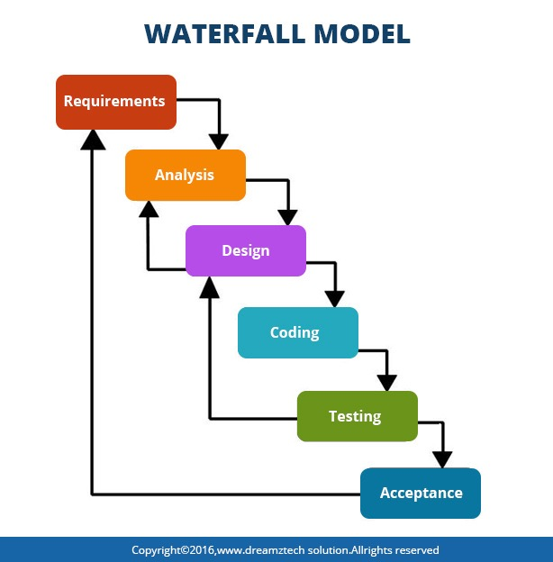
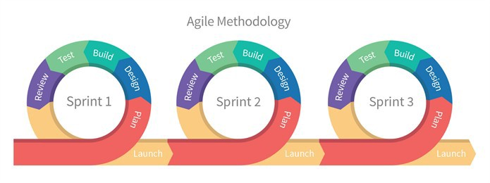
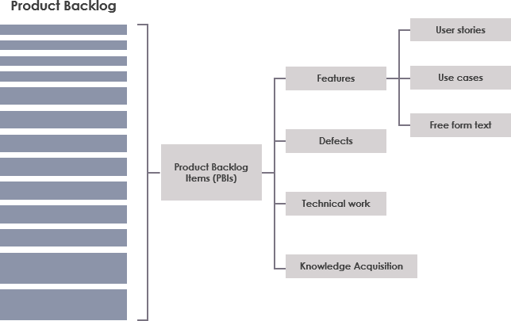
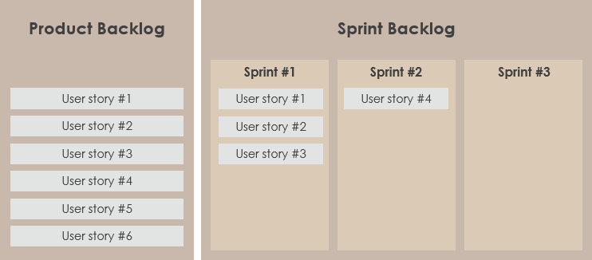
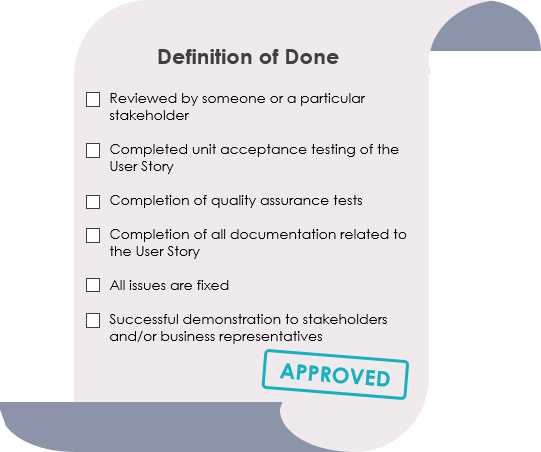
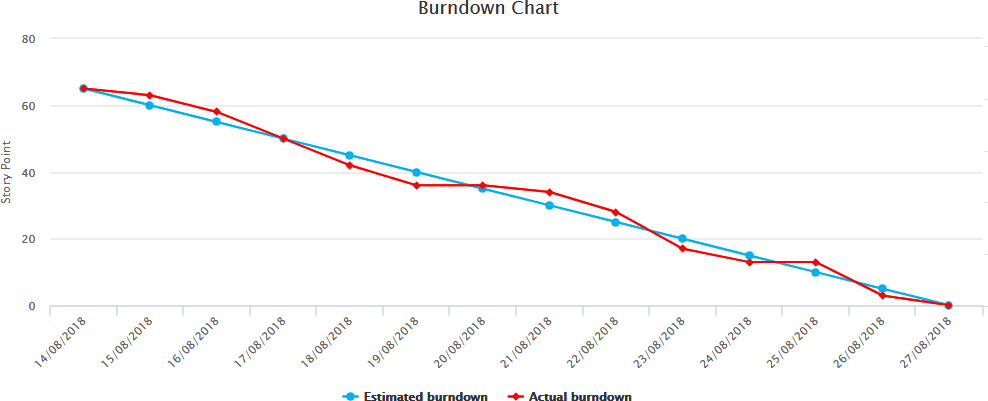
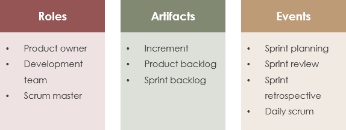

###### Sparta Global Training Day 4
###### Presentation Skills & Interview Techniques. System Development Life Cycles and Project Environment
___

> 9:00 AM - Daily Stand Up **[Morning meetup]**

What was enjoyed about yesterday and any blockers. Yesterday we understood
the importance of listening and things like cognitive biases and the NLP that allow 
you to have a better mindset. It was nice to get to grips with using command-line based
Git as it allows for good practice that will probably be essential when going to work in 
a company later on.

**Morning Activity**

To be presented in the afternoon, create a presentation with your group to the following
questions, make sure it is informative and has a good layout.

* **Topic** - What are network diagrams in planning techniques (Not in technology)
    * **Tasks**
    * Task breakdown
    * Estimation of durations
    * Understand logical dependncies
    * Create network diagram
    * Gantt Chart
    
**Brief Research** - But rather than illustrating a physical network of servers and firewalls,
they can also depict how one task in a project connects to another task —
something that’s incredibly useful for managers.

Types of network diagram -: Precedence and Arrow Diagrams

- Represents activities in a project (prepare presentation) 
 
    - A **graphical representation** of all the **tasks, responsibilities and work-flow** for a project.
    It often looks like a chart with a series of boxes and arrows. ​
    - Maps out the **schedule and work-flow** of a project and helps track progress through each stage.
    - Encompasses every single action and outcome associated with **project, illustrates**
    scope of project.​
    - Techniques such as arrows can denote time depending on their length, arrow tail
    represents the start of an activity and the head represents the finish.​
    

___
> 10:05 AM - Looking at Interview techniques **[Mid-Morning]**

**Topic Interviewing** - 
    
* It is an important part of anyone's career as it is the part that you initially meet the employer in
what some may call a **high-pressure situation** as you need to represent yourself in the best light, including
selling yourself and showing them why they want to hire you. It is also helpful to prepare some research
that relates to their company as it can sometimes impress them if you know a little about them and what they do.

* display everything that is relevant to that particular job, tailor your CV to what is expected.
Include the required information such as **profile, formal-email address, employment history,**
interests or **extra-curricular activities**. Demonstrate your own skills in a way that shows you as
someone they want to hire. 

**Two-way** thing sometimes as you are actually interviewing the company, its your opportunity to grill them and Also
get them to sell themselves to you as well.  It can interesting for the employer if you prepare some questions from the
research done as it shows the employer you have shown an interest in their company and what kind of things you will be
doing in their company day-to-day.

**For example**
    
    - What project would I be working on?
    - How many are on the team?
    - What technology stack do you use? (AWS? AZURE GITLAB? GITBUCKET?)
    - what roles make up the team and how would you want me to fit into that?
    - How would I be on boarded to understand the systems you use?
    - Major challenges with the team?
    - What kind of social / team building activities do you do here?

**Answering Interview Questions**

Best way to articulate the questions that you are asked.

>**STAR** : `Situation`, `Task`, `Action` and `Result`

* Situation (`Set the scene`)
* Task (`Describe the purpose`)
* Action (`Explain what you did`)
* Result (`Share the outcome`)

> **Shows Passion** - **"** Have energy, show pride in what you do.**"**

**Typical Questions**
    
* **TMAY** - "Tell me about yourself"
* Strength / Weakness 
* Off the wall
* Why are you interested in role/ career choice?
* Technical knowledge

**Stories**

* Rehearse your story/ presentation 4 - 5 times because practice makes perfect
and the more times you go over potential questions the more comfortable you
would be if they came up.

> **"** Doesn't have to be the biggest achievement, think from their point of view and think What they
  want from me and what are they looking for... How did you behave in previous work placements or
  in the academy. Try to **turn weaknesses into strengths** that can be **taken advantage** of in them
  interview setting, can **highlight a weakness and demonstrate how you have continuously tried to better** that weakness **"**

**Elevator Pitch**
* Show you know what you're talking about
* Makes meeting people less awkward
* Makes you confident
* Four or five sentences, to the point
* Relevant info about you and your specialism
* Try and use it during the interview
* Don't just sell yourself, sell Sparta too - be excited about your own life and career prospects.

**Power Words** - think TRUMP (less offensive and provocative)
* `Successfully` `Energized` `Enthusiastic`
* `Intrested` `Love` `Motivated` `Priority`
* `Priority` `Amazing` `Win-win`

**Activity** - Create a 5 minute elevator pitch.

**`PREPARE`** - **`PREPARE`** - **`PREPARE`** 

_What I came up with_..
> **"** Hi my name is John. Its very nice to see you all! I am a trainee at the Amazing
Sparta Global training academy with a focus in becoming a successful DEVOP engineer
with one of their many clients. I have several years of experience working with various
technologies such as C#, Game Engines, Cloud and Microservices gained from
Greenwich University where I recently graduated with a 1st Class degree with a focus
on computing. I find technology to be innovate and refreshing - and would love an
opportunity to put my expertise to the test at Sparta Global. **"**

**Feedback**
* Try add some personal achievement and something that happened outside of
technology before you continue about technology.
* Try divert your pitch towards a place
you are comfortable, and add some more casual examples.
    * **`Include Prague Apprenticeship`**
    * **`Include some casual situations`**
    * **`More power Words such as Amazing, Driven and Passionate`**
    * **`Include Personal interests and activities`**
    * **`Example of something you are currently excited about`**
    
___
> 11:45 AM - Interviewing continued... **[Late-Morning]**

**Things not to say**
- What are the benefits
- How much holiday is There
- What are the hours
- What types of progression can I expect
(They will want you working in the role they have needs for, that chance will come
but an interview for a consultant role is not the right time for that conversation)
- I don't want to move
- This role is not for me
- I would rather not **other role**
- I don't want to do **this role**

**Richard Attended for Discussion**
Spoke with Richard, talking about client interview and how they decide
- It can be based on performance if they want a limited amount of people.
- The name of the role is "Junior DEVOP consultant" when you get hired by a client.
- disappearing in class, being late are noted and it can also come to your grades as well as
contribution in the class that are taken into consideration during the selection process.

___
> 13:00 PM - Looking at presentation skills... **[Afternoon]**

**Objectives**
* List and understand the qualities of a good presenter
* How good slides are
* Know how to structure presentations
* Use MS PowerPoint to build a slide deck that supports the presentation
* Understand how presentations are used in a business environment
* Deliver a presentation
* Prepare for Grading presentations

**When might you need to give a presentations** *it is important...*
* Talking to the Board of investors in a company
* Telling the team what has happened so far and what is going well and what isn't
* It is a good way to convey information from yourself to a large audience with great
  detail
  
**Qualities of a good presenter**
* Minimal slides with not much text 
* **Clear and concise** to point on what you are explaining
* It is okay to look at the slides but do not read off the slide for the **whole timeline**
* **Educate yourself** on the topic thoroughly as it can help later in explaining the topic because
  you will be well versed in the information just from pointers that are on your Slides
* Be **respectful and be confident** when presenting, show **passion and enthusiasm**
* Your **confidence** will drop if you do not know your subject well enough

**CMADE** _`C-M-A-D-E`_

* **Confidence** 
    * Knowledge of the subject
    * Preparation and planning
    * Rehearsal
* **Manner**
    * Voice
    * Appearance
    * Movement
* **Attitude**
    * Appropriate
    * Helpful
* **Diligence**
    * Attention to detail
    * Aim for perfection
* **Enthusiasm**

**Good Slides**

* `Direct and concise` `Bullet points` `No Warping bullet points`
* `Good use of visual assets where it will add to story/ or argument`

**Structuring a Presentation** [Layout]
* Introduction and background
* Outline
* Sections
    * Lead-in
    * Content
    * Summary/ Review
* Conclusions 
* Summary 
* Any Questions

**If you are presenting** : Understand the audience, keep it simple (**KISS**).
Make sure your slides are an aid, not the end product, use notes to remember and use
diagrams and images.

**Feedback**
* Add a **Summary Slides**
* **Introduce yourself** and smoothly transition between slides by introducing your
  colleagues
* Put informative images and make sure they are not too complicated
* It is not **performed within the 5 minutes**, therefore it is important to give yourself time and
  **rehearse so you can time-box** your presentation. Otherwise you may give a bad impression.
* **Good arrangements of images** and text so it is more readable, and perhaps give more information
  as having small images on their own is that for a very experienced.
* Make sure images are **clear and not too small or bad quality**.

___
> 16:00 PM - Project Environment **[Late-Afternoon]**

**Objectives** - The project environment
* Understand the difference between **BAU (business as usual)** and project work
* Have a **clear understanding of a project life-cycle** and the use of models
* Be able to **clearly identify business roles** and their function within the project
  environment
* Apply methods to help you identify risk areas
* Be versed in essential knowledge

**BAU vs Project**
* **Projects** have to be completed within a specific time-frame whereas business-as-usual (BAU) activities
  are on-going, continuous tasks. A new system for example with have a start and finish, where as business
  as usual is something that takes place day to day everyday.
    * Uses lots of different task and the way it was performed and carried out.
    Complex and is different from project to project.
    * A project is unique and transient with a desired outcome
* **BAU** Business as usual is the normal execution of standard operations within an organisation
* **Examples** : In this class there is week 2 - SQL Database which is a project for that week, this will change and have timelines
  where as BAU will remain the same with a routine. Arrive at 9:00 stand-up, work, break ECT.
  
**Project Life Cycle**

`Initiation` → `Planning` → `Executing` → `Monitoring and Controlling` → `Closing`

**The Triple Constraint**
* Scope
    * `Time`
    * `Cost`
    * `Quality`
    
These go **hand in hand and affect** each-other as well, for example with more time to prepare
  a presentation they will then expect a better quality presentation. If the cost of a project
  is high then the quality of the project is expected to be high as a lot of money has gone into it and
  time put into it.
  
  _Not Relevant but interesting Info..._
  
 >**Example of Mono Architecture** : Netflix used monolithic architecture and that meant that their whole system went down
  as it was all reliant on each other. Microservices allow for small parts to work independently without
  coupling and allows them to exist without that reliance which can disadvantage systems.

**POPIT Model**

`People` → `Organisation` → `Process` → `Information technology (IT)`

* Benefits of managing your project well
* Prioritise resources in project management as this will allow it to be delivered on time
* Look for the correct resources, that will positively impact the project development
* Meet the deadline, not overrun on time or money and delivered to a quality that is expected
* Good delegation of work to peers, it can help the project advance faster. Do not take it all on.
* Knowing about risk in a project and dealing with that risk is essential and will help manage it.

**Off Topic** _Note(s)_
* **Auto-Scaling / High-availability** - Cloud availability in different part of the world so
if one goes down then you will have a fail-safe to take over and reduce downtime.

**Software Development Lifecycles**

> **"** The project life cycle encompasses all the activities of the project, while the systems development life cycle
focuses on realising the product requirements **"**

**Waterfall** - `System Requirements` → `Software Requirements` -> `Analysis` → `Program Design` → `Coding` → `Testing`
→ `Operations`

___

**_`PSEUDO CODE`_** - Used a lot in Analysis and program design as well as mapping requirements and is used to show to clients
as it displays the capabilities of a system in a way that is easy for non-technological individuals to understand

**V-Model**
* `Requirement Specification` →  `Acceptance Testing`
* `Functional specification` →  `System testing`
* `Technical Specification` →  `Integrating testing`
* `Program specification` →  `unit Testing`
* `Coding`

    
___

**Agile**  (_**`Iterative`**_ → `Plan` → `Do` → `Check`)
**Repeat..**

    
___

**Homework** - Research Scrum Artefacts and Event for tomorrows Class

**Research**

**Difference between Artifact and Artefact?**
*  **Artifact**: An object produced or shaped by human craft, especially a tool, weapon,
    or ornament of archaeological or historical interest.
*  **Artefact**: An artificial product or effect observed in a natural system, especially one introduced by the technology used in scientific investigation or by experimental error.

**SCRUM artefact's**
> **"** Scrum artefact's provide key information that is required by both the scrum team and the stakeholders in order for them to
    fully understand the product that is under development, the activities planned, as well as the activities done in the project. **"**

**Some of the most common artefact's** defined by **Scrum Framework**
* **Product Vision** - Helps define the projects long term goal and sets overall direction and
  guides scrum team. Should be memorable; therefore it must be short and precise.
* **Sprint Goal** - Helps create focus for the sprints, defining a objective to be met within that sprint
  with the correct backlog items. Provides guidance for development team for why the product is being built.
  Concerns the scrum team and product owner as it needs clear business goals for the coming sprint which will help organise backlog.
* **Product Backlog** - A list of all the things required in the product, showing dynamic and best understood requirements for the product. Owned by
  product owner and contains features, requirements, enhancements, and fixes that constitute the changes to be made to the product in future releases.
  This backlog is constantly changing in response to business requirements, markets conditions or technology so is consistently updated with what is needed to be more useful to the target audience.
  
  
> 

___
  
* **Sprint backlog** - Similar to product backlog expect contains items selected for that particular sprint plus a plan for delivering the product increment and sprint goal.
  This is controlled by the development team as they decide what functionality is required for a completion as well as the order of functionalities in order to move to the next increment.
  This backlog defines the product backlog items that will be performed and changed into a "Done" increment, it makes visible the work that the development team identifies as necessary to the meet.
  
> 

___
  
* **Definition of Done** - Every product backlog has its own acceptance criteria to define what needs to be done in order to declare an item as "Done", This allows a collective of these Requirements
  in one place so they can be referred to for each item and avoid repeating the definition of "Done" items. It contains quality criteria, constraints and overall non-functional requirements.
  
> 

___
  
  
* **Increment** - An increment is a sum of all the product backlog items completed during a sprint and all previous sprints. This means that at the end of the sprint, the new increment
  must be "Done", which means:
    * It must meet the Scrum Team’s Definition of "Done".
    * It must be in usable condition regardless of whether the Product Owner decides to actually release it.
* **Burn-Down Chart** - This is a graph that gives an overview of progress over time while completing a project, as tasks are completed the graph "burns down" to zero. This is used to guide the 
  development team to a successful sprint on time with a working final product. The burn-down chart also helps the development team ascertain which objectives they are not realistically able to be complete,
  these tasks are moved back to the product backlog. 
  
> 

___
  
* _Other required artefact's... (If needed)_

**SCRUM Events**

> **"** At regular intervals, the team reflects on how to become more effective, then tunes and adjusts its behaviour accordingly. **"**
>> **"** Agile approaches ask that people learn from mistakes/ or identify new ways to improve on them.
 **"**

* **The 5 Key Events** 

During a SCRUM sprint, all intended to help us work efficiently and closely together, as well as improve our knowledge and become more effective in the future.
    
- **Sprint planning** - This event kicks off each sprint, where the product owner and development team discuss backlog items (PBI's) and which ones will be included in the sprint. The product owner has overall
decision making power, but the team are expected to raise issues and push back where needed. The development team then give a forecast of how many PBI's they can deliver in the sprint, using their knowledge,
experience, resources and any facts that need to be considered. The aim of this event is to produce a "Sprint Goal" and "Sprint Backlog" that everyone agrees is realistic and achievable.
- **Daily SCRUM** - SCRUM seeks to efficiently use time and resources, the daily scrum is an essential time boxed 10 - 15 minutes. It is called stand-up as if you stand whilst doing it, it can help keep the
meeting short and to the point. It is a opportunity for the development team to check in, assess progress towards achieving the sprint goal and review and plan their activities for the next working day.
- **Sprint Review** - Takes place with the next event, and aims to et everything 'perfect' the first time around, but to improve continuously. A sprint-review takes place on the last day of the sprint and allows
the opportunity to show the "Done" increment to stakeholders (Customers, management and anyone else considered relevant). Demo working features of the sprint, while expecting useful feedback to be incorporated
into the product backlog for future sprints.
- **Sprint Retrospective** - The final meeting where the team reviews what could be improved for future sprints and how it can be achieved. There is ALWAYS a opportunity to improve according the SCRUM ethos, providing
the team time in which to identify, discuss and plan this. The whole scrum team should take part, including the development team, the scrum master and the product owner. This should be collaborative effort, just like the entire
SCRUM and Agile process.
- **The Sprint** - The Sprint is an event in itself that contains all the work and all the other events that happen during the time boxed period of development.

**SCRUM Roles**

> **"** Scrum specifies three major roles that play a part in the Scrum Team: 
Product Owner, Scrum Master, and Development team member. Besides these roles, 
you should also expect to have Stakeholders such as Business Analysts in larger organization. 
The Scrum framework requires four roles **"**

   * **Product owner**: The person with the product vision
   * **Scrum master**: The Scrum expert who helps the team build the product according to
   the Scrum framework
   * **Development team**: The team members who execute the work
   * **Stakeholders**: The people, who have genuine interest in the Product, 
    keep reviewing the team’s products and progress and keep providing continual feedback.

These individuals share different tasks and responsibilities related to the final products delivery, 
however under the SCRUM ethos it is seen as a self-organizing and cross-functional team that 
collaboratively works together.

**SCRUM Summary**

**Overall** the SCRUM framework consists of SCRUM teams, their associated roles, events, artefact's and rules, with each component in the framework serving a specific purpose and is essential to
SCRUM usage and success. Ultimately helping teams work together by encouraging teams to learn through experiences, self-organization while working on a problem and to reflect on wins and losses effectively to allow for 
continuous improvement.

> 

___
