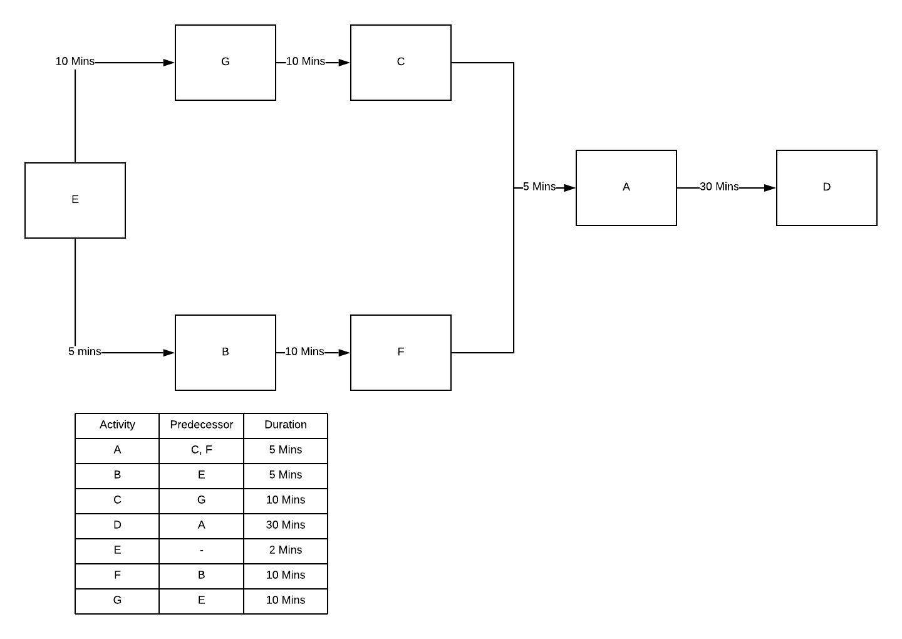
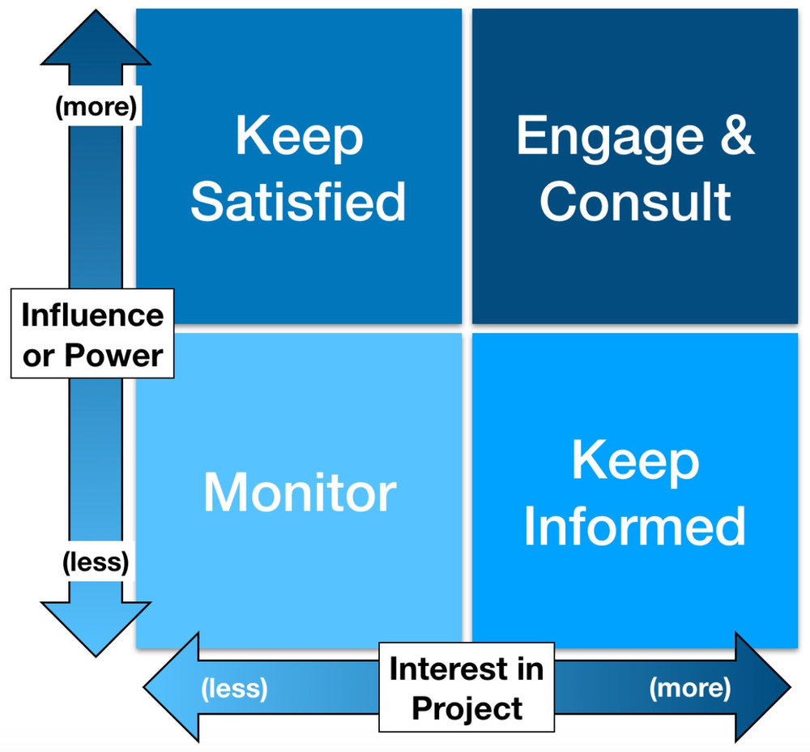

###### Sparta Global Training Day 5
###### Continuation into SDLC, Network Diagrams and Project Environment
___

> 9:00 AM - Daily Stand Up **[Morning meetup]**

**Questions to answer for the one-to-one with Sharukh**

**Agenda**

- We will time-box our meeting for 10 minutes
- Please take notes, as you will be expect to email us the summary of our conversations...
- How did you think this week went?
> **"** Well, everything was delivered with good quality and depth into what is needed for that
topic. The amount of communication between the group was nice as it allowed for everyone to keep up
especially as everyone showed a lot of patience waiting for the stragglers during the GitHub day. This
makes it look positive as the Python will be more coding and it will hopefully go this well. **"**
- From the behavioural competencies one competencies do you think you are excelling and which competencies you need to work one?
> **"** I personally think I am excelling at being determined, I make sure that I focus and listen every part of the class with my full attention
and take notes on almost all of the parts. After every lesson I take an hour to re-write my notes to a markdown file in GitHub which
helps me rehearse what I have learned that day, I am very motivated to succeed at this course, I plan to endure it and am
positive about it. **"**
- One thing to start doing? 
> **"** Start allowing myself to be a little more open and interact more with people. **"**
- One thing to stop doing? 
> **"** Try to be more of a critical thinker about questions as it can help answer questions in a more
interesting way and professional way. **"**
- One thing to continue?
> **"** Being determined and having a positive view of the course. **"**

**Stand up**

Went over a lot of topics yesterday including interview skills, types of project environment, BAU and
presentation skills. We will tell Shahrukh what we found out about SCRUM and its events and artefacts.

Everyone delivered what they have found for the homework for SCRUM framework
- I added the DOD "Definition of Done" which is the success criteria that has been defined at the beginning
of a project and is the way in which a backlog item can be categorised as "Done".

We added another class rule - "Do not eat during class in case visitors join and through common courtesy"

___

> 11:30 AM - Start Learning Network Diagrams with Astha **[Late-Morning]**

**Network Diagrams** - A Project Planning Technique
* **Task Breakdown** -  the tasks are broken down into things such as the plan, code, tests and the releases as it
allows everyone to see how it will go.

___
> 

* **Estimation of durations** - Time estimation that each particular task is going to take. Look at previous project
risks and problems, these are handled by project managers to estimate times. They use buffer times to work around
any problems that may occur in that task beyond the time estimate.
* **Understand logical dependencies** - Each task has logical dependencies, for example some tasks cannot logically
be completed without some pre-requisites; for example a pen cannot be made without a body or cap, ink ECT. Logically
one thing cannot work without the other, it has dependencies. 'D/F' means they both need to be completed before 'F'
can start.

> **"** Network diagrams allow us to see logical order of activities and define out critical path **"**

- **Logical dependencies** in a precedence table - We know that each task has a dependency so we can start mapping it out
in a table. This creates an easy virtual reference of activities that must finish before another can start. For example
B has a dependency of task A, meaning B cannot start without A.

___
> 
>
> 

- **Network Diagrams** - The precedence table is converted into a simple diagram that illustrates what needs to be done in
order. This is also known as a network diagram.

___
> 

- **Gantt chart** - A Gantt Chart, commonly used in project management, shows activities and events displayed against time they will take.
The left of the chart has a list of activities with a time scale along the top. 

**Two Network Diagram Exercises** Completed :

_**Challenge 1**_ -
___
> 

_**Challenge 2**_ -
___
> 

Expect **Devop engineers** to know knowledge about Python code, understanding of database and a lot of problems
that regularly occur in business and technologies. 

The **network diagram** allows us to see the logical order of activities and to define out critical Path. The **critical path**
will give the you time it will take to complete the entire project A.K.A defining the longest path in the diagram as it takes in the
buffers

**Activity on Node** (AoN)

There are typically four different parts of the activity node
* **`ES`** Earliest  Start - At the start of the task (Calculation: `Left to Right`)
* **`LS`** Latest Start - Just before start of buffer (Calculation: `Right to Left`)
* **`Dur`** Duration - the time you will be given to complete the task
* **`Float`** Float - Free Float [Critical Path - 0] (Calculation: `Latest Start - Earliest Start = Float`) Can have buffer

___
> 
___

Each of these help you calculate the duration of your project and also the amount of time tasks
are able to slip within that project. **Earliest Start** Calculation and **Latest Start** Calculation.

> **"** When you know the duration and earliest time of the starting node. **"**

**Working out Earliest Start** : **`Left`** →  **`Right`**

**Early Start** (`Present Node`) + **Duration** (`Present Node`) = **Earliest Start** (`Next Node`)

> **"** You only do the latest Start calculations once you know the earliest start of the final Node **"**

___
> 
___

**Working out Latest Start** : **`Right`** →  **`Left`**

**Latest Start** (`Present Node`) + **Duration** (`Predecessor Node`) = **Latest Start** (`Predecessor Node`)

> **"** The last node in an AON the earliest and latest start will be the same. **"**

___
> 
___

___

> 12:30 PM - Network Diagrams Continued... **[Afternoon]**

**Two AON Network Challenges** Completed :

_**Challenge 1**_ -
___
> 

_**Challenge 2**_ -
___
> 

**Critical Path** this is the path on the network diagrams that has a zero free float, this means 
that in that particular path every node has 0 in the float section. It is the longest path through the network and gives you a logical estimate on project length

> **"** In case of multiple incoming paths to the node ALWAYS take the lowest value, in challenge 2 this is displayed **"**

**Rules of Network Diagrams**
- Flow left to right
- Communication is important (readable, through process)
- There can be more than one critical path
- Arrows can cross over each other
- Looping is not allowed
- Conditional statements are not allowed - network diagrams are not a decision tree
- Activities can only occur once
- Earliest start of the last activity should always equal the latest finish
- If there are multiple starts, a common start node can be used to indicate a clear project
beginning on the network. Similarly a single project end node can be used to indicate a clear ending.

**Gantt Chart** is a diagram that will take the information gathered from creating the network diagram. This 
enables you to :
* Understand and control project schedules
* Communicate and present project information
* Organise work and people

___

> 14:00 PM - Tech Talk and Continuation of Project environment... **[Mid-Afternoon]**

**Notes from Talk** ~ with Bruce Pentreath

  - Technologist is a CIO/ CEO
  - Went through many roles analyst, programmer ECT to CIO
  - Burksha Hathaway assessed the company for any potential bad play in his company revenue
  - He was told that the PC would never impact the bespoke point of sale terminal (workplace computer)
  - The IT industry is privileged it moves fast and changes constantly and is well-payed
  - Gives good career safety as it is usually always needed
  - From Zimbabwe - South Africa , used to work for tarta technologies, then EDS
  - The hype of technology - Hofstadter's law - they built the first computer to beat chess player, IBM's big blue (1997)
  - been most successful when he really knows the business or has been close to the Business (try find a business that resonates with you)
  - built one of the first automated distribution centres in 1986 with IBM
  - Look for the thing that is most flexible, short projects that are valuable to some projects and then
  jump into another project
  - Jeff Sutherland came up with the original SCRUM framework (mid 90's)
  - he attached systems to companies that allowed them to monitor small parts of the companies workings
  - SAM - steal and modify (reference architecture) ~ make it yours ~
  - Try not to limit the amount of innovation that is available in a company a good example of this is Amazon
  - Agile is a believe to do well and stick to the way it is laid out.
  - Look at books of knowledge for specific subjects as they are useful to have for topics you are interested in
  - fellow of the British computer society
  - SOPHIA - skill of the information age
  - Patience - (opera winfrey) Always be open as everyone will have something they know you that you don't
  - Make sure your business is being given what they want and what the client wants, otherwise things will go wrong
  - enterprise architect TOGAF trained (The Open Group Architecture Framework)
  - Avatar is his favourite film
  - COMPANY ASH information consulting
  
___

> 15:00 PM - Returned to Class, Project environment continued... **[Mid-Afternoon]**

**Working in Project Teams**
* **Benefits of working in a team**
    * Get things done quicker through delegation of Tasks.
    * Help build confidence with communication and also makes you stronger.
    * Comes with multiple ways of approaching problems which you may not have thought of.
    
* **Attributes to Mature Teams**
    * Co-located (Different countries/ Locations)
    * Cross functional roles
    * Self-Organising
    * Accountable and Empowered
    * Test and learn feedback loops
    
* **Typical Team**
    * **BA** - Business analyst
    * **PM** - Project manager
    * **QA** -Quality Assurance
    * **Dev** - Developers
    * **UX** - user experience
    
* **Ways to reduce Project Difficulty**
    * Create positive Atmosphere 
    * Manage conflict intelligently
    * Have open and clear communication
    * Respect all your peers
    * Become trustworthy 
    
**Business Case** aims to helps everyone to agree on a project - This comes before the start of a project and will be presented
to see if they are in agreement.

___
> 

> **"** A justification for the proposed project needed to obtain authorisation from the board, so a business case was assembled. **"**

* **Examples of techniques for analysis**
    * Most
    * Boston box
    * Porters five forces
    * PESTLE
    * SWOT - `Strength`, `Weakness`, `Opportunities` and `Threats`.
    * Workshops
    * Interviews 
    * Questionnaires
    
> **"** This includes the initiation of requirement gathering  an essential part of your academy development. **"**

**Return on Investment (ROI)** - A product is _ALWAYS_ built to generate profit

> **"** It all comes down to the worth of the product to the people who need it". If it is not needed then
it won't be used and will not make a profit. **"**

| Item  | Year 1   | Year 2  | Year 3  | Year 4  |
| -----:| -----:| -----:| -----:| -----:|
| **Hardware Cost** | $100,000| | | |
| **Software Cost** |  $50,000 |  $10,000|  $10,000 |  $10,000 |
| **Maintenance Cost** |    $10,000 |    $10,000 |    $10,000 |    $10,000 |
| **_CashFlow_**| _-$110,000_    |  _-$70,000_  | _-$30,000_    |  _$10,000_   |
| **Savings** |   $50,000 |   $50,000 |    $50,000 |   $50,000 |

- [x] The Project pays back in year 4 of the project.
- [ ] The Project does not pay back within the four year period.
- [ ] The Project pas back in year 2 of the project
- [ ] The Project pays back in year 3 of the project

> **"** In the first year there was a loss of $160,000 - the savings of $50,000 brought down cashflow 
>to $110,000 `-$160,000` - `$50,000` **"**
>> **"** In the second year the Software Cost dropped to $10,000 from $50,000 which is a difference of $40,000, so 
> `-$110,000` - `$40,000` = `-$70,000` **"**

With a trend that follows this same change it will lead to year 4 providing the first profit of $10,000 

**Risk** is the situation involving a possible exposure to danger, whether it is negative or positive. 

To reduce risk to a project it is important to identify risks early on.
* To reduce the likelihood of those risks getting in the way during development, it allows for
preparations to be put in place in case they do arise as they could affect the outcome.
* All Projects have risks involved, so it is ALWAYS work looking into risks.

> **"** **Coronavirus Example**
>
>shops are open if they are essential, however pubs and restaurants are high RISK and are not allowed
to be opened. This is the active attempt to reduce the risk with the ultimate aim of eliminating it. **"** 

**Risk identification tools** are used to help achieve the goal or locating, assessing and working to
eliminate the those risks.

___
> 

* **Some Sources of Risks**
  - Technology 
  - Team
  - Scope      
  - Business
  - Economy
  - Competition
  
* **Dealing with Risk**
  - Avoidance (avoid doing something that increases a risk)
  - Transfer (transfer the risk)
  - Reduce (do stuff to reduce the overall risk)
  - Accept (unavoidable risk that cannot be avoided)
  - Exploit (change the scope of the project to make it positive)
  - Share (use AWS service they are responsible for security)
  - Enhance
  - Ignore (Do not do this as it will get you later on)
  
**StakeHolders** are any one who an have an impact on a project whether it be positive or negative.
**- Customers**
- Partners
- Suppliers
- Investors
- Developers
- Competitors
- Owners

**Power and Interest Matrix**

___
> 

> **"** Someone who has more power / influence and someone who has more interest in that project rather than
have a direct impact about how it developed. **"** 
>
> **"** Got to find the right interest in terms of parties who have more power and those who have more interest. **"**

* **Stakeholder Attitudes**
  - **Champion** - These will always fight for the project as they want the project to do Well
  - **Supporter**
  - **Neutral** - The Customers are neutral
  - **Critic**
  - **Opponent**
  - **Blocker** - third-party companies
  
* **Planning**
  - **Project** plan
  - **Resource** plan
  - **Financial** plan
  - **Quality** plan
  - **Acceptance** plan
  - **Communications** plan
  
> **"** If you fail to plan, you plan to fail. **"**

___
**_Homework_**
* Setup Azure Data studio for SQL Week
* Go back and look at recording from Day 4 so you can look at yourself presenting, this can be useful
as it allows you to see how you present and where you can improve.
* Revise/ Study for Business Week 1 Exam on Monday **(21/06/2020)** morning!