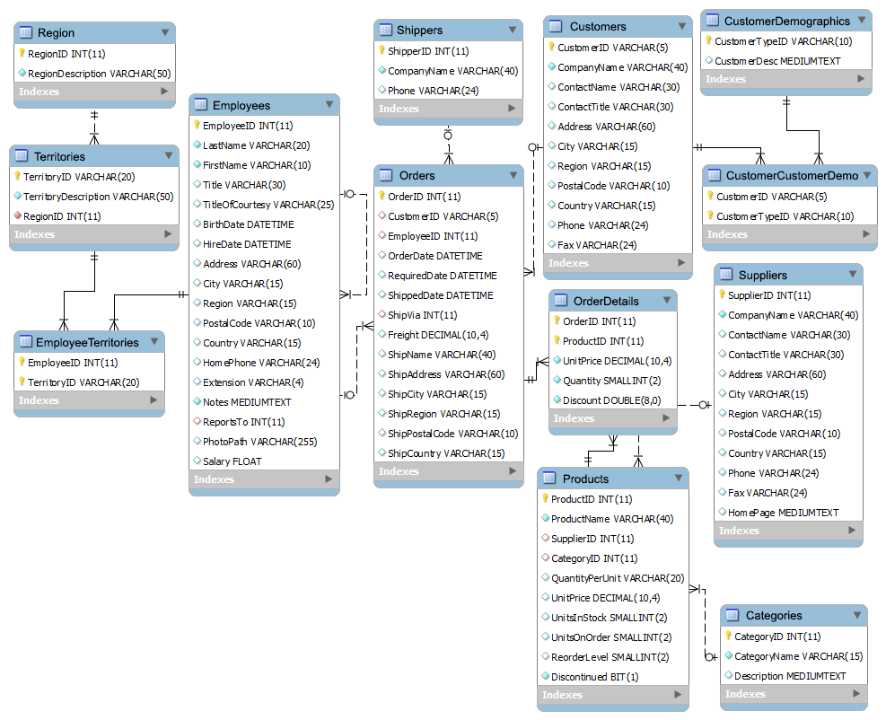

###### Sparta Global Training Day 7
###### Continuing with SQL...
___

> 9:00 AM - Daily Stand Up **[Morning meetup]**

**Tutors** are in morning meeting therefore we are expected to hold our own 
standup and talk about what we enjoyed yesterday as well as any blockers. This will hopefully lead 
to our group becoming more independent.

**Blockers** and what I **Enjoyed** from yesterday. Yesterday I enjoyed going over the SQL keys and 
seeing the different ways it is interpreted by different people. I Really like the way we have access to 
a **Northwind** database in Azure data studio, because it allows me to test out queries I am curious about. 
I am more of a practical learner so I agree with Anais, I would prefer more practical examples with real databases 
rather than theory.

> 

**No Blockers**...
> **"** Perhaps it will be better if we do more practical work as this is the best way to learn something like databases, 
>particularly getting to grips with the DBMS. **"**

___

> 9:42 AM - Introduction Database SQL continued... **[Morning]**

**Structured Query langauge**

* **Data Manipulation language**
    * Manipulate the data within your tables and `INSERT`, `UPDATE`, `DELETE` and `SELECT` the data.
* **Data Definition Language**
    * Define the data you want to `CREATE` in a table, `ALTER` data, `DROP` tables or `TRUNCATE`. `TRUNCATE` empties your table/ database, `DROP` 
    deletes your table/ database.
* **Data Control Language**
    * Control user privilege/ rights for the user, usually assigned by the database administrator. 
    Allow to `GRANT` certain rights such as `SELECT` and `UPDATE` but Not `DROP` or `DELETE`. Later 
    `REVOKE` these privileges away from this person.
* **Transaction Control Language**
    * A update has been done, the `COMMIT` will push these changes to the database. `ROLLBACK` is to go back to a previous 
    version of the database, due to a issue or bug. The `SAVEPOINT` is made when you make a 
    change to the database, this is a point where you can `ROLLBACK` to.

**`Exam has 70% is DML`** <br>
**`Exam has 30% is DDL`**

| DML    | DDL      | DCL    | TCL       |
|--------|----------|--------|-----------|
| `SELECT` | `CREATE`   | `GRANT`  | `COMMIT`    |
| `INSERT` | `ALTER`    | `REVOKE` | `ROLLBACK`  |
| `UPDATE` | `DROP`     |          | `SAVEPOINT` |
| `DELETE` | `TRUNCATE` |          |           |

**Good practice** is to add a drop database line before yours as if a database already 
exists with the same name, it will drop that and allow you to create yours.

___

> 10:50 AM - Introduction Database SQL continued... **[Mid-Morning]**

**Data Types** (part 1)
* **VARCHAR**
    * Adaptable to different lengths of characters. Records MAX size.
    * Memory efficient `VARCHAR(20)` will use up to 20 but release what isn't used.
    * `VARCHAR(MAX)` goes to a max of 65,535 bytes but is bad practice.
* **CHARACTER** or **CHAR**
    * Data must be at a fixed length. Fixed amount of space used.
    * Fixed length `CHAR(10)` uses all the spaces and fills the blank space with white space. **50% faster** than 
    `VARCHAR`. E.G License plate always same length.
* **INT**
    * Holds a whole number/ integer value (see all BIGINT, SMALLINT and TINYINT) positive or negative.
    * `INT(11)`
* **DATE** or **TIME** or **DATETIME**
    * Stores Date, Time or both date and time.
    
**Data Types** (part 2)
* **DECIMAL or NUMERIC**
    * Fixed Precision and scale (digits to right of decimal point) numbers.
    * For `DECIMAL(4, 2)` the `4` is the amount of numbers before and after the decimal point, the `2`
    is the amount of numbers after the point.
* **BINARY**
    * Use to store binary data such as an image or file
* **FLOAT**
    * Scientific use (very large numbers)
* **BIT**
    * Equivalent to binary (0,1 or NULL)
    
**Challenge** add Data types to this table - 

| Column Name  | Description                                   | Example     | Data Type  |
|--------------|-----------------------------------------------|-------------|------------|
| Post Code    | 6 to 8 Characters                             | WV1 8JD     | `VARCHAR(8)` |
| Phone Number | 11 Digits, no punctuation                     | 07971781325 | `CHAR(11)`   |
| Birth Date   | dd/mm/yyyy                                    | 31/01/1980  | `DATE or DATETIME`       |
| Weight in Kg | A number with a decimal place                 | 63.5029     | `DECIMAL(6,4) `     |
| Comments     | Large block of text, more than 255 characters | ........    | `VARCHAR(3000)`   |

**Break** 

___

> 14:00 PM - Introduction Database SQL continued... **[Afternoon]**

**SQL KEY WORDS** with **Examples**

* **CREATE** 


`CREATE DATABASE JohnByrne_db`


```sql
    CREATE TABLE customers (
    customerID INT IDENTITY(1, 1) PRIMARY KEY NOT NULL,
    FirstName VARCHAR(100) NOT NULL,
    LastName VARCHAR(100) NOT NULL
    DateOfBirth DATE)
```
```sql
    CREATE TABLE film_table
    ( film_name VARCHAR(20),
    film_type VARCHAR(20),
    date_of_release DATE, 
    director VARCHAR(40),
    writer VARCHAR(100),
    star VARCHAR(100),
    film_language CHAR(2),
    official_website VARCHAR(100),
    plot_summary VARCHAR(1000))
```

```sql 
    CREATE TABLE director ( 
    director_id INT IDENTITY(1, 5),
    director_name VARCHAR(50),
    city VARCHAR(20) DEFAULT 'LONDON',
    film_id INT, 
    PRIMARY KEY(director_id),
    FOREIGN KEY(film_id) REFERENCES film_table(film_id))
```

* **INSERT**
    * `INSERT INTO customers (FirstName, LastName, DateOfBirth)`<br>
    `VALUES ('Barry', 'B. Barlow', '1996-10-20');` IDENTITY is auto increment from 1, incrementing by 1
    * `INSERT INTO film_table (film_name, film_type, date_of_release, director, writer, star, film_language, official_website, plot_summary)` <br>
    `VALUES ('The Joker', 'Thriller', '2019-10-04',  'Todd Philips', 'Scott Silver',' Joaquin Phoenix', 'en', 'www.joker.movie', 'Description..');`

* **DROP**
    * `DROP TABLE customers` 
    * `DROP DATABASE John_db`
    
* **ALTER**
    * `ALTER TABLE film_table DROP` <br>
    `COLUMN release_date;`
    * `ALTER TABLE film_table` <br>
`ALTER COLUMN film_name VARCHAR(10) NOT NULL` [ Change Nullable to **No** ]
    * `ALTER TABLE film_table` <br> `ADD date_joined DATETIME` or `DATE`
    
* **SELECT**
    * `SELECT * FROM film_table` 
    * `SELECT film_name,  writer FROM film_table`
    
* **EXTRA**
    * `SP_HELP` Reports information about a database object 

* **UPDATE**
    * `UPDATE people` <br>
    `SET person_id = 1` <br>
    `WHERE person_id =2` 
    * `UPDATE film_table` <br>
    `SET plot_summary = 'This film is actually trash!'` <br>
    `WHERE film_name = 'The Joker'`
    
* **DELETE**
    * `DELETE FROM film_table WHERE film_id = 1`
    * `DELETE FROM film_table WHERE rating < 1`
     
>To add a Primary key simply add a `PRIMARY KEY` next to the colum and 
>add `IDENTITY(1, 1)` as this tells this column to increment by 1 starting from 1 each time 
>a new value is added to the table. When you insert into a table you don't have to define a value 
>for the `PRIMARY KEY` as the database will take care of this.
>
>`DEFAULT` constraint allows a default value to be assigned into a column, for example 
>city could be London.
>
>Single **' '** Quotes are used for text or dates, and integer based values do not need any quotes. So 
>`VARCHAR`, `CHAR` and `DATE` all use quotes.
>
>`NOT NULL` means that this particular column does not accept empty values, it requires some kind of data. This must be met otherwise an insert cannot be made.
>
>`DELETE` will remove a record from a database following a condition, however a record which has a relationship 
> to another table as a `FOREIGN KEY` cannot be deleted as it does not follow data relationship integrity.

**Vartiations of INSERT**
* Changing the order of the columns
    * If you've already created a table, the order in which you add the data doesn't have to be the same as the original column order as 
    long as the values match the order you are now inserting.
* Omitting column names
    * You don't have to put the column names in, but the values have to be in the same order as the original columns.
* Leaving some columns out
    * You can leave some information out, it doesn't have to be inserted with the rest. For this you will have to specify the 
    column names the values are going into.
    
>**NULL** is not thing, but it does not equate to zero. It isn't even an empty string. A value can be `NULL`, but `NULL` never equals `NULL` 
because `NULL` is an undefined value. 

**Database Consideration**
* Data Security
* Data Recovery
* Data Integrity
* Normal form

**`AWS`** is able to scale up and down depending on the load that is required by their users this allows 
them to provide faster connectivity.

**Normal Form**

- Attain better design and performance because we effectively remove all the redundencies from the database such as 
duplicated data.

**1st Normal Form**
* A database is in First Normal Form when the following conditions have been met.

* Make Everything atomic
    * Data must be presented as small as it can be.

* There should be no repeating groups.
    * For example, a table that records data on a book and its author(s)
    with the following columns [Book ID], [Author 1], [Author 2] ,[Author 3] is not 1NF because [Author 1], [Author 2], and [Author 3] 
    are all repeating the same attribute. 

* **Question**

This **table** is NOT in **1NF** because the values in **Colour** are not **atomic**, this means they aren't singular values. 
`
_table_product_`

| Product ID | Colour       | Price |
|------------|--------------|-------|
| 1          | red, green   | 10.99 |
| 2          | yellow       | 12.00 |
| 3          | green        | 14.99 |
| 4          | yellow, blue | 5.99  |
| 5          | red          | 20.00 |

* **Answer**

To fix the table it needs to be seperated into two seperate tables, this is because 
**Product_ID** will always be **5.99**, but can come in both the colours **Yellow** and **Blue**.

`_table_product_price_` _table1_

| product ID | Price |
|------------|-------|
| 1          | 10.99 |
| 2          | 12.00 |
| 3          | 14.99 |
| 4          | 5.99  |
| 5          | 20.00 |

`_table_product_colour_` _table2_

| product ID | Colour |
|------------|--------|
| 1          | red    |
| 1          | green  |
| 2          | yellow |
| 3          | green  |
| 4          | yellow |
| 4          | blue   |
| 5          | red    |

___

**2nd Normal Form**

A database is in second Normal Form when the following conditions are satisfied:
* It is in 1NF
* All non-key attributes are fully functional dependent on the Primary Key
* An example is location which depends on only part of the primary key, this is wrong instead it should depend fully on the primary key.

* **Question**

Here the **composite key** is used. **Product_ID** and **Store** combine to make a Primary Key. In this case **Location** only depend on **Store** which is part of the primary key. 

`_table_pruchase_detail`

| Product ID | Store | Location |
|------------|-------|----------|
| 1          | 1     | London   |
| 1          | 3     | Tokyo    |
| 2          | 1     | London   |
| 3          | 2     | New York |
| 4          | 3     | Tokyo    |

* **Answer**

To fix this table we need to split the table, so that the **Location** column relies on a primary key, in this case **Store**. 

`_table_pruchase` _table1_

| Product ID | Store |
|------------|-------|
| 1          | 1     |
| 1          | 3     |
| 2          | 1     |
| 3          | 2     |
| 4          | 3     |

`table_store` _table2_

| Store | Location |
|------------|-------|
| 1         | London     |
| 2          | New York  |
| 3          | Tokyo    |

___

**3rd Normal Form** 
A database is in Third Normal Form when the following conditions are satisfied:
*   It is in 2NF
*   There is no transitive functional dependency
    * i.e A transitive Functional dependency is when a non-key column is Functionally Dependent on another 
    non-key column, which is Functionally dependent on the Primary Key 

* **Question**

In this example **Book_ID** determines **Genre_ID**, which in turn determines **Genre Type** - that means they are functionally 
dependent on each other.

`table_book_detail`

| Book ID | Genre ID | Genre Type | Price |
|---------|----------|------------|-------|
| 1       | 1        | Fiction    | 9.99  |
| 2       | 2        | Travel     | 14.99 |
| 3       | 1        | Fiction    | 24.99 |

* **Answer**

To fix this we are going to choose **BookID** as the primary key for the first table because it doesn't 
rely on any other table to exist like the **GenreID**. Another table can track **GenreID** as it is 
functionally dependent on **GenreType**

`table_book` _table1_

| Book ID | Genre ID | Price |
|---------|----------|-------|
| 1       | 1        | 9.99  |
| 2       | 2        | 14.99 |
| 3       | 1        | 24.99 |

`table_genre` _table2_

| Genre ID | Genre Type| 
|---------|-----------|
| 1       | Fiction   |
| 2       | Travel    |

___ 
**HOMEWORK**
* Research Manual or automatic way to do <br> `DELETE FROM film_table WHERE film_id=1`
    * **AUTOMATIC** - A `foreign key` with `CASCADE` delete means that if a record in 
    the parent table is deleted, then the corresponding records in the 
    child table will automatically be deleted. This is called a cascade delete 
    in SQL Server.
    * **EXAMPLE** - <br>`DELETE FROM film_table WHERE film_id = 1` <br>
    `ALTER TABLE director` <br>
    `ADD CONSTRAINT film_id` <br>
    `FOREIGN KEY (film_id)` <br>
    `REFERENCES film_table (film_id) ON DELETE CASCADE`
    
    * **MANUAL** - A foreign key constraint, you can delete the foreign key constraint manually 
    which removes the requirement for referential integrity.
    * **EXAMPLE** - <br>
    `ALTER TABLE film_table` <br>
    `DROP CONSTRAINT (film_id)` <br>