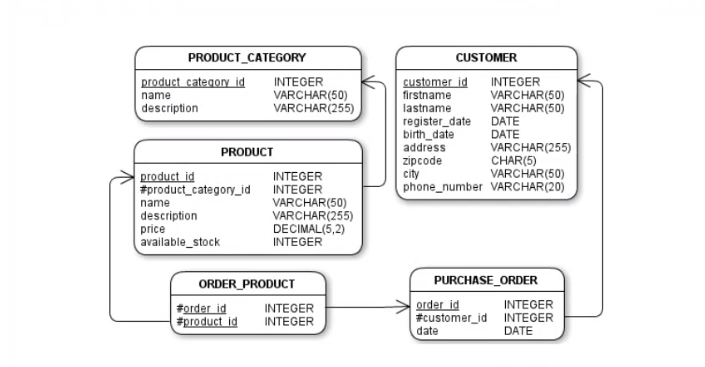
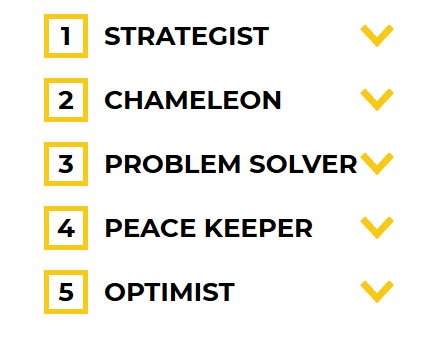

###### Sparta Global Training Day 11
###### Agenda for this week is Python however the SQL test is also organised for Tuesday morning.
___

> 9:00 AM - Daily Stand Up **[Morning meetup]**

**Astha** and **Sharukh** gone to training meeting so we are revising for databases until 9:30
when they are back.

- We went over the questions in the mini-project to compare what answers we got. No one exchanged 
answers only tips of what to do.

**Blockers** and stuff I **enjoyed** about last week and the weekend.

I spent a while on the project over the weekend, I have finished the project now but I 
found the last question specifically a little bit mind boggling. It specifically was not 
something I had seen before and I only got it through multiple attempts. I couldn't 
get it formatted in a way that showed the month as a name and year as a number using the format
as I think it converts it to a `VARCHAR`. 

| DML    | DDL      | DCL    | TCL       |
|--------|----------|--------|-----------|
| `SELECT` | `CREATE`   | `GRANT`  | `COMMIT`    |
| `INSERT` | `ALTER`    | `REVOKE` | `ROLLBACK`  |
| `UPDATE` | `DROP`     |          | `SAVEPOINT` |
| `DELETE` | `TRUNCATE` |          |           |

**Re-Iteration** of table for revision.

___

> 10:45 AM - Started CodingGames Mock test

There were 2 questions, one was a question that required 4 `INNER JOINS` the other was a theory question 
asking about a conjunction table and what is does. I ended with :star: **100%** :star: 

**Test**
- **Questions** - Do not ask any technical questions during the test.

_Modify the query to select only the ids of customers having purchased at least one product in the "Books" and "Garden" category.
Output should have no duplicates and should be sorted in ascending order._ <br> 
:warning: **`DO EXACTLY IS ASKED`** :warning:

> 


```sql 
SELECT DISTINCT c.customer_id
FROM Customer c
INNER JOIN PURCHASE_ORDER po ON c.Customer_id = po.customer_id
INNER JOIN ORDER_PRODUCT op ON po.order_id = op.order_id 
INNER JOIN PRODUCT p ON op.product_Id = p.product_id
INNER JOIN PRODUCT_CATEGORY ON p.product_category_id = pc.product_category_id
WHERE pc.name IN ('Books', 'Garden')
ORDER BY c.customer_id DESC
```

~ Link to document containing summary of Mini-Project

**profile pre-work** in preparation for the week on profiles, there are a couple of tasks that need to be completed.

- [x] Take the Strength finder test, My Results link : **[High5Test Results](https://high5test.com/test/result-your-friend/ODM2MjY4)**

**_Results from High5Test..._**
 
> 

- [x] Personal SWOT Analysis-Examples

 **Personal SWOT analysis**
*  **Strengths**
    * Technical Person - Computing Degree
    * **Independent** and comfortable in lots of situations
    * **Patient** and **trustworthy** with people, rarely get annoyed and am relaxed in general
    * **modest**, **friendly** and always willing to help people
    * **Quick learner**, **calm** - can learn software rather quick
    
* **Weaknesses**
    * Not very logical in the way I think about stuff at first
    * Not as confident as I would like to be and can sometimes come across as a little introverted
    * Easily distracted 
    * Can be self-conscious about my looks and how people perceive me 
    * Not a critical thinker, struggle to pass information in a easily understandable manner
    
* **Opportunities**
    * Sparta Global Academy providing lots of helpful resources and learning experiences.
    * Information technology, computing is a ever-expanding field that has lots of opportunities
    * Enhancing personal development, making myself more professional in the workplace and more socilable and approachable.
    * Native language is most in demand for IT profession, able to communicate effectively with others.
    
* **Threats** 
    * Although I have a background in IT I can still forget concepts and make silly mistakes like not
    reading the question properly
    * Not got a lot of experience within professional environments which could put me at a disadvantage 
    * Bad habits in way I behave in a professional environment
    * Not a good team leader 
    * Can be shy at times but also distant to others as I am more of a independent learner


- [ ] Johari Window-They need to ask people-Family, Friends and Colleagues from previous organisation, 1 member from each group and ask the different set of adjectives they would like to assign the trainee and why. <br>
The list of adjectives would be **[HERE](https://en.wikipedia.org/wiki/Johari_window)**. <br>
After that the trainee starts putting those in the Johari window. The adjectives which neither they chose for themselves nor their people would go in the Unknown Part of the box. They will find all the info about this in the above link.

**Results**
 
* **Family** - <br>
    * **
* **Friends** - <br>
    * **Adaptable** - has coped and successfully conquered many challenges without setbacks, 
    e.g. moving in, COVID impact of uni
    * **Mature** - has logic, outlook and thinking way beyond his age
    * **Trustworthy** - you can always rely on John to do whatever is asked (& agreed) on time, 
    every time and done well
* **Colleague** - <br>