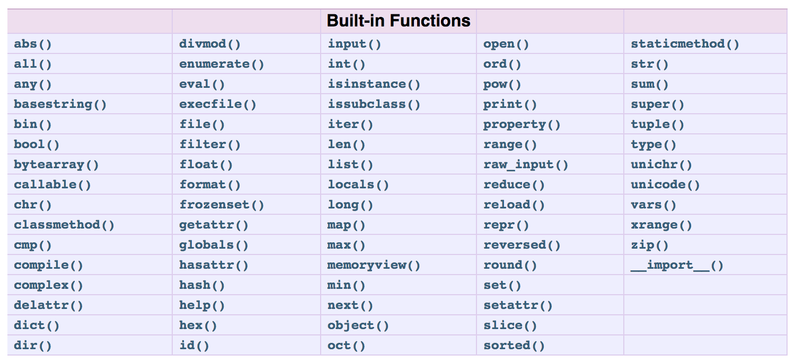

###### Sparta Global Training Day 12
###### Finish of SQL week by doing test then continuation on with Python
___

> 9:00 AM - Daily Stand Up **[Morning meetup]**

This morning we are doing our `SQL` test on **codingames**... 

**Stand up**... <br>
Yesterday was a good day as I had a lot of time to go over my work and see the way in which 
someone else had done the same question to achieve the same answer as I got. I am happy that I 
got a good score in the test. I done a lot of revision last night and am fairly confident in both the practical 
and theory part of the test. I have lots of experience to pull from and I need to apply my full focus on the 
test for the best result.

**Blockers**...<br>
I am personally not feeling many blockers at the moment, I feel like I have grasped the basic concepts 
of sub-queries but not to a degree where I could use them from memory and would most likely use a `JOIN` statement
instead. I just need to invest more time in the future to learn sub-queries further, however as I am not
confident I am gonna try to refrain using them as much as I can.

___

> 10:00AM - SQL Test on CodinGames **[Morning]**


:star: Got **97%** :star: on **SQL Test**

Finishing with the final SQL-Test and preparing for Python module to start by going though the [**W3Schools Python**](https://www.w3schools.com/python/python_variables.asp)
course

Created Python Cheatsheet ~ [**HERE**](/Notes/Python-Intro-Week-3/W3Schools-Python-CheatSheet.md) 

Created Version of SQL Mini-Project Summary ~ [**HERE**](/Documents/SQL-Mini-Project-Summary-NoMarks.pdf) 

___
> 1:30PM - Profiling Workshop with Astha **[Afternoon]**

**Objectives**
* You will be more self-aware from different perspectives
* You will understand how to write a better summary
* You will understand the difference between skills and behaviour

There are the 5 Strengths test and this can help you produce a good piece of information for your strengths 
as well as assist in writing your summary in the profile. 

It is better to have **60%** Hard Skills and **40%** Soft Skills as I am a technical person and it can sometimes be more 
desired by employers. Especially for employers of Devops.

* behaviour and value in summary (`hard-worker`, `Creativity`, `Speaking`)

* skills go in skills section (`time-management`, `teamwork`, `planning`, `remote-working`)
    * Have Strong skills that are really wanted and include other aspects such as responsibility and enthusises these aspects.
    * Software (`GitHub`, `Azure Data Studio`, `PyCharm`, `Visual Studio`) - Languages (`C#`, `SQL`, `Python`)
    
* Transferable Skills
    * Initiative
    * Planning
    * Teamwork
    * Communication 
    * Problem-solving
    * Can be many more.... (Not only Tech - Customer facing role ECT.,)
    
**Summary** It could be good to show off your university degree and what you did for your final year project

**Tips for Profile**
* Use **Justify** lining with clean edges
* Talk in **Third-Person** throughout
* For employment history **bullet-points** are much more preferable in this section as it is much more readable
* In certifications add **diploma** and other technical and non-technical certifications achieved.
* Write hobby in short, make sure it is something recent with one or two lines about it.
* Add folder that contains profiles in `.gitignore` so it cannot be seen through GitHub
* Add Profile and stuff into a folder inside the SpartaGlobal OneDrive and then right click and Share, then share that link 
with your trainer so they can review it through the link. 
* Someone is expected to be the **Profile Co-ordinator**

___
> 4:00PM - GDPR- General Data Protection Regulation **[Afternoon]**

**Objectives**
* To understand what GDPR is and why its important
* To understand the different types of data
* To develop understanding of cyber-security
* To learn techniques for maintaining confidentiality 

**What are the key changes**
* **Increased scope**
    * GDPR applies to any company dealing with individuals who reside in the EU, regardless of 
    whether the company itself resides in the EU.
* **Penalties**
    * Large fines for infringements
* **Consent**
    * The request for consent must be clear and easily accessible, stating the purpose for the data.
    * It must be easy withdraw consent.
    
**Why GDPR is important**
* Protects individuals data across the EU
* If a company breaches the GDPR, they can be fined. There are two tiers of fines:
    * Up to 20 million or up to 4% of the Company's Annual turnover - whichever is greater
    * Up to 10 million or up to 2% of the Company's Annual turnover - whichever is greater
    
**What constitutes a breach**
* Breaches of an individual's rights and freedom in relation to their data.
    * This will result in the higher tier fine
* Breaches of obligations by data processor
    * this wil result in lower tier fine
    
**Other Penalties** 
* warnings and reprimands
* A temporary or permanent ban on data processing
* Ordering the rectification, restriction on data processing
* Suspending data transfers to third countries
* Compensating for damages

**Who does it apply to?**
* **Controller**
    * Determines the purpose and means of processing the data
* **Processor**
    * Responsible for processing personal data on behalf of a controller
    
**Different types of Data**
* **Personal**
    * Any data that can identify an individual
    * Eg. Name, address, email, number, date of birth etc.
* **Sensitive**
    * Any data contains sensitive information
    * Eg. Health, finances, sexuality, religion, ethnicity etc.
    
**The individual Rights**
* Right to be informed
* Right to access 
* Right to rectification 
* Right to erasure/Right to be forgotten
* Right to restrict processing
* Right to data portability
* Right to object
* Right related to automated decisions

**What are the GDPR principles**
* Lawfulness, Fairness and Transparency
* Purpose Limitation
* Data Minimisation
* Storage Limitation
* Integrity and Confidentiality
* Accurate and Up to date
* Accountability

**Other Obligations**
* Assign a data protection Officer (DPO)
* Inform ICO of data breaches within 72 hours
* All companies required to update their privacy policies

**Storing and Processing Data**
* Paper copies
    * Could be lost or damaged so should be kept securely and destroyed when no longer needed
* Emails 
    * Insecure, could cause a break
* Spreadsheets
    * If stored locally, can jeopardise the 'Right to be forgotten'
* Databases
    * Preferred method of data storage and processing, as this keeps all the data in one
    central location for easier tracking and control
    
**Databases**
* When you add someone to a database, remember that individual has the 'Right to access' at any time.
* Do not add any comments on a database that you would not be comfortable saying in person

**Maintaining Confidentiality**
* Dispose of confidential data safely 
* Protect your print-outs
* Password Protection and Encryption
* Keep credentials safe
* Lock your machine
* Keep a clear desk
* Avoid storing data on discs or USBs

**Sparta Global Privacy Policy**

>At Sparta Global Limited we are committed to and hugely passionate about protecting and respecting your privacy. Whether you deal with us as a Spartan, Candidate, Client, Supplier or Partner we will always make sure we do the right thing.
>>The General Data Protection Regulation (GDPR) (Regulation (EU) 2016/679) is a relatively recent regulation which has replaced the Data Protection Regulation (Directive 95/46/EC). The Regulation aims to harmonise data protection legislation across EU/EEA member states, enhancing privacy rights for individuals and providing a strict framework within which commercial organisations can legally operate. We welcome this piece of legislation as it’s all about understanding you and putting you first, which is what we do every single day.
>>>Even though the UK has expressed its intention to leave the EU in March 2019, the Government intends for the GDPR to continue in UK law post Brexit and has also introduced a Data Protection Bill to replace the current Data Protection Act.

* **Cyber Security**

**It is important**

Cyber Security underpins and protects the core functions of every organisation and just like our own safety and possible
financial cost if personally attacked, businesses face those same threats.

All Staff should be aware of how they might be vulnerable to cyber-attacks and how to stay safe online.

Your organisation is responsible for securing its systems and data from those attacks, but you also have a key role to play 
to help in making sure those safety measures stay in place. This knowledge is applicable to your work and personal life.

**Who are the Cyber-Attackers**

There are many groups of people that may want to do this
* Online criminals
* Foreign Governments
* Hackers - untargeted, agents of chaos
* Political Activists
* Terrorist Organisations
* Malicious Insiders

It's good to point out that sometimes it might simply be people making genuine mistakes too...

**How - Type of Attackers**

* Vishing
* Smishing
* Phishing 
* Impersonation
* Waterholing

Being prone to these attacks might result in the release/loss of confidential information or on the following 
software being installed on your computer
* Malware
* Ransomware

**Social Engineering**

Attacks usually try to utilise social engineering to get you to do something that may or may not be in your best interest - its a type of confidence
trick...

* **Six Key principles to be aware of**
    * Reciprocity
    * Commitment and Consistency
    * Social Proof
    * Authority
    * Liking
    * Scarcity
    
**Countermeasures**
* Defend against Phising
* Monitor your digital footprint
* Secure your devices
* Internet usage
* Training Employees
* Security Protocols
* Event Test
* Waste Management
* Understanding the importance of reporting


  
___
> 4:30 PM Making a start on Python (Variables) **[Late-Afternoon]**

* **Python**

Python is the fastest growing programming language at this current moment, in the space of 10 years it has overtaken the most 
popular programming languages like JavaScript, C# and Java. Invented by :star: **Guido van Rossum** :star:

* Supports multiple systems and platforms
* Object-orientated Programming (OOPs) driven
* Helps to improve Programmer's Productivity
* Allows you to scale even the most complex applications with ease 
* Extensive Support Libraries
* Predominantly used in Machine Learning and Data Analysis

:star: **Amazingly Powerful Language** :star:

The python interpreter has a number of functions and types built into it that are always available.



* **Variables**

Can store different types of data inside these variables it is often thought of as an empty box that is capable of 
storing this data and can be used throughout the program. 

* **Types**
    * String `Hello World`
    * Boolean `True` `False`
    * Decimal `1.5`
    
It is always good to have good naming conventions with variables so that if someone else reads 
your code they will be able to understand it better, it is also recommended to use either `snake_case` or `camelCase` 
it is up to developer.

* **Variable declaration and assignment**
```python 
pay = 10
hours = 1.5
name = "Spartan"
```

* **Input Variable declaration and assignment**

```python 
number = Input("What is your Spartan number")
```

* **Adding variables and integers**<br>
To add Integers into a string it is required that you either use the `.format` function or 
convert / cast using `__str__()` or `str()` to turn the variables type into a string in the `print` function.
```python 
print(name + "-" + number + " makes $" + pay.__str__() + " every " + hours.__str__() + " Hours...\n")
```

* **Type** Operator
```python
print(type(pay))
print(type(hours))
print(type(name))
```

This will output the types of each of these variables in this case: <br>
`print(type(pay))` = `<class 'int'>` <br>
`print(type(hours))` = `<class 'float'>` <br>
`print(type(name))` = `<class 'str'>` <br>
    
**Exercise**
1. Create a variable called `first_name` and `last_name`    
2. Create a variable called `full_name` with the last two combined
3. Create a variable called `age`
4. Create a variable called `address`

```python
first_name = input("What is your first name?  ")
last_name = input("\nWhat is your last name?  ")

full_name = first_name + " " + last_name

age = input("Great! Nice to meet you " + full_name + ". How old are you?  ")
address = input("\nAnd what is your address?  ")

print("Alright, to confirm " + full_name + ". You are " + age + " years old and live at " + address + "...")
```

Alternatively for the last printout you could use the `.format` string function

```python 
print("Alright, to confirm {0}. You are {1} years old and live at {2}...".format(full_name, age, address))
```

___
**Homework**

* ~~Go to watch the GDPR recording and bulk up the notes on **GDPR**~~
* Complete Profile and Summary before Monday