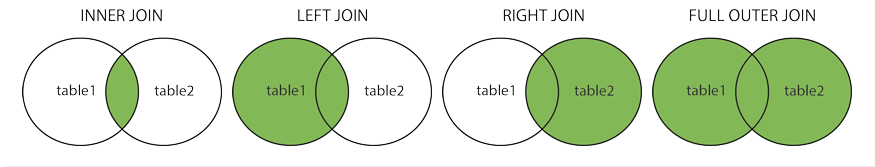
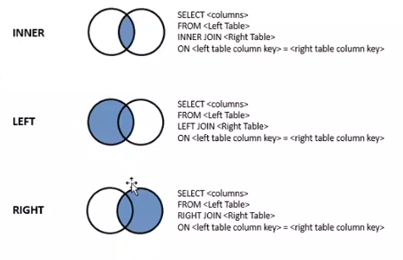

###### Sparta Global Training Day 9
###### Continuing with SQL and presenting on `GROUP BY` and `HAVING`
___

> 9:00 AM - Daily Stand Up **[Morning meetup]**

Things that I enjoyed from yesterday as well as the blockers from yesterday.

**Enjoy** ... <br> 
I enjoyed learning about the wildcards **%** and **_** as they are useful 
for finding data based on a set of conditions and not exact search terms. I can see how 
this would be useful in industry whilst doing querying.

**Blockers** ... <br>
Need to go over some `DELETE CASCADE` a little more as well as 
go over **DDL**, **DML**, **DCL** and **TCL**. I need to know the **DDL** and **DML** off by 
heart so that in the future I can easily serve that information if ever asked in the future.

**Graduation Presentation**... <br>
At the end of the graduation at Sparta Global there will be a presentation given to 
all of Sparta Global, Sales Team and students. **PREPARE** and research their interests and 
technology they are using.

* **Date Functions**

**GETDATE** - `SELECT GETDATE()` to return the current date and time 

**SYSDATETIME** -  `SELECT SYSDATETIME()` to return the date and time of the computer being used

**DATEADD** `DATEADD(d, 5, OrderDate) AS "Due Date"` to add 5 days. 
The `d` extracts todays date and adds the 5.

**DATEDIFF** `DATEDIFF(d, OrderDate, ShippedDate) AS "Ship Time"` to calculate difference between dates

**YEAR** `SELECT YEAR(OrderDate) AS "Order year"` to extract the year from a date

**MONTH** `SELECT MONTH(OrderDate) AS "Order Month"` to extract the month from a date

**DAY** `SELECT DAY(OrderDate) AS "Order Day"` to extract the day from a date

**d** = `day`, **m** = `month` and **y** = `year` <br>

_• **DATEADD** has 3 arguments, `d` or `dd` means day, `m` or `mm` months, `yy` or `yyyy` year, the date to be added to and how many 
units to add_ <br>
```sql
SELECT DATEADD(d, 5, OrderDate) AS "Due Date",
    DATEDIFF(d,OrderDate, ShippedDate) AS "Ship Days"
FROM Orders
```

_• Working out the age of everyone in the employees table, also try to figure out months, days too._ <br>
```sql
SELECT CONCAT(e.EmployeeID, ', ', e.FirstName,' ', e.LastName) AS "Employee",
CONCAT(DATEDIFF(yyyy, e.BirthDate, GETDATE()), '.',
DATEDIFF(mm, e.BirthDate, GETDATE()), '.', 
DATEDIFF(d, e.BirthDate, GETDATE())) AS "Year.Month.Days"
FROM Employees e
```

* **CASE**

A `CASE` statement can be useful when you need varying results output based on different data. 
Pay close attention to `WHEN` `THEN` `ELSE` and `END`. Use single quotes for data and double quotes 
for column aliases.

* **Aggregate Functions**

The following aggregate functions can be used to calculate totals usually in conjunction with `GROUP BY` clause.

_• **Aggregate Functions** can be used be used with a `GROUP BY`, but without a `GROUP BY` 
you get one row (total) as a result. IF you use an aggregate function in a select statement, 
all other columns must either be an aggregate or in the `GROUP BY` clause._ <br>
 
* **SUM** - `SUM(OrderTotal)` for the grand total of a column for all rows selected 

* **AVG** - `AVG(UnitPrice)` for the average of a column for all rows selected

* **MIN** - `MIN(UnitPrice)` for the smallest value in a column for all rows selected

* **MAX** - `MAX(UnitPrice)` for the largest value in a column for all rows selected 

* **COUNT** - `COUNT(*)` for the number of NOT NULL rows selected. If * is used all rows are counted.
 
_• This finds the `SUM` `AVG` `MIN` and `MAX` for each supplier and adding a group, will show all the suppliers 
grouped by their ID, essentially categorising the results based on the supplier._ <br>
```sql
SELECT SUM(p.UnitsOnOrder) AS "Total on Order",
    AVG(p.UnitsOnOrder) AS "Avg On Order",
    MIN(p.UnitsOnOrder) AS "Min On Order",
    MAX(p.UnitsOnOrder) AS "Max On Order"
FROM Products p
GROUP BY supplierID
```
 
_•Use `GROUP BY` to calculate the average reorder level for all products by CategoryID.
Remember the `SELECT` clause must match the `GROUP BY` clause apart from any aggregates.
You need to make sure you actually `ORDER BY` with the same as what has been selected, and only 
order by the reorder otherwise it won't show the average._ <br>
```sql
SELECT
AVG(p.ReorderLevel) AS "Average Reorder Level"
FROM Products p 
GROUP BY p.CategoryID
ORDER BY AVG(p.ReorderLevel) DESC 
```
_• `HAVING` is used instead of `WHERE` when filtering on subtotals/ grouped data.
Columns aliases cannot be used in the `HAVING` clause. Aggregate functions are not 
available for use in the `WHERE` clause due to the SQL processing sequence._

```sql 
SELECT SupplierID,
SUM(UnitsOnOrder) AS "Total On Order",
    AVG(UnitsOnOrder) AS "Avg On Order"
FROM Products 
GROUP BY SupplierID 
HAVING AVG(UnitsOnOrder) > 5
```

* **LOGICAL** (syntax) Sequence

1. **SELECT** <br>
2. **WHERE** <br>
3. **GROUP BY** <br>
4. **HAVING** <br>
5. **SELECT** <br>
6. **DISTINCT** <br>
7. **ORDER BY** 

:star: **Edgar F.Codd** is the one who coined the term relational database :star:

___

> 2:00 PM - Presentation, continuation with SQL  **[Afernoon]**

We presented the `GROUP BY` and `HAVING` clauses to the class. It went well
however when we presented we tried to involve the audience we should have tried 
to involve the audience as much as possible and ask them if they want to move on ECT, 
question people in the class if they understand to reinforce the information. 

* **GROUP BY**

Its a key word that will categorise the same values in the column. 

Its often used with a aggregate functions ( `COUNT`, `MAX`, `MIN`, `SUM`, `AVG` )
to group the result-set by one or more columns.

You can also use `GROUP BY` in conjunction with `ORDER BY`


_• Using the Northwind database, list the number of customers in each country using the
`GROUP BY` function._ <br>

```sql
SELECT COUNT (c.CustomerID) AS "Number of people living in the country", c.Country
FROM Customers c
GROUP BY c.Country
```

_• Using your Northwind database, list the number of customers in each country sorted high to low
 function._ <br>
 
```sql
SELECT COUNT (c.CustomerID) AS "Number of people living in the country", c.Country
FROM Customers c
GROUP BY c.Country
ORDER BY COUNT(c.CustomerID) DESC
```

* **HAVING**

It is an alternative to the `WHERE` clause and was added to work
with aggregate functions. `WHILE` is only used to `SELECT` queries, which contain aggregate 
functions or `GROUP BY` which is correct.

`HAVING` clause is used to filter summarized data or grouped data in SQL to use with or 
without the `GROUP BY` function. In `GROUP BY` the logical execution sequence means it executes 
before the `HAVING` clause.

_• Using your Northwind database, list the number of customers in each country using the `GROUP BY` clause. 
Only include countries with more than 10 customers using the `HAVING` clause._ <br>
```sql 
SELECT COUNT(c.CustomerID), c.Country 
FROM Customers c
GROUP BY c.Country
HAVING COUNT(c.CustomerID) < 10
```

_•Using the Northwind database list the number of customers in each country (`GROUP BY`), except the USA (`WHERE`) sorted high to low (`DESC)` and only include countries with 9 more customers (`HAVING`)._ <br>
```sql 
SELECT COUNT(c.CustomerID), Country 
    FROM Customers c
    WHERE Country <> 'USA'
    GROUP BY Country
HAVING COUNT(c.CustomerID) >= 9
    ORDER BY COUNT(c.CustomerID) DESC
```

* **JOINS**
    * `INNER JOIN` - Returns records that have matching values in both tables
    * `LEFT JOIN` - Returns all records from the left table, and the matched records from the right table.
    * `RIGHT JOIN` - Returns all records from the right table, and the matched records from the left table.
    * `FULL JOIN` - Returns all records when there is a match in either left or right table
    * `SELF JOIN` - A Self JOIN is a regular join, but the table is joined with itself
    
**JOIN** clauses are used to combine rows from two or more tables, based on a related 
column between them. It allows you to create a lsit of combined rows of matching data from different 
tables.<br>

> 

> 


**INNER JOIN** (simple join)

The most frequently used, it returns any rows where there is a matched key in BOTH tables

**LEFT JOIN** or **LEFT OUTER JOIN**

Return all rows from the left table, and the matched rows from the right table 
regardless of any matching entry in the right table. It will also show `NULL` values even 
if it doesnt match on he right, meaning it will show it all as `NULL`.

When performing **INNER JOINS** between multiple tables it is best to have a  **ERD** of the
databases structure.

_Table 1 - Student table_

| st_id | student_name | course_id |
|-------|--------------|-----------|
| 1     | Lee          | 1         |
| 2     | Barry        | 1         |
| 3     | David        | 2         |
| 4     | Tim          | 5         |
| 5     | Nicole       | NULL      |

_table 2 - Course table_

| c_id | course_name |
|------|-------------|
| 1    | Business    |
| 2    | Test        |
| 3    | Agile       |
| 4    | Web         |
| 5    | Dev         |

These two tables are going to be used to explain how joinin works 
when quering two tables.

* **`INNER JOIN`** - This compares both tables and only shows the relational data

```sql 
SELECT * FROM course c INNER JOIN student s
ON s.course_id=c.c_id
```

| c_id | course_name | st_id | student_name | course_id |
|------|-------------|-------|--------------|-----------|
| 1    | Business    | 1     | Lee          | 1         |
| 2    | Test        | 2     | Barry        | 1         |
| 3    | Agile       | 3     | David        | 2         |
| 4    | Web         | 4     | Tim          | 5         |

* **`LEFT JOIN`** and **`RIGHT JOIN`** - These `JOINS` compare either the left to the right, 
or the right to the left only take notice of what is matching in their respected 
side `LEFT` or `RIGHT`

```sql 
SELECT * FROM student s LEFT JOIN course c   
ON s.course_id=c.c_id
```

_This only cares about the left table, 
this shows its matches as well as any of its NULL values or NON matches_


| st_id | Student_name | course_id | c_id | course_name |
|-------|--------------|-----------|------|-------------|
| 1     | Lee          | 1         | 1    | Bussiness   |
| 2     | Barry        | 1         | 1    | Business    |
| 3     | David        | 2         | 2    | Test        |
| 4     | Tim          | 5         | 5    | Dev         |
| 5     | Nicole       | NULL      | NULL | NULL        |

```sql
SELECT * FROM student s RIGHT JOIN course c   
ON s.course_id=c.c_id
```

_This only cares about the right table, 
this shows its matches as well as any of its NULL values or NON matches_

| st_id | Student_name | course_id | c_id | course_name |
|-------|--------------|-----------|------|-------------|
| 1     | Lee          | 1         | 1    | Bussiness   |
| 2     | Barry        | 1         | 1    | Business    |
| 3     | David        | 2         | 2    | Test        |
| NULL  | NULL         | NULL      | 3    | Agile       |
| NULL  | NULL         | NULL      | 4    | Web         |
| 4     | Tim          | 5         | 5    | Dev         |

```sql
SELECT * FROM student s FULL JOIN course c   
ON s.course_id=c.c_id
```

* **`FULL JOIN`** - This will get all the tables selected, and compare the records 
to find matches, it will display what is displayed seperated in `LEFT` and `RIGHT` in one
table.

_This returns all the records from both tables when there is a match 
in either left or right tables_

| st_id | Student_name | course_id | c_id | course_name |
|-------|--------------|-----------|------|-------------|
| 1     | Lee          | 1         | 1    | Bussiness   |
| 2     | Barry        | 1         | 1    | Business    |
| 3     | David        | 2         | 2    | Test        |
| 4     | Tim          | 5         | 5    | DEV         |
| 5     | Nicole       | NULL      | NULL | NULL        |
| NULL  | NULL         | NULL      | 3    | Agile       |
| NULL  | NULL         | NULL      | 4    | Web         |

```sql 
SELECT * FROM student s FULL JOIN course c   
ON s.course_id=c.c_id
```

* **`SELF JOIN`** - This is a regular `JOIN` however you are joining the table with itself, for example you could compare 
the customers table from Northwind with itself, to see which customers are from the same city.

```sql 
SELECT A.ContactName AS CustomerName1, B.ContactName AS CustomerName2, A.City
FROM Customers A, Customers B
WHERE A.CustomerID <> B.CustomerID
AND A.City = B.City
ORDER BY A.City;
```

<br>

**Entity Relationship Diagram** (ERD) of the Northwind database. Very useful when performing
 `JOINS` as it can help you understand referential keys throughout the tables.<br>
> 

_helpful in below exercise_

**Exercise**<br>
_Using rows from Products, `GROUP BY` Supplier showing an average of Units On Order for each Supplier_ <br>
_Include the Supplier name (use CompanyName) in the result set using an `INNER JOIN` to Suppliers table_ <br>
_Also Remember the `GROUP BY` clause will need to include the Supplier Name_ <br>
_**Note**: In the `SELECT` statement, you will need to specify which table you are requesting or use Aliases on 
ALL columns that have the same name in multiple tables (e.g. wherever SupplierID appears in SQL)_

```sql 
SELECT s.CompanyName AS "Supplier Name", AVG(p.UnitsOnOrder) AS "Average of UnitsOnOrder"
FROM Products p 
INNER JOIN Suppliers s 
ON p.SupplierID = s.SupplierID 
GROUP BY s.SupplierID, s.CompanyName
ORDER BY "Average of UnitsOnOrder" DESC
```

---
**Homework**

* Look at presentation later today and look at how many power words were used and how 
many could have been used. Get 5 points that you need to improve
for presentation.

* Do the activity showed at the end of the day on the presentation video.

* Look more into `OUTER JOIN`, `INNER JOIN`, `LEFT JOIN`, `SELF JOIN`, `CATERSIAN` and `RIGHT JOIN`

* Exercises in the Northwind database as it is good practice, exercise and solutions.

**[W3Schools Northwind Exercises](https://www.w3resource.com/mysql-exercises/northwind/products-table-exercises/)**

* SQL Online Test at TESTDOME

**[TESTDOME SQL Test](https://www.testdome.com/tests/sql-online-test/12)**

* SQL test that has a small certificate

**[W3Schools Quiz](https://www.w3schools.com/quiztest/quiztest.asp?qtest=SQL)**

