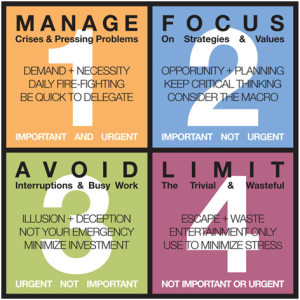

###### Sparta Global Training Day 2
###### Communication
___

> 9:00 AM - Daily Stand Up **[Morning meetup]**

Behavioural Competencies presentation made with my group, includes all the different behavioural
competencies that are essential.

* **Analytic**
    * Critical thinker, researcher, strategic, optimise, implementer
* **Independent**
    * Accountability, courageous, disciplined, networker, self-starter
* **Determined**
    * Motivated, goal-oriented, endurance, positivity, focused
* **Professional**
    * Communication, reliability, demeanor, appearance, poise
* **Studious**
    * Life-long leaner, curious, cognitive ability, reflection, iterative growth
* **Imaginative**
    * Divergent thinker, creative, open minded, sharing ideas, value driven
    
These are the 6 Behavioural competencies that make a person a great colleague and general
person as it helps them be successful, innovative and approachable

* **GRIT** 
> **"** **Growth** is about how likely we are to go seek fresh ideas, perspectives inputs, and idea to help
>you success at that thing. **"**

> **"** **Resilience** is about bouncing back from adversity and being able to use adversity to your advantage **"**

> **"** **Instinct** is about going about after our goals the best way, not the hardest way **"**

> **"** **Tenacity** is that perseverance, persistence, never say die never ay quit dimension of **GRIT**. **"**

___
> 11:20 AM - Time management & Task Management **[Late-Morning]**

* **Tooling** - The kind of software's are available to utilise:
    1. `Office 365`
    2. `Files in Engineering 67 Teams chat`
    3. `Outlook` This is a professional email client - Remember to be formal and write professional emails
    4. `One-Tab` Helps to keep tab counts down on your computer by squishing them into a single tab with a list of
    those tabs.
    
* **Time Management**
    1. **Time Boxing** - Define a timeline and use the time effectively to do
each one - the range of skills, tools and technique utilised to accomplish
specified tasks, projects and goals. Staying focused and make sure to look
at what is coming up, plan how you are going to accomplish each task.

    2. **Task Management** -  the process of managing a task during its lifecycle, including
planning, tracking and reporting. Plan the tasks that need to be done in a way that starts from the most
urgent, to the most important taking into consideration; **time-to-complete**, **requirements**, and the 
overall task **completion-plan**

* **[#]** **The 2 Minute Rule** **[#]**
    * The gist of the 2-minute rule is that if something will take two minutes or less to complete, you should just do it. 
    Don't think about it, don't add it to your to-do list, don't put it off for later. Knock it out.
    
* **Ubiquitous Capture** :
    *  It is a task that needs to be captured in a way that will remind you of What
is needed to be done, for example calendar, notes or Trello. Keep notes of
a presentation that reminds you to ask anything you are curious on for
example. This can be good because it can remind you of a task in its intierty, to avoid missing bits and pieces

* **Granularity** :
    * Find a new place to live, new flat within 20 minutes
    * Call estate management call the letting company
    * Organise viewing and decide on who to sell the house to
    
> **"** To look at set of tasks and organise them in order of priority, this
priority is determined by requirements to complete the task and the amount of
time that it would take to complete as well.

**Priority Order** > **Break Tasks into grain-size** > **Most Important task first** 

**Important** - For example turning up to class everyday is an important part of my day!
* Important activities have an outcome that leads to us achieving our goals,
whether these are professional or personal.
    * **DO** (Do it now)
    * **DECIDE** (Schedule a time to do it)

**Urgent** - If there was a fire then that is urgent and you need to leave. This is a task that
takes priority over any **important** tasks as it is a task or action that will usually have an 
immediate affect.
* Urgent activities demand immediate attention, and are usually associated with achieving someone else's goals.
    * **DELEGATE** (Who can do it for you)
    * **DELETE** (Eliminate it)
    
    
**Urgent and Importance matrix**: 

    
___
> 13:40 AM - Communication 1 **[Afternoon]**

[**Group Activity**] - Research what **Pareto Principle** is : **80%** of the effects come from **20%** of causes.

The **Pareto Principle** is very simple, yet very important. It is named after Italian economist Vilfredo Pareto. 
Also known as the **80/20 Principle** - because in Italy **80%** of the land was owned by only **20%** of the population.
Meaning that **80%** of the population is left with **20%** of the and to live on.

* **Use case** : In bank, **20%** of the clients can account for **80%** of the banks overall
stakeholders with money in their banks. These clients are high-value
and need special attention as they supply a huge part of the business clients.
* **Extra** :  **20%** of the work is usually the bulk of the
operation, however behind that **80%** is supporting of the real work.

**Discipline / Motivation** - The discipline and motivation of an individual
* To keep yourself disciplined is important as it can lead to Motivation
and make you want to achieve a goal more, this can help reduce the chance
of losing focus.
* Dedicated space can help get an individual into a routine and keep them focused

___
> 14:15 AM - Communication 1 Continued... **[Afternoon]**

Continuation of communication : The definition of **Communication** is to transfer the information
to another person. There are lots of different ways to do this. But it is important to make
sure it is **effective** communication. If the person you talking to does not understand something you
have said then you have not communicated your information properly.

in **Programming comments** that trails the code is supposed to effectively
explain what that piece of code does in a couple lines.

`// This is a comment in some languages`
* Effective communication
* Active listening to promote requirement elicitation and business skills
* Understand the effect of body language
* Apply open and closed question to remove ambiguity

**+** Delivery always affects the message outcome **+**  
**+** The real message is the one received, not the one intended **+**  

* **Poor Communication**
    * can lead to dead-ends and also affect the development
of any product; for example it may lead to an incorrect product Meaning
more money and resources will be needed to correct that.
        - Loss of Business
        - Mistakes
        - Lack of coordination
        - Damage to corporate image
        - Employee frustration
        - Poor Morale
        
* **Aspects** of **Poor Communication**
Personal, Physical, Geographical, Cultural or Organisational

    * **Cultural** - different places expect different behaviour (china, USA, UK)
    * **Personal** - **self-awareness** of own behaviour (flailing hands), passionate
presentation, body-language.
    * **Verbal** -  **verbal communication** is something that is said, it is tailored
usually towards the audience (for example non-jargon) for non programmers
    * **Vocal** - the tone of the voice, you need to make sure it is clear,
harsh tone for rules and a soft tone for general communication
    * **Visual** - the look and physical hand gestures, movements of the presenter
can sometimes give someone an impression.

**Perception is Projection** :  How we present ourselves, how we turn up and present
ourselves when going to give a presentation. For example good expression,
hand gestures and interaction with the presenter.

> **"** It is not what you say, its how you say it **"**

* **Body Language**
    - Sit or stand at right angles, on the same level
    - Respect personal space
    - Use open gestures
    - Focus on the other person if they are presenting
    - Lean in to show interest
    - Lean further to apply pressure
    - Lean back to relax
    - Maintain appropriate eye contact
    
**7 Habits of Effective people**    
* **Be Proactive** - Focus on the things you can control rather than things you can't.

1. **Begin with the end in mind** - Beginning each day with a clear vision of your desired direction and destination.
2. **Put first things first** - what we say vs how we allocate our time.
3. **Think win-win** - For you to win they do not have to lose.
4. **Seek first** to understand then to be understood - Does what you do
offer value?
5. **Synergy** - You can do more than just by yourself.
6. **Sharpen the Saw** - Go the long way even if it takes time

___
> 15:20 AM - Communication 1 Continued... **[Afternoon]**

* Levels of listening:

**[Cosmetic]** `->` **[Conversational]** `->` **[Active]** `->` **[Deep]**

**Good Questions**

**Closed Questions**

- When did that happen?
- Did you receive the Python grade you expected?

_Requires a straight forward `yes` or `no`, and get straight to the point._

**Open Questions**

- What led up to that?
- Tell me about yourself?

_Open Questions allows you to explain yourself as much as you need to, explain yourself as this
is usually an open discussion_

**Building Rapport**

Starting at a new workplace it is important to become involved,
mutual attentiveness, positivity, coordination.
Being positive and likeable as well as having good communication and effective
working can maybe help influence an employer to want to hire you in the future.

* **Different Personalities**
    * Extroverts
    * Introverts
    * Supporter
    * Director
    * Analytical
    
None are good and none are bad but they are what is the differentiation within
the workplace. Understanding personality types as a base can help influence
if and how we get along with people, whether it be in the workplace or in
everyday life.

**Individual Activity**

Write something about this image {Picture of an Apple}

> **"** Its an extremely red ripe apple that has presumable just been picked,
this indicated by the leaf on top. It also looks like it has been
polished by the intense shine it is giving off - it looks like a very tasty
apple that I want to eat. **"**

___
> 16:00 AM - Communication 2 Brief Look **[Afternoon]**

**TED TALK** The power of Listening
> Courtesy of **William Ury**

* **Notes from video**
    * successful negotiators listen more than they talk (listen twice as much as you
speak)
    * listening to where someone is coming from (human mind opening to listen)
    * power of listening shifted his mood
        * listening helps understand the other side (exercise influence to change
someone's mind)
        * helps connect with the other human, builds rapport and shows your care
        * makes it more likely the other person will care what you say brings you to yes
    
**Real Listening**
- Listen within their frame of reference and not ours
- Listen to what is being said but also what is not being said the underlying
feelings and needs
> **"** It is something that is learned and practice everyday **"**

* **Why it is so hard**
    1. There is so much going on in our minds (noise and distraction) mental and
emotional space to listen to the other side
    2. To listen to the other side we need to learn to listen to ourselves first,
let emotions go and listen (moment of silence to tune in and see where we are)
    3. teach and learn to listen to each other better

**#** Extra Notes
* List of techniques of active listening
    * **Examples** of active listening
        - Wait to disclose my opinion
        - Validation
        - Demonstrating concern
        - being ready to speak (won't be listening properly)
        
    * **HARD** techniques for me
        - Vocal tone
        - Attention to detail
        - Respond judgment
        - Appropriate time to insert my opinion

* Take a personality test - **16 Personalities** 
**_https://www.16personalities.com/_**

I got **Adventurer** - **ISFP-a** 

_**[Artisan {Artisan, Pragmatic}] - According to Sparta Chart**_