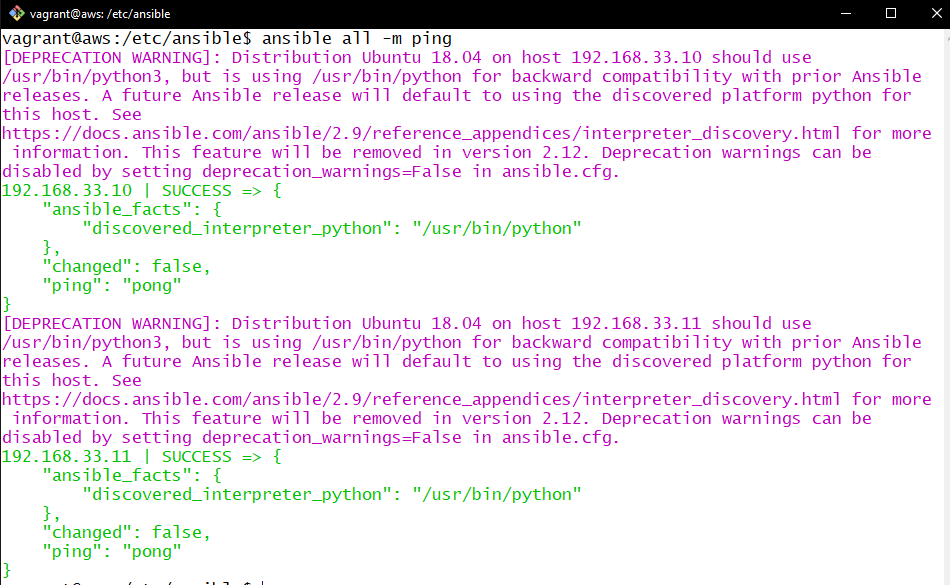
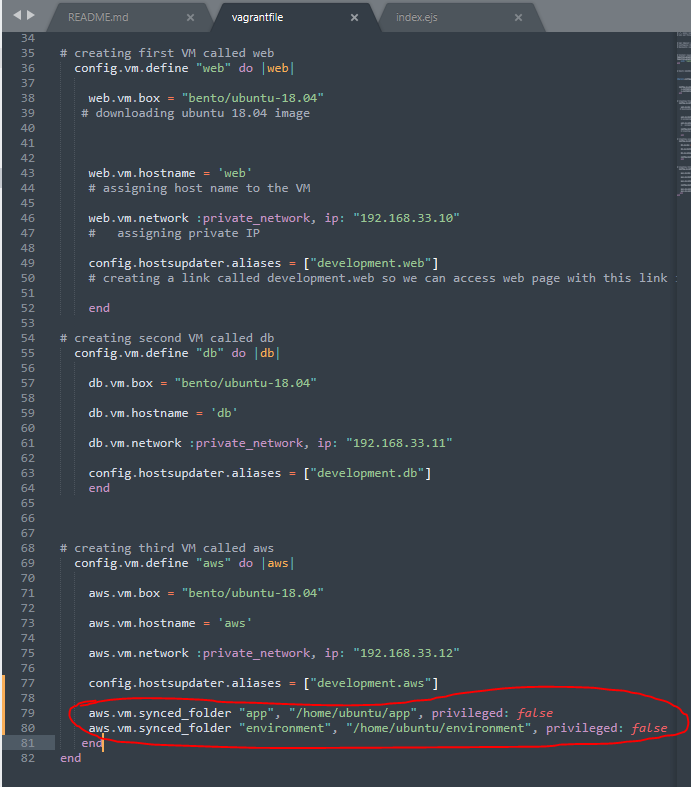
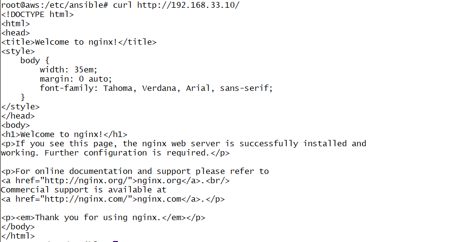

###### Sparta Global Training Day 46
###### Ansible, configuration management tools in DevOps.
___

> 9:00 AM Stand up [Morning]

I did not have many blockers this weekend, however I was quite busy due to some family issues. I did not manage to completely record all the videos but I successfully made a note of them and will definitely do that later in the day or the week.

## **Ansible**

* **Configuration management with Ansible**
* **IAC Infrastructure as code**
* **Multi Server Environment**

First we went through the videos we had to record over the weekend, however I did not have anything significant to show here.

I plan to do the videos after the lesson today as I did not find the time on the weekend ~

The Videos will be available to view [**HERE**]()

> 11:00 AM Starting to look at Ansible [Early-Morning]

# Infrastructure as code (IAC)

* We use **IAC** to help us speed up the process of configuration management using **Ansible** or **Orchestration** and **Terraform**.

* **How does this speed up the process?**
* By creating a script whether it a **YML** file using **Ansible**
* **YAML** - another Mark up language

**Ansible vm/controller**

Two Virtual Machines/ Instances: **Web** and **DB**
* What are the Dependencies of these two instances:
* **Web** << **SSH** >>
    * Python (Already installed on Linux version Ubuntu 16.04)
* **DB** << **SSH** >>
    * Python (Already installed on Linux version Ubuntu 16.04)

* **What is Ansible?**
* Automation tool for configuration management
    * **Why use Ansible?**
        * Simple
        * Agentless - (this means it can connect to different software's and servers even if it hasn't got ansible installed on it.)
        * IT automation Tool
        * Relates simplicity (**SSH**) Best Configuration tool in the industry for **DevOps**. 
    * The Ansible only needs to be on the controller it does not have to be installed inside any of the instances, and as long as it has a connection with **SSH** it can configure and update configurations within these instances. So **SSH Key** is needed.

* **How does it benefit DevOps?**
* Save time
* Open source
* Makes configuring management predictable (Cost Effective)
* It automates the process (configuration management easy)

**What is the Hybrid cloud?**
* This is when multiple instances are being hosted in multiple locations such as one on **AWS**, **Azure** or **local** and these can all be configured together using **Ansible** to skip the process of having to log into the instance and change stuff manually.

## Steps we are taking

* mkdir Ansible
* cd into Ansible
* Nano Vagrant File -> Paste in contents
* Nano README.md
* Create [GitHub](https://github.com/JohnByrneJames/Ansible) and link it
* Run Vagrant Up 
* Go into each **VM** with vagrant **SSH** and run `sudo apt-get update`

Now we want to make the controller nicknamed `AWS` into our Ansible Controller agent. The `AWS` is actually on Premise meaning it is on the companies servers, but `AWS` was just the name we gave it.
* **TO DO**
   * Install ansible onto controller
   * Look at file system of ansible (how it works, files and directories ECT.)
   * How to make host entries (tell controller which Ips to communicate with)
   * Configure the instance so we can ping the other instance and get a response.
   
* `sudo apt-get install software-properties-common -y` get dependencies for **ansible**
* `sudo apt-add-repository ppa:ansible/ansible` this gets the package from the ansible repository. Then run another `sudo apt-get update -y`.
* Now you have the package use `sudo apt-get install ansible -y`
* Now check if you have it installed with `ansible --verison`
* Install tree `sudo apt-get install tree` (**tree** is a package manager)
* **Ansible** default location is `cd /etc/ansible`.

### Ansible Commands

* `ansible name-vm -m ping` to ping another server. `-m` stands for module. You can use this to test connection between this controller and the target hosts/ VMs.
* We pinged to two host Ips which were in the vagrant file and got replies on both.
* `ssh vagrant@web` and `ssh vagrant@db` gave no response now we need to add them to the `hosts` file.
* Now we go into the `hosts` file and added our `app` and `db` VMs:

>[web]
192.168.33.10 ansible_connection=ssh ansible_ssh_user=vagrant ansible_ssh_pass=vagrant
[db]
192.168.33.11 ansible_connection=ssh ansible_ssh_user=vagrant ansible_ssh_pass=vagrant
[aws]
192.168.33.12 ansible_connection=ssh ansible_ssh_user=vagrant ansible_ssh_pass=vagrant

* Now we are able to SSH into the `App` and `DB` using **SSH** like so, and entering **Vagrant** as the password.

* `ssh vagrant@192.168.33.10` For **Web**
* `ssh vagrant@192.168.33.11` For **DB**
* Doing those last two commands creates a connection between the Controller and its hosts when you run the ` ansible all -m ping` command.

Now we pinged all the VMs and got a response saying **SUCCESS**.



_This is what it looked like when I pinged the two newly added hosts **DB** and **WebApp**_

Ansible Controller is working, we can ping to all servers and response is "pong" A.K.A **SUCCESS**

We are going to automate this process soon.

## Ad-hoc commands 

**What are ad-hoc commands?** When, How and why do we use them... Some information on [Documentation](https://docs.ansible.com/ansible/latest/user_guide/intro_adhoc.html#intro-adhoc)

**What**

They are one line commands, they have been used in the past.

**Why**

Allow us to run small commands to any servers in the hosts file and able to retrieve data quickly and efficiently. For example the time in the country or space left on the server.

**FAST**, **ROBUST**, **FLEXIBLE** and **EASY**

### **Command List**

```bash
# Get time
ansible web -a "date"

# Get Machine name, E.G. version running (last -a) means all
ansible db -a "uname -a"

# Get version on own
ansible db -a "uname"

# Go into every server on our hosts and run `ls -a`
ansible all -m shell -a "ls -a"

# Go into every server and see what free space is left
ansible all -m shell -a "free"
```

**Now we are tasked with researching through the ad-hoc documentation**

Trying out new commands and reporting back after 10 minutes

```bash
# I discoverd a command that returns useful variables from a host
ansible all -m setup

# Gain a list of available modules using
ansible-doc l

# Get up-time of servers
ansible all -m shell -a "uptime"

# Show all environment variables
ansible all -m shell -a "env"

# Copy over files into DB and APP Instances
sudo ansible all -m copy -a "src=test-file.txt dest=/home/vagrant"

# Get ip address of hosts
ansible all -m shell -a "var=hostvars[inventory_hostname]['ansible_default_ipv4']['address']"

ansible db -m shell -a "hostname -i"

# Find disk space inside the VMs
ansible all -m shell -a "free"
```

[Good Site](https://www.tecmint.com/commands-to-collect-system-and-hardware-information-in-linux/)

**ansible playbooks**

* What are they? - They are **YAML** files with .yml extensions
* Why should we use them/ benefits _ **For Configuration management** and to **install programs** or **update programs**
* How to create a playbook
* What can we do with a playbooks? **Automates tasks** in multiple servers.
* playbooks are writing in YAML or YML
* YAML syntax - YAML file starts with `---` three dashes
* YAML works on indentation like **python**

We created a playbook inside the `ansible` folder and then we ran it.

First.. we creat the playbook using `YAML` like so:

```bash
# Create playbook file
nano install_nginx_on_web.yml
```

```yaml
# This is a YAML file to install NGINX in our web server (A Playbook)
---  # The --- makes this recognised as a yaml file

# Where we are going to install NGINX
- hosts: web

# get the facts
  gather_facts: yes

# work from root user (Permissions)
  become: true

# What do we want ansible to do for us in this playbook

  tasks:
  - name: Install nginx

    # Telling ansible which package to install and the state of it.
    # States : Present / Absent
    apt: pkg=nginx state=present
```

```bash
ansible-playbook <name>
```

This is now running in the browser on the default port that comes with NGINX, we are now to update it like we have before with all the previous provisioning.

We have been set this [**exercise**](https://trello.com/c/mLrOvoMl/215-ansible-exercise)

## My Steps

First thing I did was add a `sync_folders` line to the `Vagrant File` in my folder where my virtual machines were running.



I have added a line to my playbook to start the **NGINX** service.

```bash
# Run the playbook - the `-b` tells ansible to become root on the remote server using sudo.
ansible-playbook <playbook_name> -b
```

There is a command to get around return of the **HTML** from a webpage to see if it is displaying the correct out:

```bash
# curl the addresses HTML
curl http://192.168.33.10/
```



