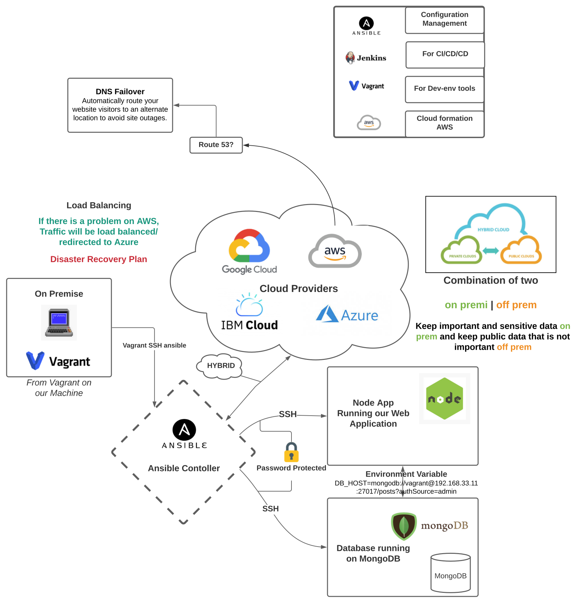
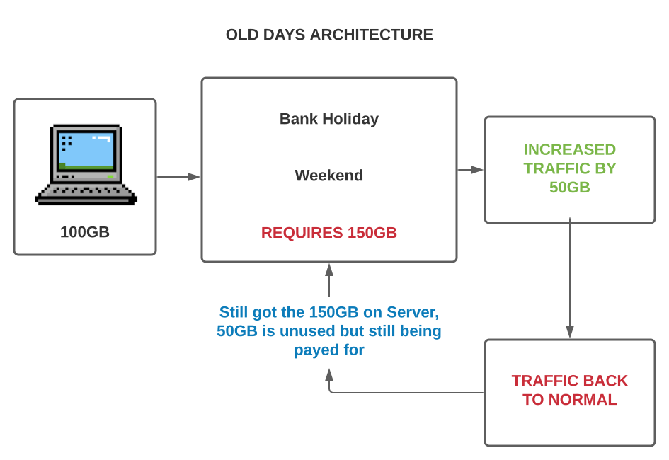

###### Sparta Global Training Day 49
###### Using Ansible to up AWS instances and provision them from single controller
___

> 9:00 AM Academy Stand up [Morning]

I got the AMI up via my ansible playbook and was able to successfully provision the EC2 instance via my controller!

> 9:30 AM Learning Theory of IAC [Morning]

_**public cloud providers**_ - AWS, Azure, GCP, IBM

_**Ansible Controller**_

_**Web App inside VM Ubuntu**_ _18.04_ 

_**This is a diagram of our IAC and work so far so we can understand the structure and tools we are using and why?**_

When you are in industry, for example you are working with **Azure** instead of **AWS** you can adopt that very quickly because you just need to change a few lines of code and it will work with the Azure cloud.

Another point about Ansible, you can specify multiple hosts: perhaps even all and it will go off and run this particular playbook in all of those servers. The playbooks contents may not need to change that drastically, perhaps maybe if they are using centOS you need to use **Yum** instead of **apt**.

### Small Exercise

* _**Mutable vs Immutable**_

* Mutable is an entity that can be changed if something makes a change or influences it. Immutable is the opposite and describes an entity that cannot be changed after it has been created, no matter what you do to it. For example in Python a tuple is a immutable object, whereas a list is a mutable object.

* **Mutable** means _**Liable to change**_

* **Immutable** means _**unchanging or unable to change**_

* However for this part we are focusing on mutable and immutable infrastructure 

* _**AWS Route53**_ [**LINK**](https://aws.amazon.com/route53/)

* Amazon Route 53 is a highly available and scalable cloud DNS web service. It is designed to allow developers to control the flow of traffic into an application, including triggering disaster recovery plans that will redirect users to another location if something happens on one location.

_An example here is A EC2 Instance running a web app from AWS goes down due to technical difficulties with Amazons own infrastructure, this would trigger the Route53 to redirect traffic to an identical web app being hosted on Azures Virtual VMs. As a result the users are not affected in any way. This app is scalable, highly available and reliable, flexible, scalable as it can handle large query volumes without any human intervention_

The feature in which you can actually redirect traffic on **AWS** is called **DNS Failover** a DNS web service. It helps redirect users to an alternate location when it detects an application is experiencing an outage. In the event an endpoint fails, Route 53 will route traffic away from the failed endpoint and to other, healthy endpoints. The redirecting could be to a different region where the outage is not present, or to a different cloud service such as Azure.

### Benefits: `Highly available and reliable`, `Flexible`, `Design for use with other AWS services`, `Simple`, `Fast`, `Cost-effective`, `Scalable`, `Simplify the hybrid cloud`

* _**Load Balancing in AWS**_ [**LINK**](https://aws.amazon.com/elasticloadbalancing/)

Load balancing distributes incoming traffic across multiple target applications, such as Amazon EC2 instances, containers, IP addresses, and lambda functions. Load balancing can also handle application traffic in a single availability zone or across multiple availability zones. 

**Three types of Load Balancing** referred to as **Elastic Load Balancing** on **AWS**

* **Classic Load Balancer** 
    * Provides basic load balancing across multiple Amazon EC2 instances and operates at both the request and connection level.
* **Network Load Balancer**
    * Network Load Balancer is best suited for load balancing of Transmission Control Protocol (TCP), User Datagram Protocol (UDP) and Transport Layer Security (TLS) traffic where extreme performance is required. Network load balancer routes traffic to targets within the Amazon VPC and is capable of handling millions of requests per second while maintaining low latency.
* **Application Load Balancer**
    * Best suited for load balancing of HTTP and HTTPS traffic and provides advanced request routing targeted at the delivery of modern application architectures, including microservices and containers. Operating at the individual request level (Layer 7), Application Load Balancer routes traffic to targets within Amazon Virtual Private Cloud (Amazon VPC) based on the content of the request.
    
### Benefits: `Highly available`, `Secure`, `Elastic`, `Flexible`, `Robust`, `Hybrid`.

**Explanation** - Times before cloud infrastructure

**Old Days** - 

Here the extra 50GB used to be an investment that would go to waste once the increase in traffic demand was met and has now return back to normal. However the 50GB is now still there and costing the company money to maintain but not being used.

**QUESTION**

**1.**  _**On AWS what do we use to monitor our EC2 instances.**_

* **Cloud Watch** on AWS
    * Amazon CloudWatch is a monitoring and observability service built for DevOps engineers, developers, site reliability engineers (SREs), and IT managers. The cloud watch provides data and actionable insights to monitor your applications, is able to monitor and respond to system-wide performance changes, optimize resource utilization, and get unified view of operation health. Cloudwatch collects monitoring and operational data in the form of logs, metrics, and events, this allows a view of both on and off premise servers.
    
### Benefits: `Observability on a single platform across applications and infrastructure`, `Collect metrics in AWS and on premise`, ` improve performance and resource optimization`, `See operational visibility and insight` and `Derive actionale insights from logs`.
    
**2.** _**What other tools are available in DevOps to monitor to infrastructure.**_
    
* **ELK Stack**
* **Splunk**

# Terraform 

### Use Infrastructure as Code to provision and manage any cloud, infrastructure or service.

A lot of todays work can be found [HERE](https://github.com/JohnByrneJames/Terraform)