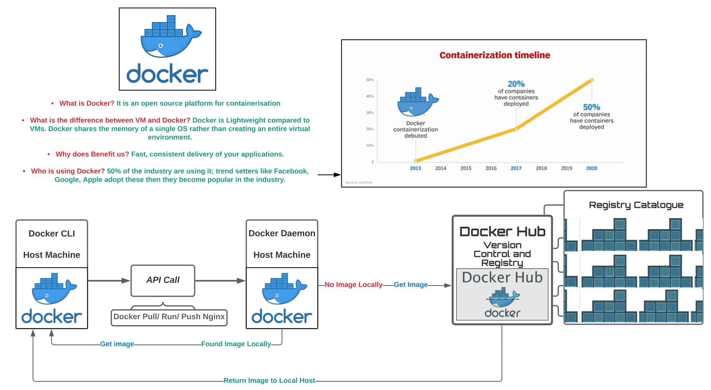

###### Sparta Global Training Day 52
###### Continuing with Docker and exploring deeper into its power
___

> 9:00 AM Academy Stand up [Morning]

I completed the exercise of creating my own repository on docker hub and then adding an image to it and pulling it down to my pc. No blockers particularly and I am looking forward to the rest of the day.

**Exercise**

1. We are going pull our image we have on our docker hub.
2. Then see it in the browser to see if it is working.
3. Get a colleagues image from their Repository.
4. run it and then view it in the browser.

If you want to delete an image in docker.

```bash
# Delete a docker image (-f = force)
docker rmi <image_name> -f

# Delete a docker container 
docker rm <container_name> -f

# Deleting my own image
docker rmi johnbyrnejames/john-eng67

# pulling down my image again (:latest = version)
docker pull johnbyrnejames/john-eng67:latest

# Check if the image was pulled successfully
docker images

# create a container and run the image in detached mode
# run it on port 99:80 as port 80 is already in use for me
docker run -d -p 99:80 johnbyrnejames/john-eng67:latest

# Pulling maxes image from Docker Hub
docker pull max476/max-docker-first:firstcommit

# creating this as a container and access it through port 100
docker run -d -p 100:80 max476/max-docker-first:firstcommit
```

* What is Docker? It is an open source platform for containerisation

* What is the difference between VM and Docker? Docker is Lightweight compared to VMs. Docker shares the memory of a single OS rather than creating an entire virtual environment.

* Why does Benefit us? Fast, consistent delivery of your applications.

* Who is using Docker? 50% of the industry are using it; trend setters like Facebook, Google, Apple adopt these then they become popular in the industry.

**Now we are going to download the docker documentation locally**

```bash
# Download the docker documentation image first
docker pull ahskhan/docker-official-doc

# run the documentation on port 4000 as a detached container
docker run -d -p 4000:4000 ahskhan/docker-official-doc:latest
```

### Diagram of Docker and how it works with the Docker Daemon

_**benefits**_ of Containers



Docker communicates with DockerHub using the API call, it comes from the client to the docker daemon which handles the images and containers, if the image is not found locally it will contact Docker Hub to get that image and then return it to the hosts machines. 

Now we are inside the NGINX folder and here and we want to locate the default HTML file for NGINX which located at `usr/share/nginx/share/html`

```bash
# navigate to NGINX default location
cd usr/share/nginx/html

# list items - should see two html files (error) and (success)
ls
```

We want to replace our the NGINX default index.html file with my own HTML file so that is displayed in the browser. I used the cp command to choose a local HTML file and place it inside the default HTML folder in my container.

```bash
docker cp index.html wonderful_bardeen:usr/share/nginx/html/

# Stop container
docker stop wonderful_bardeen

# Start container
docker start wonderful_bardeen
```

1. Refresh the web browser to see the changes
2. docker stop container
3. docker start container
4. launch NGINX localhost page - see update html page
5. view the logs of nginx container and store them into nginx_logs.txt file
6. re-tag your image and push it to your docker hub repo
7. share the link of your docker-hub images - command

```bash
# Copy in new html page
docker cp index.html wonderful_bardeen:usr/share/nginx/html/

# Stop and Start container
docker stop/start <container_name>

# view logs of nginx container

# Commit changes with new tag
docker commit thirsty_wing johnbyrnejames/john-eng67:newindex

# push changes to the repo with new changes
docker push johnbyrnejames/john-eng67:newindex
```

This is the link of my [**Docker-Hub**](https://hub.docker.com/repository/docker/johnbyrnejames/john-eng67/general) Repo.

Now lets create the **Dockerfile**, and place the app1 folder inside the directory so it can copy into our new images directory.

```bash
# Run Dockerfile (. = pick dockerfile from current directory)
docker build -t johnbyrnejames/nginx-app:v1 .

# push our new image to our Dockerhub . = 
docker push johnbyrnejames/nginx-app:v1
```

We then went inside the image, and then changed the html file, and it instantly refreshed the changes in our container app running in our local host.

This is how you create a microservice, you detach the service from the code and allow it to be accessed. Go inside the code and look at the code to see what code is separated into separate parts. 

### Micro Services

* Microservices - also known as the microservice architecture is an architectural style that structures an application as a collection of services that are:
    * Highly maintainable and testable 
    * Loosely coupled
    * Independently deployable
    * Organized around business capabilities
    * Owned by a small team
    * Relates to Agile when it is segregated and small bits being worked on with small teams.
    
* Talk to each other through networking tools: Kubernetes, Docker Compose/ Swarm.
    
### Monolith Architecture

* It is slow and relies on the hierarchy to load and run for the user, typically you won't know where a particular problem is as it is all connected.

### Whats the difference?

* **Why do we still have monolith?** : better for basic small companies, the microservices are quite a complex network which are better for larger companies.

**Paypal website** use Microservices Architecture

**Independent Corner Shop website** use Monolith Architecture

**Lots of teams** each microservice needs a team; therefore it can be expensive to pay all these employees/ developers.

### Exercise for today

* Dockerise the sparta-node-app
* Launch it with port:3000
* push it to your docker hub
* Create a detailed README.md with Monolithic VS Micro-services Architecture
* Use cases of both architectures implementations, where they can be used and should be used.

* Create a image for MongoDB containerise it
* Connect it to node-app we created
* Create a volume to make data persistent
* Use docker compose to launch the full app
* Get localhost:3000/posts to load

___

The mongodb default config file is located in `/etc/mongod.conf.orig`

