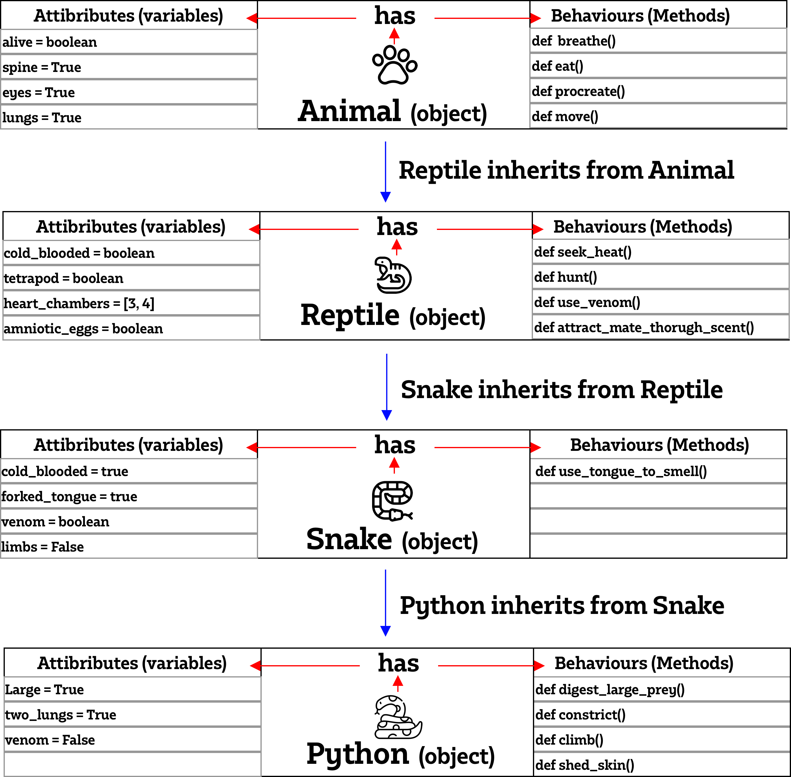

###### Sparta Global Training Day 13
###### Python starting...
___

> 9:00 AM Stand-up [Morning]

Yesterday was quite enjoyable for me, I have always been looking forward to getting into the world 
python and yesterday was the first proper day we started to comb over the concepts of the interpreted language.
As I have used other languages in the past I have noticed small differences in the syntax and the reduced need for constant 
instruction, instead Python will attempt to interpret everything you are trying to achieve in the program. It is clear to see 
why it is such a powerful and widely used language and I am looking forward to getting more and more into it 
particularly the advanced concepts such as functions and the object oriented programming. Good pace, just fast enough.

# Concepts of Object oriented programming
* **Abstraction**
* **Encapsulation** 
* **Polymorphism** 
* **Inheritance** 

**Analogy...**

Some people find it basic but relates to all of us.

>Similarly when you are a baby you cannot walk on your own, you needed that support. 
Now you are able to support yourself but you needed that helping hand and support whilst you 
were younger, its the same with Python let yourself absorb the knowledge and learn these things 
until you are confident enough to explore and expand your knowledge on your own. It is 
important to understand the building blocks of python, otherwise the advanced python wont make sense.

# Abstraction

> Abstraction means hiding the complexity and only showing the essential features of the object.
This is achieved using abstract classes and interfaces. An abstract class is a class that generally
provides incomplete functionality and contains one or more abstract methods. Abstract methods are the methods
that generally don’t have any implementation, it is left to the sub classes to provide implementation for the
abstract methods.

When using methods in our code the outcome was "woof", we abstracted the method here the user does not know
what is happening behind the scene.
```python
def bark(self):
    return "woof"

print(fido.bark())
```

# Inheritance

>Inheritance allows us to define a class that inherits all the methods and properties from another class.
Parent class is the class being inherited from, also called base class.
 Child class is the class that inherits from another class, also called derived class.

If there was an animal class, we could inherit its attributes and functionality into two 
classes known as snake and dog, they are both animals and will be able to use the methods
and attributes already defined in the animal class.

```python 
snake(Animal)
print(animal.sleep())
```

# Polymorphism

> This allows us to define methods in a child class with the same name as defined in their parent class.
Using the same name helps your program look more intuitive and easier.
A child class inherits all methods from the parent class, however in some situations
the method inherited from the parent doesnt fit the child class.

We can inherit as well as override particular attributes or behaviour without affecting the parent class. 
This is a class that can exist in multiple instances and one change will not affect them all, therefore it is
safe to change attributes.

# Encapsulation 

>The idea of wrapping data and methods that work on data within one unit. It puts restrictions on
on accessing variables and methods directly and can prevent the accidental modification of data.
To prevent accidental change, an object’s variable can only be changed by an object’s method.
Those type of variables are known as private variable.

making variables or even methods private to the user so that they cannot be accessed outside of a class unless
they are going through the object. It is done on certain attributes if they are not allowed to be changed outside or 
if they should remain static. The double underscores are what makes the function sleep, private.

```python
def __sleep():
    return "This is a private function."
```

[**Python Libraries**](https://docs.python.org/3/library/) <br> **Very Useful!** has a lot of information about the python functions and concepts.

> **~ Today's Python Files ~** <br>
* [**functions**](../../Python-Files/Revision-Files/function.py) :page_with_curl:

* [**math_functions**](../../Python-Files/Revision-Files/math_functions.py) :page_with_curl:
* [**oop_classes**](../../Python-Files/Revision-Files/OOP-FIles/oop_classes.py) :page_with_curl:
* [**dog_oop**](../../Python-Files/Revision-Files/OOP-FIles/dog_oop.py) :page_with_curl:
* [**got_two_oop**](../../Python-Files/Revision-Files/OOP-FIles/dog_two_oop.py) :page_with_curl:

___
**Homework**

* Look into 4 OOP pillars
* Look at `__init__` of a class instance and how `super()` is used in python is used.

* Create a Parent class called animal with class name animal. <br>
  Create a file called Snake and import reptile <br>
  Create a file called Reptile and import Snake <br>
  Create a python file - Why? (Explanation of Exercise is below) <br>
  Include Pseudo Code as well.
  
