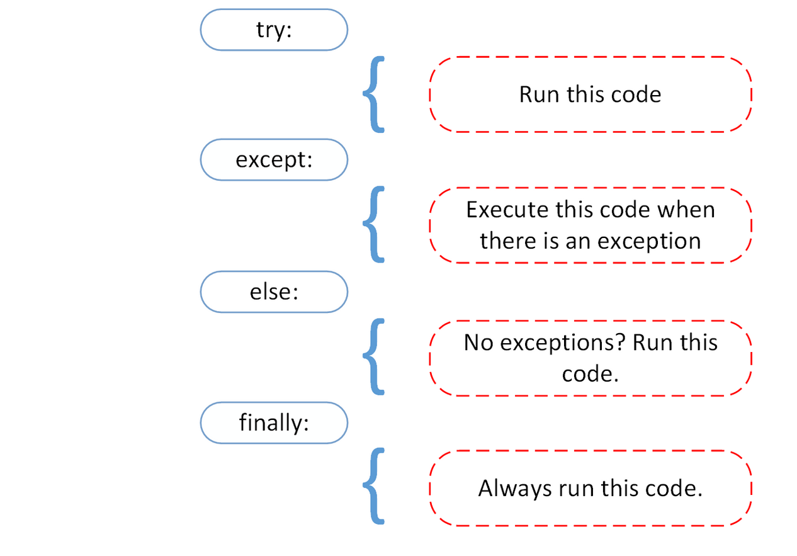

###### Sparta Global Training Day 18
###### Going over Python concepts again to really get them, also we are covering the TDD (test driven development).

___

> 9:00 AM Stand-up [Morning]

Exercise set from 9:00 - 9:30 AM

> • Create 2 Python files and one README.md in a new project  
> • Create a class calculator with basic calculator functionality **+ / * -**  
> • Import parent class into child class  
> • Test functionality in child class  

This exercise can be found here [**Morning-Exercise**](https://github.com/JohnByrneJames/oop_calculator)

I enjoyed yesterday and really was excited to get into JSON and XML type data formats as it is quite a popular way
of communicating data over the internet, particularly the API aspects as they return large amount of data. The last hour that we
got free was really good as it allowed us more time to talk after the lesson and personally more time to work on revision.

**File Handling**

To do : **_Today's Goals_**
* Reading from and writing to files [**Main.py**](../../Python-Files/File-Handling/main.py), [**textfile.py**](../../Python-Files/File-Handling/textfile.py)
* Exception handling 
* CSV
* Assignments

**Exception Handling**

Exceptions try [ Code to be run ~~ may raise an exception ] except (general / or pointed exception) [ do something to inform user of exception ]
finally [ code that will always run finally, despite any exceptions ]

If you have an error that is an exception then it will happen during runtime and cause the program to come to a
abrupt exit. This is why we handle them with exceptions.

We also have talked about debugging in the environment as well, it can be used with breakpoints which can be placed
throughout the code - these breakpoints will prompt the debugger console to appear where you can manually move the interpreter
through the code step by step, this is useful to find errors and problems in large processes.

**Shortcut**:
* In PyCharm to reformat a piece of code/ file you can use the shortcut `Ctrl + alt + Shift + L`

**Dynamically generated programming languages** :
* Interpreter based languages like the Python interpreter actually run the code during runtime and deal with the
syntax as it comes up. For example you don't label the variables, the interpreter will automatically interpret what type
your variables will be.
* Compiler based languages like C# interpret the code before then run it through the compiler once its compiled.

___ 
**Homework** and **Assignments**
* Accept from the user some text. Ensure user enters something else raise an exception.
After that write that text to a file and then read from this file to  write to another file simultaneously
* Reading an image to  writing to another file simultaneously