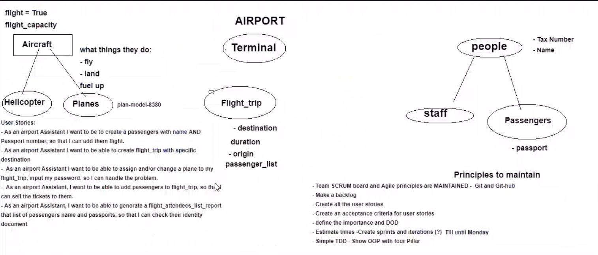

###### Sparta Global Training Day 21
###### Official Python test is today, starting at 10:00AM
___

> 9:00 AM Stand-up [Morning]

The stand up this morning was quite small, it took place at 9:30 because of the trainers meeting, however it
was quite small as everyone wanted to get on with their revision for the upcoming Python test at 10:45. Thankfully I had
little blockers over the weekend and just refreshed some stuff in the morning. I spent a large portion of my weekend looking into
advanced concepts such as user-defined exceptions and recursion in methods, which paid off as the test had recursion in its
most difficult form. A feat that is difficult to accomplish if you don't understand how it works.

:star: I got **100%** :star:

Happy with the result, however in the future I want to mold my problem-solving skills to grasp onto an immediate
answer that is intuitive as I wasted time messing with basic concepts.

> 1:30 AM Stand-up [Early-afternoon]

**Presentations** of other trainees who hadn't done it last week.

> 4:00 AM Stand-up [Late-afternoon]

**Groups for Project**
* **John**
* **Sohaib**
* **Max**

**The plane Project** -- 

___
**Homework**
* write the README.md in [Database-connection](../../Python-Files/Database-Connection)
* Finish of Flask Login page [FLASK](../../Python-Files/app)