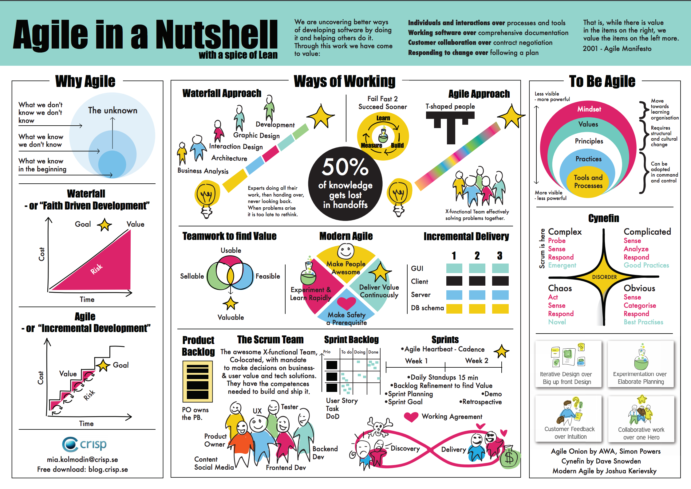

###### Sparta Global Training Day 26
###### This week we are preparing for our interviews with the sales team, but first we must present our project week presentation from last week again.
___

> 9:00 AM - 9:30 AM Stand-up [Morning]

We need to go through our notes and look at how we presented last week, making sure we record three positive and negative points
about the presentation. This is a good way to improve in the future as you are identifying your weaknesses during a presentation.

**Presentation Review**
* **Constructive**
    * Try to talk with more enthusiasm about your code and work, especially if you are not delivering anything that is
    well known by a client as it could help them to also get excited about the presentation / project being shown.
    * Always makes sure you focus on the viewers, even though my presentation was on the second monitor I had to look away from the
    audience to demonstrate the functionality, however the occasional look back at the audience keeps them engaged and makes them feel
    like they are being talked to and not at.
    * I need to make sure there are a fair amount of power words in the presentation as they can get the audience and myself
    more enthused. I also need to make sure that the project isn't too technical as is likely that clients who are viewing the project
    presentation will not have a lot of technical knowledge and won't understand.

* **Positive**
   * Spoke with a clear voice, whatever I said was properly conveyed to the viewer and I had a bit of a understanding tone, it showed that I
   was not just babbling about the technical implementation but more focusing on my knowledge of how it works and trying to keep
   the demonstrating less technical and more functionality for any non-technical end-users.
   * I think I presentation was quite well presented in terms of who it was for, someone who is not technical, it shows all the good points
   of the program and also confirms the functionality by walking through that each user story has been completed successfully.
   * I was confident in the program, particularly the part I made. I think that conveyed in the presentation.
   
**One-to-one** with Shahrukh

I really appreciate the shout out in the academy for the 100% achieved in the Python exam, it was a big surprise.
It gives me a lot of motivation to keep doing my best so thanks for that.

---

**Notes** on one-to-one

- We will time-box our meeting for 10 minutes
- Please take notes, as you will be expect to email us the summary of our conversations...
- How did you think this week went?
>**"** I think this week went really well, it was nice to have a small group to work in day-in day-out as it actually is a great
>representation of how it is to work in an agile environment in industry. Our group was also quite diverse in terms of technical skills,
>this meant that there was a lot of help needed in some parts so it showed how it is difficult to work in an environment that requires your attention
>to work as well as help others. I was happy to help my team actually because not only does it enforce the concepts into myself but also teaches them something new.
>I think I was the Git Master as I had the most knowledge and experience in it, so guided the group in the creation of branches and
>made sure everyone felt involved and had a feeling of learning. I let them all merge their own branches towards the end as it is easiest to
>learn from doing. I also learnt that it is important to respect your colleagues, I am quite a perfectionist so I made my code in a way that I like, their
>code is a lot different and made in their own fashion which isn't always good for me but it is important to put that aside and focus of working as a team. This
>paid off in the end as we merged all our work into one program which I was quite proud of.
>**"**
- From the behavioural competencies one competencies do you think you are excelling and which competencies you need to work on?
>**"** I think I have been very adaptive this week in terms of working with others and not doing what I usually do; which is
>take over to make sure everything is 'PERFECT'. It felt good to adapt and in the end it all worked out, it is defiantly going to be with me
>for a while and help me progress as a team-worker and good person. The person I live with is a project manager at HSBC and he overheard my group work
>and said he thinks I sound like a natural leader the way I conducted the group and presentation.
>**"**
- One thing to start doing? 
>**"** I need to work more on my organisational skills, I am quite organised but I think I need to make myself more motivated to do stuff
>even if it is a pain to do. 
>**"**
- One thing to stop doing? 
>**"** I need stop drifting off during the training, sometimes I find myself part listening and part looking at something else. This is a bad habit
>as I think it looks bad, although I am usually just making notes on the side but it should be left for a more convenient time when there is no teaching.
>**"**
- One thing to continue?
> **"** Continue making sure I am up to date with all the latest changes.
> **"**

**Positive** 
- Shahrukh said that he is very happy with my current progress at this point, I seem to be competent with the technologies we have used so far
and he has no worries as to my progression as it looks like I am doing well.

**Constructive** 
- Shahrukh mentioned that he has noticed I get a little down whenever I am given constructive feedback. This is great feedback as I was
actually totally unaware of this - I thought of my self as someone who loves constructive feedback as it helps you grow as a person both technically
and in non-technically.

___

> 10:00 AM Presentation preparation [Morning]

## **Presentation in front of Academy 30+ People**

___

> 13:15 PM Soft skills revision [Afternoon]

**STAR**
* Situation
* Task
* Action
* Result

**Give example of STAR** in your life

### **Agile** is a methodology [IMPORTANT]
### **SCRUM** is a framework [IMPORTANT]

**Simple Questions**
* What is the different between Agile and SCRUM?

Make sure you answer with **STAR** and include examples of where this has been implemented by yourself, for example
agile is a methodology it allows us to split our project into sections of implementation and **SCRUM** is the framework
that drives the agile methodology, it organises the way it is carried out by stand-up and the iterative approach.

Completed online **STAR** [**HERE**](https://forms.office.com/Pages/ResponseDetailPage.aspx?id=fMYV_3Aon06twX1h2FW2Z79EQBoj-m1FvzgXyOfwAJVUREREODhTTjQ1R0pFQk0xN0FQMlhLOEFIVS4u&rid=17&GetResponseToken=-PgxhAdMudRLVUQTSWIJ7YMdr8aK0AsY416ACHlC1lw)

**Revise for rest of day, waiting for Interview to come through**

**Interview with Shahrukh**

It went okay, there was no technical questions as Shahrukh knows that I am quite proficient in my technical knowledge, so there was litte to no
questions about that - but 

**My Notes for the interview**
___
>Studied at Greenwich (1st) Studying --->
>
>Training to become a DevOps consultant at SpartaGlobal
>
>Proficient in C#, SQL, Git and Python
>
>Passionate about technology, specifically fields such as DevOps which offer such a diverse range of opportunities and technologies to learn.
>
>Experience with IDEs such as PyCharm, Visual Studio, Microsoft DBMS, Azure Data studio and Unity Games Engine
>
>Familiar with the agile methodology and SCRUM framework
>
>I appreciate this opportunity, and look forward to hearing more about the opportunity.
>
>---------------------------------------------------------------------------------------
>behave competencies - Imaginative, Studious, Professional, Determined, Independent and Analytical
>
> ###AGILE
>continuous iterations (dev/test) - encourages concurrent testing and development
>break project into small parts
>encourage face-to-face comm / teamwork (cross-functional teams stkholder, dev, bus)
>SCRUM
>agile process with a focus on delivering business value i nthe shortest time.
>inspects software iterably (emph accountability, teamwork, goal driven).
>framework focused on gradual and changing requirements that come through dev
>react to changes as the process is always being insepected/ assessed each step
>
>artefacts - sprint goal, product backlog, sprint, DOD
---------------------------------------------------------------------------------------
>**1 NF** - atomic so data is small as it can be (singular values)
>
>**2 NF** - all non key are functioanly dependent on PK
>
>**3 NF** - A non-key col is dep on another which is dep on PK
---------------------------------------------------------------------------------------
>**Poly** - Polymorphism is taken from the Greek words Poly (many) and morphism (forms). It means that the same function name can be used for different types. This makes programming more intuitive and easier.
>
>product bklg, sprint bklg, DOD, sprint goal, prdct vision, increment
>
>sprnt pln, sprnt rev, sprn retro, daily SCRUM
>
>
>**To DO :**
>
>FIZZBUZZ
>SCRIBLE
>20 examples
>Let them know about achievements, 100% achievement and GitHub knowledge in elevator pitch
>Include examples of STAR, FIZZBUZZ, SCRUBLE in your response

**Interview time**
* **11:40 AM - with Tim Mccarthy** 

Be back in class at 3:30 PM 

___
**Homework**
* Practice STAR responses, with 20 examples practice your STAR response so it can instantly 
be retrieved if it is asked in an interview.