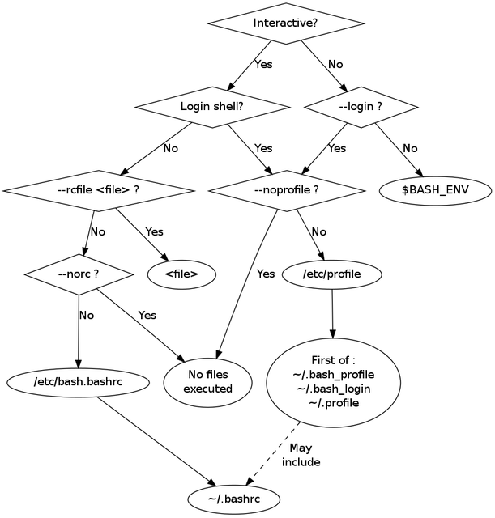

###### Sparta Global Training Day 33
###### Continuation of Vagrant and Oracle VM box

___

> 9:00 AM - 9:30 AM Self-revision [Morning]

Finished off my DB and APP Virtual Machines, the DB has been loaded with MongoDB, this process was then set as a provision.
So when the virtual machine(s) is first created with `vagrant up` then the VMs are created with the mongoDB already in it. This
is a multi-machine environment which means there is two or more machines running in one `VagrantFile`.
* **db**
* **app**

It is created in [**THIS**](https://github.com/JohnByrneJames/VM_MultiMachine) GitHub repository.

> 10:00 AM Stand up [Early-Morning]

Yesterday was good I enjoyed learning the types of automation that are possible within Virtual box and the shell interpreter within
the bash terminal. I want to have a good idea of what automating a process looks like now, I definetly want to try automate a github process
in my own time to further enhance my own experience.

**Running Tests for db and app**

from within `/d/VM_MultiMachine/tests/spec` do the command `rake spec:db` or `rake spec:app`

I also added the code:

```bash
sudo systemctl enable mongod
```

This will then set the service to start on boot of the virtual machine, meaning you do not have to keep running start every time.

**Running Tests**

What are these tests, why do we need to do them? and real life tests.

I also had to change a couple things in the `VagrantFile` and `Provision.sh` file in the `environment/db` directory.

**Variables VS Environment Variables**

* How to create a variable in Linux

```bash
name = "eng67"
```

* How to display a variable value

```bash
echo $name
```

* Store command value in your var and display it ~ 

```bash
dir=$(pwd) 

echo $dir
>>> /home/vagrant/app
```

So store the command `pwd` inside the variable `dir`. Next time you enter `dir` your will do the `pwd` command.

* Variables - temporary variables

So when you exit the VM and come back these variables won't be there anymore.

* Environment variables - Persistent variable

To do this we do the following command with keyword `export`:

```bash
export name="eng-67" 
```

In order to see all the variables in an environment you use the command:

```bash
env
```

> 13:30 PM Continuing with variables in Linux [Early-Morning]

**Exercise**
Create a variable inside a bash script and run it, below are the commands I used to do that:

```bash
# Create a .sh file with
touch env_var.sh

# Go inside and add the following
nano env_var.sh
> #!/bin/sh
>
> export group="eng-67"
> echo $group
>
> dir=$(ls)
> echo $dir

# give file perms and run it
chmod +x env_var.sh
./env_var.sh

```
**Database**

Now we are going to set this database variable as a persistent variable inside our database virtual machine environment.

`export DB_HOST="mongodb://192.168.10.111:27017/posts"`

In order to make this a persistent variable there were 3 steps:

* Add it to the `.profile` file which is visible with `ls -a` 

```bash
ls -a

nano .profile
# Scroll to the bottom and add the line

DB_HOST="mongodb://192.168.10.111:27017/posts"
```

* Then we need to add it in the `.bashrc` file

```bash
nano .bashrc

#At the bottom of the file add this line:

export DB_HOST=mongodb://192.168.10.111:27017/posts
```

This is then set in the etc/environment variables when you reset the environment by `exit()` and then `vagrant ssh app`
to come back in, it will be visible inside the environment variables with `env`

I also added an automated file to do it all for you:

```shell
#!/bin/bash
echo "Enter variable name: "
read variable_name
echo "Enter variable value: "
read variable_value
echo "adding " $variable_name " to environment variables: " $variable_value
echo "export "$variable_name"="$variable_value>>~/.bashrc
echo $variable_name"="$variable_value>>~/.profile
echo $variable_name"="$variable_value>>/etc/environment
source ~/.bashrc
source ~/.profile
echo "do you want to restart your computer to apply changes in /etc/environment file? yes(y)no(n)"
read restart
case $restart in
    y) sudo shutdown -r 0;;
    n) echo "don't forget to restart your computer manually";;
esac
exit
```

**Linux Commands Diagram**



We changed some parts of our VagrantFile so that the environment variable was made during creation of the virtual machines.

After lots of fiddling the database was successfully connected and we could actually load the posts page.

before it worked we had to install npm with `npm install` which installed all the dependencies that were required
and this then allowed the data to be loaded on the posts page.