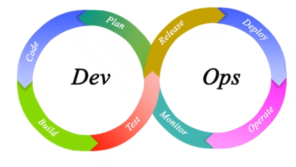
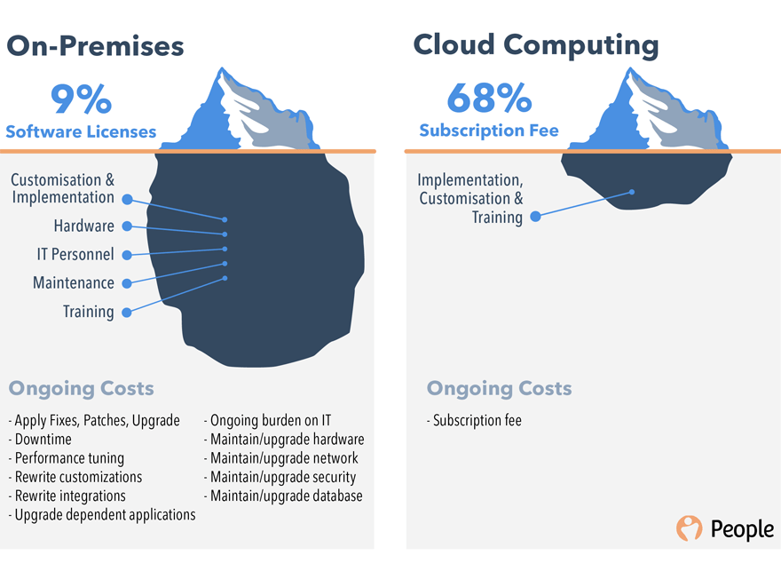
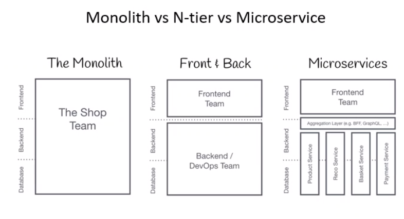
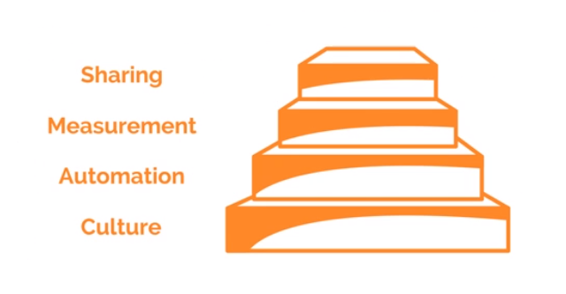
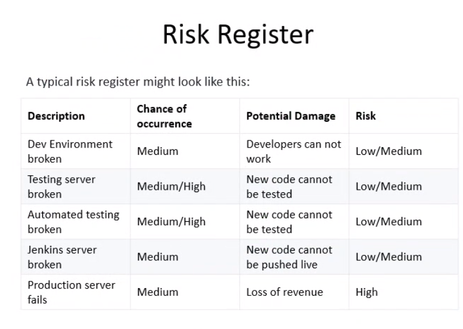
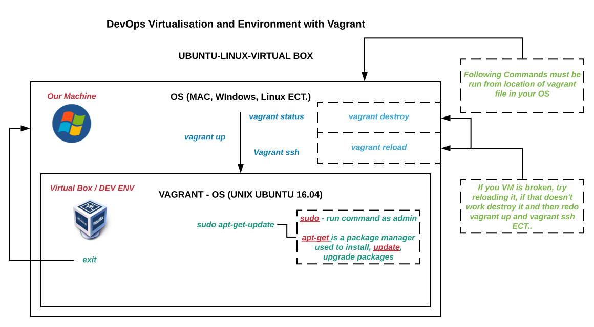

###### Sparta Global Training Day 31
###### We are learning about DevOps today and then 4-5 interview with Richard
___

> 9:00 AM - 9:30 AM Stand-up [Morning]

I spoke about the struggle of setting up the VM and Visualisation on my machine and how I finally figured it out on the weekend.

**Introduction to DevOps**



**Content**

* Why do we need DevOps
* What is DevOps
* DevOps Lifecycle
* DevOps Implementation
* Risk Register 

*DevOps* aims to improve production and development of any software development process in business. Before
DevOps there was always a constant argument between the Development and Operations team. However when DevOps came around
these individuals were involved in every aspect of the development process and could help deploy it.

**Infrastructure Revolution** 



**Application Design Patterns**



**Four Pillars of DevOps**
* Ease of Use

* Flexibility
* Robustness
* Cost

**What is DevOps**

**Practical Definitions**
* A **Collaboration** of Development (Dev) and Operations (Ops).
* A **Culture** which promotes collaboration between Development and Operations Team to deploy code to
production faster in an automated and repeatable way.
* A **Practice** of development and operation engineers taking part together in the whole service lifecycle.
* An **Approach** through which superior quality software can be developed quickly and with more reliability.
* An **Alignment** of development and IT operations with better communication and collaboration.

## **DevOps Value**

## **CAMS Model**



Really good CAM resource [**HERE**](https://squadex.com/insights/how-to-implement-devops-with-cams/)

## **DevOps Principles**
1. Customer-Centric Action
2. End-to-End Responsibility
3. Continuous Improvement
4. Automate everything
5. Work as one teams
6. Monitor and test everything

## **Stages in DevOps LifeCycle**


* Continuous Development
* Continuous Testing
* Continuous Integration
* Continuous Deployment
* Continuous Monitoring

## **DevOps implementation**

* **Cloud Platform**
    * AWS
    * GCP
    * Azure
* **Infrastructure Architecture**
    * Virtualisation
    * Containerization (Docker)
* **DevOps Implementation**
    * Infrastructure as code (IAC)
    * Infrastructure as a service (IaaS)
    * Infrastructure as a platform (IaaP)
    * Infrastructure as a product

## **Risk Register**



# Starting on The Oracle VirtualBox

navigate to the Virtual Box location in the git Bash run as administrator. Do

```bash
vagrant status
```

This will give us the status of the virtual box, if it is running or not. Then run this command to run the
virtual environment.

```bash
vagrant up
```

Go to the place where the virtual box has been created.

```bash
vagrant ssh
```

This puts us inside the virtual box environment, in our case. Then we run the command:

```bash
sudo apt-get update
```

This commands updates the virtual box environment.
* **sudo** - run command as admin
* **apt-get** is a package manager used to install, **update**, upgrade packages

A great cheatsheet for vagrant commands can be found [**HERE**](https://gist.github.com/wpscholar/a49594e2e2b918f4d0c4)


**Diagram of Virtual Machine and Vagrant ECT**

