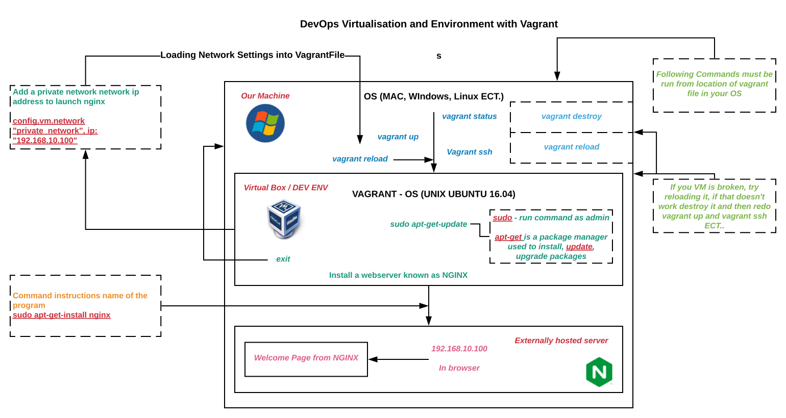

###### Sparta Global Training Day 31
###### We are learning about DevOps today and then 4-5 interview with Richard
___

> 9:00 AM - 9:30 AM Stand-up [Morning]

I spoke about the struggle of setting up the VM and Visualisation on my machine and how I finally figured it out on the weekend.

**Introduction to DevOps**


**Content**

* Why do we need DevOps
* What is DevOps
* DevOps Lifecycle
* DevOps Implementation
* Risk Register 

*DevOps* aims to improve production and development of any software development process in business. Before
DevOps there was always a constant argument between the Development and Operations team. However when DevOps came around
these individuals were involved in every aspect of the development process and could help deploy it.

**Infrastructure Revolution** 


**Application Design Patterns**


**Four Pillars of DevOps**
* Ease of Use

* Flexibility
* Robustness
* Cost

**What is DevOps**

**Practical Definitions**
* A **Collaboration** of Development (Dev) and Operations (Ops).
* A **Culture** which promotes collaboration between Development and Operations Team to deploy code to
production faster in an automated and repeatable way.
* A **Practice** of development and operation engineers taking part together in the whole service lifecycle.
* An **Approach** through which superior quality software can be developed quickly and with more reliability.
* An **Alignment** of development and IT operations with better communication and collaboration.

## **DevOps Value**

## **CAMS Model**


Really good CAM resource [**HERE**](https://squadex.com/insights/how-to-implement-devops-with-cams/)

## **DevOps Principles**
1. Customer-Centric Action
2. End-to-End Responsibility
3. Continuous Improvement
4. Automate everything
5. Work as one teams
6. Monitor and test everything

## **Stages in DevOps LifeCycle**


* Continuous Development
* Continuous Testing
* Continuous Integration
* Continuous Deployment
* Continuous Monitoring

## **DevOps implementation**

* **Cloud Platform**
    * AWS
    * GCP
    * Azure
* **Infrastructure Architecture**
    * Virtualisation
    * Containerization (Docker)
* **DevOps Implementation**
    * Infrastructure as code (IAC)
    * Infrastructure as a service (IaaS)
    * Infrastructure as a platform (IaaP)
    * Infrastructure as a product

## **Risk Register**


# Starting on The Oracle VirtualBox

navigate to the Virtual Box location in the git Bash run as administrator. Do

```bash
vagrant status
```

This will give us the status of the virtual box, if it is running or not. Then run this command to run the
virtual environment.

```bash
vagrant up
```

Go to the place where the virtual box has been created.

The alternative of running a VM is to go to the VM and right click, then press show to run it that way.

```bash
vagrant ssh
```

This puts us inside the virtual box environment, in our case. Then we run the command:

```bash
sudo apt-get update
```

This commands updates the virtual box environment.
* **sudo** - run command as admin
* **apt-get** is a package manager used to install, **update**, upgrade packages

A great cheatsheet for vagrant commands can be found [**HERE**](https://gist.github.com/wpscholar/a49594e2e2b918f4d0c4)


**Diagram of Virtual Machine and Vagrant ECT**


To set updates to happen automatically you can use the command:

```bash
sudo apt-get update -y
```

We also learnt how to create, for example a README.md file inside the cmd line using:

```bash
nano unix_commands.md
```

Nano is a editor we can use the command line.

## Some Unix Commands

**Where are you in the directory?**

```bash
pwd
```

This command prints out the current working directory.

**Who am I?**

```bash
who
```

This command prints out the current machine you are on, so in this case vagrant run VM

**What do I have available in the current directory?**

```bash
ls
```

To reveal the hidden files use the -a (all) extension too:

```bash
ls -a
```

**How can I find out the name of the system I am using?**

```bash
uname
```

This prints out the name of the system you are currently working on, in this case **Linux**

**How can we create a file?**

```bash
touch myfirstfile.txt
```

This will create a txt file inside the current directory.

**How can we make a directory?**

```bash
mkdir myfirstdir
```

This creates a directory in your current directory (ls) to show

**How to navigate inside a directory**

```bash
cd myfirstdir
```

This will navigate inside the directory

**How to navigate back out of the directory**

```bash
cd.. 
```

This will then take you back out of the directory, back by one level.

**How to navigate back out of the directory**

```bash
cd
```

This will take you back to the root directory of your application, could be C:/ on my computer or
home/ inside the virtual machine.

> 1:30 PM Back to VM and Vagrant [Afternoon]

**SUDO Commands - This is an administrator command**

**How do we remove a file?**

```bash
sudo rm myfirsttext.txt
```

this will remove the text file that has been specified from the directory. This cannot be done with directories.

**How do we gain access to the root or admin user in the virtual machine?**

In order to gain access to the root user in Linux you need to use the command:

```bash
sudo su
```

This sets yourself into a super user, e.g. an admin, to undo this you can simply use the `exit` command to
return to normal user status.

**How do we check who is using the virtual machine?**

```bash
id
```

Using this command will tell you info about yourself and any other users using the virtual machine.

**To print to the terminal**

```bash
echo "message"
```

# **Installing NGINX with package manager**

To install a program through Linux we need to use the package manager `apt-get` this package manager
is different between versions of linux but have a list of popular packages and installs them when they are requested by the
user.

To install **NGINX** we use the command:

```bash
sudo apt-get install nginx
```

sudo is not needed if you are already on the **root** but will not cause an error either way.

To check if the service is running you need to use the following command:

```bash
systemctl status nginx
```

This is will give us the status of the **NGINX** service, alternatively you can replace this with `start` and `stop` commands.

Inside the `Vagrantfile` you need to include a new line of code (network):

```bash
config.vm.network "private_network", ip: "192.168.10.100"
```

This line of code is creating a private IP to access our **NGINX** server on the web from inside the Virtual machine. After
this we now need to reload the vagrant file, so it knows what we are now trying to do additionally.

Now we run the VM again with `vagrant up` then navigate to `192.168.10.100` on your browser and you can see the **NGINX** welcome page.

**Second Iteration of the Diagram detailing cycle of operations from today's training**



**Redirecting the Network address**

As a side note - the vagrant file is written in **Ruby**

```bash
config.hostsupdater.aliases = ["development.local"] 
```

Here we are redirecting the host to this specified alias. In this case `development.local`. Then do the
`reload vagrant` command afterwards. This gave an **Error**

To fix the error we then had to install a vagrant plugin using the following command:

```bash
vagrant plugin install vagrant-hostsupdater
```

**Then...**

```bash
vagrant reload
```

This will successfully reload the VM. This can then be reloaded and ran. Now we can access the **NGINX**
server via the alias we just gave it. Type `http://development.local/` in the browser and it will load the **NGINX** server
welcome page.

## Exercise 4 - 5

We used the following command:

```bash
vagrant destroy
```

This destroyed our Virtual Box and now we have been tasked to go through today's tasks and do everything ourselves,
including adding vagrant.