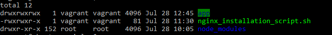
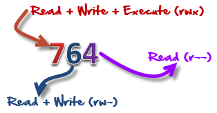
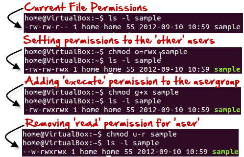
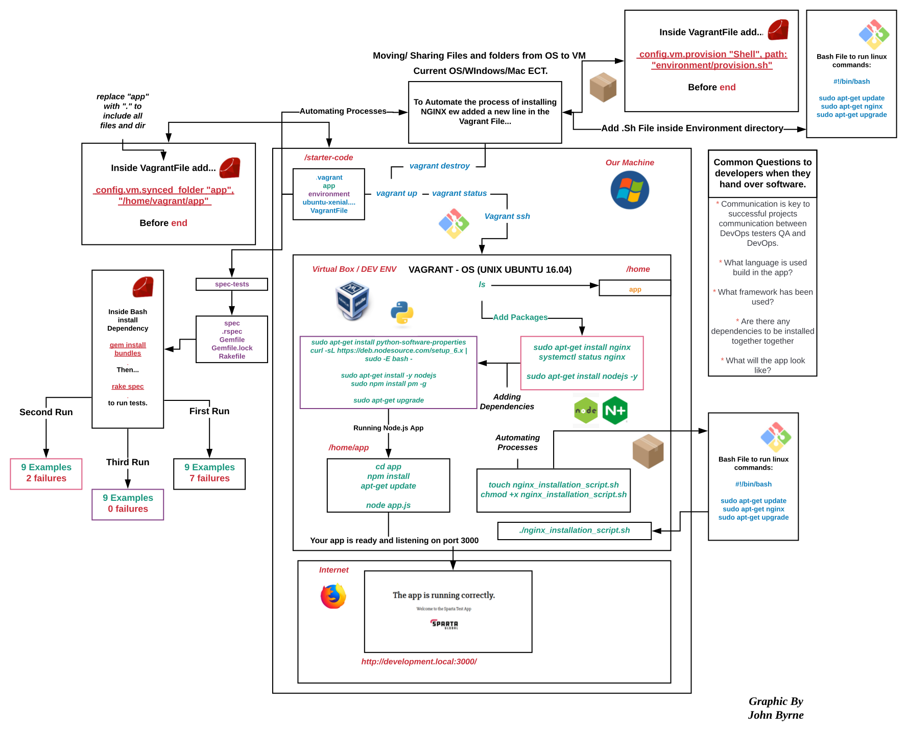

###### Sparta Global Training Day 32
###### Continuation of Vagrant and Oracle VM box
___

> 9:00 AM - 9:30 AM Stand-up [Morning]

Yesterday went well, I enjoyed learning about Linux and its intricacies. It is clear to see why it is a preference for
the DevOps role due to its ability to do almost anything inside its OS and ease of use, particularly how easy it was to
download and set up the **NGINX** server. I would like to know how to host the server publicly from inside the virtual machine too
but I think I will look into that eventually.

Enjoying the completely command line based environment, it makes sense as it is directly talking with the computer
which significantly increases the speed at which the processes are carried out. It also is quite exciting to
work without a GUI as it makes you feel more technical.

> 9:30 AM Training in VM [Early-Morning]

**Moving Folders from OS to VM**

Today we will discuss how to move folders and files from our own OS to the VM we are setting up.
We have a folder with a folder called app, we want to move that into the VM. so inside out `VagrantFile` we add the following
line:

```bash
config.vm.synced_folder "app", "/home/vagrant/app"
```

As this is a new folder, we first need to initialise the VM, to do that we are using the:

```bash
vagrant up

vagrant status

vagrant ssh
```

Once we are inside the VM we then ran the command `ls` which displayed our app folder inside the VM.


**Common Questions of DevOps in industry**

Communication with the developers when they hand over a software, there are some common questions.

* Communication is key to successful projects communication between DevOps testers QA and DevOps.
* What language is used build in the app?
* What framework has been used?
* Are there any dependencies to be installed together together
* What will the app look like?

**Requirements**
* Node app requires nodejs to be installed
* Ruby to be installed to run the tests

**Now we are going to try run some tests**
From the base file, we navigate `/D/VM_SecondEnv/Environment/spec-tests`

We then had to run a the following command:

```bash
bundle
```

This did not work as it required some dependencies that we didn't have. In order to fix this we needed to install that
dependency using the following command:

```bash
gem install bundler
```

This then said that 1 gem has been installed. The gem install is a ruby module, and it installs everything needed.
After we installed the bundle, which finished with the message: `Bundle complete! 2 Gemfile dependencies, 16 gems now installed.`

Now we are going to run a test known as `rake spec`, we are expecting tons of errors. In the spec-tests file
there is a file called Rakefile that contains all the tests that are going to be run. This file ran 9 tests, 7 failed
and 2 passed which were the ones testing for `Git` installation which is true.

Now to satisfy the tests that have failed we need to install and run both **NGINX** and **NODEJS**

```bash
apt-get install nginx
systemctl status nginx
```

After that we need to install **NODEJS**

```bash
sudo apt-get install nodejs -y
```

This has then returned the tests at success, it says there are only 2 failures. So we are to correct 1 by installing `PM2`.

To do this I first had to install a package called npm with the following command:

```bash
apt install npm
```

Then after that I went on to install pm2 with this command:

```bash
npm install pm2 -g
```

This loaded a bunch of files and installation packages that made up pm2 and then when I ran the `rake spec again` I only got 1
failure which was to do with the version of node.js.

**Going through with Shahrukh**

We first added python download:

```bash
sudo apt-get install python-software-properties
```

This makes sure that the most recent software versions are installed across the board. Now we are installing a curl dependency.

```bash 
curl -sL https://deb.nodesource.com/setup_6.x | sudo -E bash -
```

```bash
sudo apt-get install -y nodejs
```

The last two commands help to get the software versions up to the latest, then again we run the command:

```bash
sudo npm install pm2 -g
```

This will run the pm2 installer again and with the latest software properties and setup that we set up it should
install the correct version to satisfy the last test failure. Which is the "pm2" is expected to be installed
by "npm".

Then we used the command:

```bash
sudo apt-get upgrade
```

After that we have now satisfied all of the examples, and receive the message `9 examples, 0 failures`

**Now we are going to try run the app**

The app we were given is stored inside the app file. This app file has a node app and to run it we need to install
any dependencies that may be required. The first thing we need to do is navigate into the app folder.

```bash
cd app
```

First we are going to install the `npm` package manager using the following command:

```bash
npm install
```

**Side Note** to check the version of the node use the command `node --version`

### Running the App with NodeJS

To run the app, whilst inside the /app directory use the following command:

```bash
node app.js
```

This returns `Your app is ready and listening on port 3000` which is a successful run.
This app is then accessible on the URL: **`http://development.local:3000/`**


> 9:30 AM Finishing installing and going through Process [Afternoon]

The README.md inside the app directory contains some instructions on how to access different parts of the website and use it.
When the app is running use the `Ctrl+C` to exit.

Inside the `app.js` file we can see how the website is used. It talks about the instance being created, as well as the other parts of
the website that is included. The port which is 3000 as well as its message.

Inside the `package.json` there is a list of dependencies that are required in order to actually run the program, what
frameworks are being used, the main file it is running on ECT..

To access any of these files we use the `nano` text editor inside the VM. We do not need to understand the files and
functionality 100% but we need to be able to have a good idea of **WHAT** and **HOW** the app is working.

**Next** we go back to the root directory with `cd ..` and use the command:

```bash
touch nginx_installation_script.sh
```

Now we need to change this file into a executable file. This means we need to change the permissions of the file.

```bash
chmod +x nginx_installation_script.sh
```

This is now an executable and will come up as a green file when you use the `ls` command in the terminal. To run this file you use the
command:

```bash
./nginx_installation_script.sh
```

This won't run at the moment as there is nothing inside the file at the moment. We are going to try automate processes now inside this file.
This means it is going to automate a process that would usually take someone 2 to 3 hours.

Inside this file we entered the following:

> `#!/bin/bash`
>
> sudo apt-get update
> sudo apt-get install nginx
> sudo apt-get upgrade

Now to test this we are going to remove **NGINX** and then run the file we just made so it can automate the process of installing the
**NGINX** package.

```bash
sudo apt-get remove nginx
```

then we do our new automated installation bash file to install all the **NGINX** dependencies along with the updates using:

```bash
./nginx_installation_script.sh
```

This successfully installed the **NGINX**. As you can see this a very powerful way of making the installation process a lot easier.
For example if you were instructing a client or colleague to install the software, you could simply give them the `.sh` and ask them to run it
which would automatically install all and any dependencies that they may need. Effectively automating the process entirely. 

> 13:40 PM [Afternoon]

**Time to learn some more Linux Commands**

The first command is: **TOP**

```bash
top
```

This hows us all the programs running in the background. It is useful to check which programs are being run in the background,
since Linux has no GUI so it can be hard to tell.

The next command is: **PS**

```bash
ps
```

This command gives the programIDs

The next command is: **CAT** (Computer-aided-translation)

```bash
cat file_name
```

Instead of having to nano into a file you can actually print out the files contents into the terminal.
This can be useful for quick reading of what is inside.

The next command is: **CHMOD**

```bash
chmod +x file_name.sh
```

This here gives the file the permission to be run as an executable file. In linux there are three groups of users:

* **User**
* **Group**
* **All**

All these have three permissions.
* **READ** : This permission give you the authority to open and read a file. Read permission on a directory gives you 
the ability to lists its content.
* **WRITE** :  The write permission gives you the authority to modify the contents of a file. 
The write permission on a directory gives you the authority to add, remove and rename files stored in the directory. 
Consider a scenario where you have to write permission on file but do not have write permission on the directory where 
the file is stored. You will be able to modify the file contents. But you will not be able to rename, 
move or remove the file from the directory.
* **Execute** : In Windows, an executable program usually has an extension ".exe" and which you can easily run. 
In Unix/Linux, you cannot run a program unless the execute permission is set. If the execute permission is not set, 
you might still be able to see/modify the program code(provided read & write permissions are set), but not run it.

If you use the command:

```bash
ls -l
```



It will return the file type and access permissions. Here the first '-' implies that we have selected a file.p and the directories
are shown using a 'd'.

The characters are pretty easy to remember:

* **r** = **read permission**
* **w** = **write permission**
* **x** = **execute permission**
* **-** = **no permission** 

the first part of the code `-rw-rw-r--` (no execute permission)

* Read the file
* Write or edit the file
* He cannot execute the file since the execute bit is set to '-'

The second part of it is `rw-`. For the user group `Home` and group member can:

* Read the file
* Write or edit the file

The third part is for the world which means any user. It says `r--` . This means the user can only:

* Read the file

We can use the 'chmod' command which stands for 'change mode'. Using the command, we can set permissions (read, write, execute) on a file/directory for the owner, group and the world. Syntax:

```bash
chmod permissions filename
```

There are 2 ways to use the command-

1. **Absolute mode**
2. **Symbolic mode**

## Absolute (numeric) mode

In this mode, file permissions are not represented as characters but a three-digit octal number. 

| Number 	| Permission Type        	| Symbol 	|
|--------	|------------------------	|--------	|
| 0      	| No permission          	| ---    	|
| 1      	| Execute                	| --x    	|
| 2      	| Write                  	| -w-    	|
| 3      	| Execute + Write        	| -wx    	|
| 4      	| Read                   	| r--    	|
| 5      	| Read + Execute         	| r-x    	|
| 6      	| Read + Write           	| rw-    	|
| 7      	| Read + Write + Execute 	| rwx    	|



**'764'** absolute code says the following: 

* Owner can read, write and execute
* User group can read and write
* World can only read

Also shown as **-rwxrw-r-**

## Symbolic mode

In the Absolute mode, you change permissions for all 3 owners. In the symbolic mode, 
you can modify permissions of a specific owner. 
It makes use of mathematical symbols to modify the file permissions. 

| Operator 	| Description                                                    	|
|----------	|----------------------------------------------------------------	|
| +        	| Adds permission to a file or directory                         	|
| -        	| Removes permissions                                            	|
| =        	| Sets the permissions and overrides the permissions set earlier 	|

**The various owners are represented as:**

| User 	| Denotations 	|
|------	|-------------	|
| u    	| user/owner  	|
| g    	| group       	|
| o    	| other       	|
| a    	| all         	|

We will not be using permissions in numbers like 755 but characters like rwx. Let's look into an example:



**Changing Ownership and Group**

For changing the ownership of a file/directory, you can use the following command: 

```bash
chown user
```

In case you want to change the user as well as group for a file or directory use the command 

```bash
chown user:group filename
```

For more information go [**HERE**](https://www.guru99.com/file-permissions.html)

___

**Continuation on VM and automating processes**

Now we have gone back to our VM location in our local machine. Then inside our `VagrantFile` we want to add all the files
from our VM directory into the VM when it is run. To do this we change the command like so:

```bash
config.vm.synced_folder "app", "/home/vagrant/app"

#Into

config.vm.synced_folder ".", "/home/vagrant/app"
```

The '.' stands for everything in this folder. Then we go and do a `vagrant reload`, followed by the `vagrant ssh`.
Then we navigate to the directory we specified the vagrant to sync the contents to, which is `home/vagrant/app`.
In order to go to the app when inside the VM we do `cd app` and it has successfully synced all the files and folders from our
OS directory.

**Exercise**

- Run shell/bash script commands from environment folder on your OS
- create a file called provision.sh inside the environment folder 
- add one line in the vagrant file to link the provision.sh to at the same time while vm is being created.
- Hint - vagrant official documentation to find the correct syntax to add code into the vagrantfile

Before starting I destroyed my VM as I wanted to start fresh and see if the code worked, in terms of automatically installing
**NGINX**. To destroy the VM I used `vagrant destroy`

First of all I went to the `app/environment` directory and created a file with the command `touch provision.sh`.

Inside the `touch provision.sh` we added the following:

>#!/bin/bash
>sudo apt-get update -y
>sudo apt-get install nginx -y
>sudo apt-get upgrade -y

This is an automated `.sh` file that will automatically update and install the **NGINX** module into the VM as it bootsup.
But first we need to tell Vagrant to do this when it creates the VM, so in the `VagrantFile` we add the following line of code:

**Important** We add `-y` at the end as this automatically answers yes to any optional messages that may appear, making the process
truly automated and not reliant on user input.

```bash
# run provision.sh here during VM start up
config.vm.provision "shell", path: "environment/provision.sh"
```

This effectively tells the run file to run this command, to run the `.sh` file in vagrants shell interpreter. This means
as soon as I `vagrant ssh` into the virtual machine the **NGINX** is already installed. This is an amazing way to automate
access and setups for users.

**This is a diagram I made over the day to better describe the concept**




**Exercise**

Now we are going to automate everything we have done today using what we have learnt.

___
**Homework**

The sample application has the ability to connect to a database. We need to provision our development environment with a vm for the database and one for the database.
Vagrant is capable of running two or more virtual machines at once with different configurations.

**Tasks**
- [x] Research how to create a multi machine vagrant environment [**INFO**](https://www.vagrantup.com/docs/multi-machine)
- [x] Add a second virtual machine called "db" to your Vagrant file
- [x] Configure the db machine with a different IP from the app
- [x] Provision the db machine with a MongoDB database