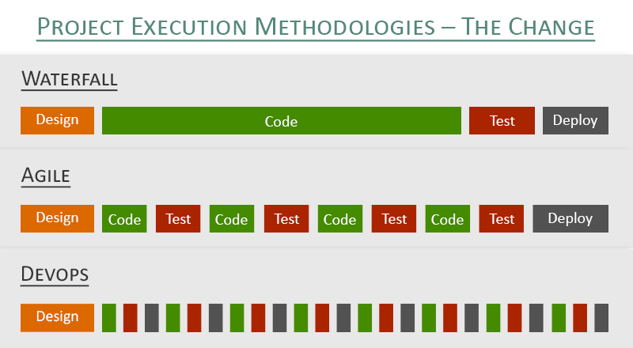

###### Sparta Global Training Day 36
###### Continuous Integration and delivery this week (**_JENKINS_**)

___

> 9:30 AM - 10:00 AM Self-revision and Standup [Morning]

I explained my problem, we are going to look at this problem later on if we find some time as it is causing a lot of problems
for myself and delaying the team further.

**CI/CD Pipelines with Jenkins**
* Jenkins **CD** - Continuous Delivery
* Jenkins **CD** - Continuous Deployment

~ **CI** _Continuous Integration testing_ ~

* **IAC :** _Infrastructure as code_
* Configuration management with **Ansible**
* Multi server Environment

**Why use SSH**
* Two Security Problems
* Private Repositories

Why should we use SSH with GitHub

**SSH Keys and GitHub**
There are two methods to clone the repo
**SSH** and **HTTP**
- We have two types of Repos: **Public** and **Private**

First thing we did was create a Repo called `ci-start-code` and copied the contents of Shahrukh's repo into my own.

**CI-Start-code** Repository ~ _Public_ ~

On-premise (Your laptop) 

Generate a key in the local system to restrict access.

**Generate a SSH Key**
- Generate a SSH key in your local system
- Copy the key from the local system to the specific GitHub Repository
- On this occasion That Repository is called [ci-start-code](https://github.com/JohnByrneJames/ci-start-code)
- .ssh folder where we store the ssh keys available
- Name the key as your name (E.G. john)

- To see the folder you need to use `ls -a` to view the ssh keys
- Go to users, and your user then look for the `.ssh` folder
- Enter the folder using `cd .ssh`
- Then I entered the following command `ssh-keygen -t rsa -b 4096 -C "my_email" `
- Then I entered my name as the key `name` and left the passphrase blank.
- Now I copy the public key with the command `cat john.pub`

- Go to the gitHub repo > Settings > Deploy Keys and add a new key with your name as the title
and the public key with the one you just copied.

* Always have descriptive naming conventions for your keys, for example "name"-"software" (E.G. John-Jenkins)
* Now the secured public key from our local system has been copied to our cloud which is GitHub in this case.
* JENKINS is running on **AWS** (Amazon Web Services)
* JENKINS is written in **Java**

The private key is actually like having a padlocked door, you need the private
key to get into the public key. This is known as a key-pair. By adding the key into GitHub we have essentially
padlocked the Repository and are going to give Jenkins the private key to unlock that padlock. Jenkins will automate the process of
testing the code you push to GitHub.

**Pipeline**

Commit-to-source -> Build -> Test -> Production

Any Errors will throw an error and we need to go fix that.

(**SOURCE** ➜ **Build** ➜ **Test**) = **CI** Integration
↓
(**PRODUCTION**) = **CD** Delivery and Deployment 

* (Delivery is automated)
* (Deployment is manual) unless it is to an existing app that is fully functional or confident developers.

**Bit of history into Jenkins and Software development**

**SDLC** Software development life cycle

Development ➜ Tests and Integration ➜ Acceptance ➜ Deployment and Maintenance 

**SAAS** Software as a service

Historically SDLC has been very slow and prevented new ideas as it took to long to add little functionality and release it.
DevOps as a job is to modulise things, E.G. automate the process of this using the software available: Ansible, Jenkins, Cradle and many many more.

* **CI** is daily
* **CDelivery**
* **CDeployment** 

- **We will time-box our meeting for 10 minutes**
- **Please take notes, as you will be expect to email us the summary of our conversations...**
- **How did you think this week went?**
>**"** 
>**"**
- From the behavioural competencies one competencies do you think you are excelling and which competencies you need to work one?
>**"** 
>**"**
- One thing to start doing? 
>**"**  
>**"**
- One thing to stop doing? 
>**"**  
>**"**
- One thing to continue?
> **"** 
> **"**

* **Positive feedback**  
>**"** 
No constructive Shahrukh said he is happy with my progress so far, and the problems I am having with the Virtual machine is 
>quite normal among DevOps. Some computers just have specific problems with hardware.
>**"**

* **Constructive feedback**  
>**"** 
Nothing constructive
>**"**