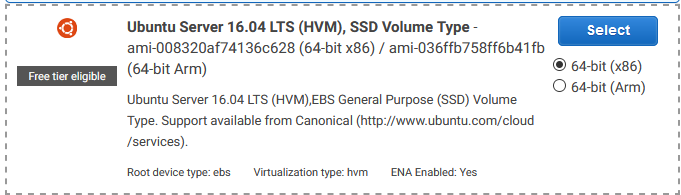
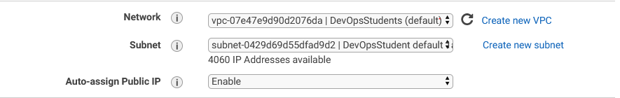

###### Sparta Global Training Day 39
###### Using AWS to run a EM2 machine and connect to it Via SSH

___


> 9:00 AM Stand up [Morning]

This morning we had a stand up. Finally I got my vagrant up to work with my old tower computer, which is more powerful than my laptop but also much bigger!

**Jenkins Configuration**

_We are looking to merge the branch before and then run the tests against that, then if the tests are a success then Jenkins will automatically merge the servers for us. There will also be the addition of adding a email notification when the build is a success and has been merged._

**Settings**
* **General**
  * **Description** : Any
  * **Strategy** : Log Rotation
  * **Day to Keep building**:
  * **Max # of builds to keep**: 3
  * **Github Project**: `project url:` https://github.com/JohnByrneJames/WebApp-CI/
* **Office 365 Connector**
  - [ ] This build requires lockable resources
  - [ ] This project is parametrised
  - [ ] Throttle builds
  - [ ] Disable the project
  - [ ] Execute concurrent builds if necessary
  - [x] Restrict where this project can be run
  * Label Expression: `sparta-ubuntu-node`
* **Source Code Management**
  * **Git**
  * **Repository**
    * Repository URL : git@github.com:JohnByrneJames/WebApp-CI.git
    * Credentials :
      * **Kind** : `SSH Username with private key`
      * **Scope** : `Global (Jenkins, nodes, items, all child items, etc)`
      * **ID** : anything `John-Jenkins`
      * **Description** : anything `John-Jenkins`
      * **Add Public SSH to GitHub**
      * **Add Private SSH to Jenkins** : `Private SSH Key`
  * **Branches to build** : `Branch Specifier (blank for `any`)` : `*/develop`
  * Repository Browser : `Auto`
  * Addition Behaviours : `Add`
* **Build Triggers**
  - [ ] Trigger builds remotely (e.g., from scripts)
  - [ ] Build after other projects are built
  - [ ] Build periodically
  - [x] GitHub hook trigger for GITScm polling
  - [ ] Poll SCM
* **Build Environment**
  - [ ] Delete workspace before build starts
  - [ ] Use secret text(s) or file(s)
  - [ ] Provide Configuration files
  - [ ] Abort the build if it's stuck
  - [ ] Add timestamps to the Console Output
  - [ ] Execute shell script on remote host using ssh
  - [ ] Inspect build log for published Gradle build scans
  - [x] Provide Node & npm bin/ folder to PATH
    * **NodeJS Installation** : `Sparta-Node-JS`
    * **npmrc file** : `- use system default -`
    * **Cache location** : `Default (~/.npm or %APP DATA% pm-cache)`
  - [ ] SSH Agent
  - [ ] With Ant
* **+** Build Step
  * **Build**
    * **Execute Shell**
    * `cd app`
    * `npm install`
    * `npm test`
* **Jenkins Plugins +** - Post-build Actions
  * **Git Publisher**
    - [x] Push Only If Build Succeeds
    - [x] Merge Results
    - [x] Force Push
    * **Tags**
    * **Branches**
      * **1**
      * Branch to push : `master`
      * Target remote name : `origin`
  * **E-mail Notification**
    * --
    

**Notes from today**

To find a specific process you can do the following command:

```bash
ps aux | grep node
```

or you can just do `ps aux |` to display all the commands running.

Now we are installing Sublime text, a lightweight editor rather than PyCharm. It is also going to be a default editor for adding stuff.


1. Open command prompt and type sysdm.cpl
2. In Advanced tab, select Environment variables
3. Under system variables, select variable named "Path" and click Edit.
4. Add "C:\Program Files\Sublime Text 3;" to the end of the existing string.
5. Save the changes and restart command prompt.

Now when I am in the command line I can open sublime anywhere using the command `subl`


**For Future Reference**

**Changing PC meant I needed a new SSH Key**

I kept getting the error, you are an invalid use, to fix this problem I needed to boot up the SSH agent and then add the locally stored private SSH key so it would recognise me when I attempted to push to the Github repository. 

First I activated the SSH agent and added my private key, whilst inside the .ssh hidden directory.

```bash
cd ~/.ssh/

eval $(ssh-agent -s)

ssh-add <name of key>

ssh-add l (list all keys in agent)
```

This fixed my problem and I could push to the repository.

> 2:00 PM Amazon Web Services [Mid-Afternoon]

**AWS**

We log in through this [**LINK**](https://sparta-devops.signin.aws.amazon.com/console)

**Post Requests**

These happen behind the scenes and are usually data being sent to the server from the user, typically these are private details and they wont be visible in the URL. This is used sometimes during payment as it is confidential information that should not be seen by any other individuals.

**Get Requests**

These are requests that happen when you click a website for example you are getting all the URL requests and displaying the page. The URL usually contains paths and arguments of the get request too.

They both have an end-point when they are made, these are used in different cases but have their specific uses.

On The **AWS** website we went to `Services > EMC2 > Instances` then we click **Create** instance.

Now we are going to create an instance, of this particular machine:



Then a list of machines are loaded, some of them are very powerful, with lots of **cores** and **gigabytes** these are more expensive but are available so must be in some kind of demand.

We chose the t2.micro with **1** CPU and **1GB** of memory.

In the configuring the instance we left everything except these settings below.



Then in the Tags section we added `Name` into the key and in the value we added our own naming convention, mine was `Eng67.John.Webapp`.


Then we launched our server and navigated to our .ssh and added the DevOpsStudent.pem we were given.

Whilst in the ssh folder in git bash we need to ssh into the Virtual Machine that is now being hosted on **AWS**. To access it we used the command:

```bash
ssh -i ~/.ssh/DevOpsStudents.pem ubuntu@<ip address from VM>
```

Now we are inside this Virtual Machine on the Amazon Web Services.

Other users cannot SSH into our Virtual Machines, because when we set up the Virtual machines `security group` we set it to only allow our IP access our machine.

**Moving some code to AWS VM**

We installed the following:

```bash
sudo apt-get update

sudo apt-get install nginx

sudo apt-get install nodejs

sudo apt-get install npm
```

Now we want to send a folder into our **EC2** instance being hosted on AWS.

There is also a cool way to access a manual of certain commands when you use the `man` key word before a command, for example:

```bash
man scp <to send folders to VM on AWS>
```

To send a secure copy of our folder we are using:

```bash
scp -i <key> path/file user@ip:/path/file1
```

In the folder we can open the directory we are in using sublime with `subl .`

We used the command:

```bash
scp -i ~/.ssh/DevOpsStudents.pem -r app/ ubuntu@3.250.67.195:~/app/
```

This then copied over the app folder from within our local directory into the virtual machines directory using the pem key to following by `-r` as this makes it recursive in order to move all the files until there are no more left. The letter `i` stands for identity and should have our public key to match with the stored private key on AWS.

We did the necessary provisioning the our Virtual machines to to get NGINX running and NPM installed then the web server could be reached and by adding over people to my security group they were also able to access the web server.

For now our work is on the Trello board..