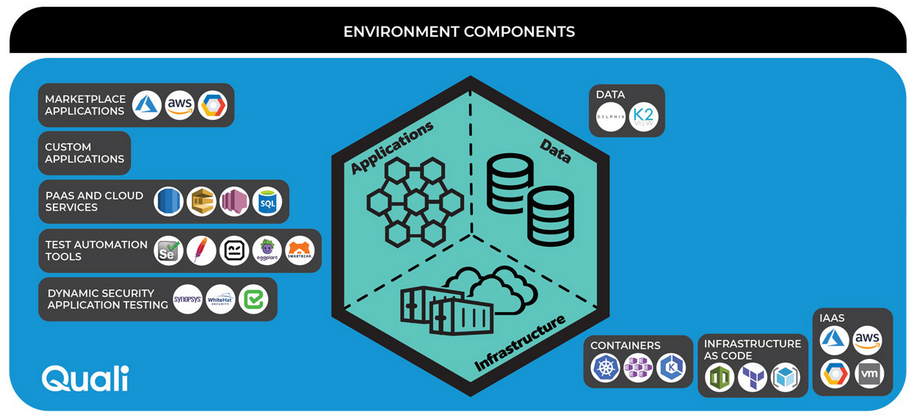
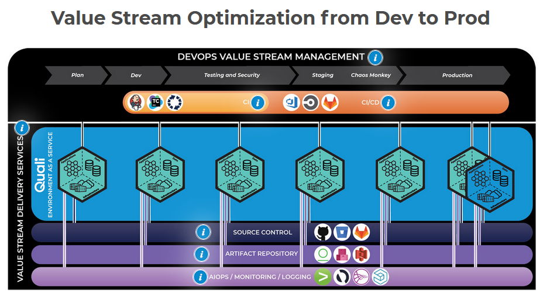

###### Sparta Global Training Day 39
###### Running our VM on Jenkins with automated testing

___


> 9:30 AM Academy Stand up [Morning]

This morning is the academy stand up and we are going to go over the week and perhaps some people will get a shout out. Before that I plan to work on my provisioning script for the EM2 machine on my AWS.

**One-to-One** with Shahrukh

- **We will time-box our meeting for 10 minutes**
- **Please take notes, as you will be expect to email us the summary of our conversations...**
- **How did you think this week went?**
>**"** I think this week went quite well for myself, I finally got my Virtual machine to work and plan to use my weekend to catch up on using Vagrant and reverse proxy. I also really enjoyed finally getting hands on with Amazon Web Services and seeing how continuous integration is beneficial using Jenkins to test at every push of code.
>**"**
- From the behavioural competencies one competencies do you think you are excelling and which competencies you need to work one?
>**"** I want to carry on being motivated and Studious towards everything I do so that I can always be a life-long learner and someone who is always looking forward to learning something new and has a positive mindset whenever something new or difficult is put in front of them. I think I need to work on my interaction with the class, sometimes I hesitate to answer a question because I am afraid that is wrong and don't want to embarrass myself.
>**"**
- One thing to start doing? 
>**"** Start interacting more and being more confident in the class room environment so I can be the best person I know I can be.
>**"**
- One thing to stop doing? 
>**"** When I am facing a issue that may or may not be a hardware issue I need to work on my ability to stay positive. This is important as it allows me to focus on the issue at hand and keep a fresh mind.
>**"**
- One thing to continue?
> **"** I need to carry on being my most motivated self as it has really help me get into a good mindset and I am able to keep up with it.
> **"**

* **Positive feedback** <br>
>**"** NGINX 75% was good 
>**"**

* **Constructive feedback** <br>
>**"** Quality gate - Create README and add heading interview prep (GO back 8 weeks and note 10 exercises that you liked [Just choose 10 and label]). UNDER EACH OF THE 10 - S T A R
>
> **Find somebody in class** Get dead-honest feedback without hesitation.  
>**"**

**Some Interesting Images**






**Todays Tasks**

[**TRELLO**](https://trello.com/b/eZdQiVQU/engineering-67)


* **Jenkins**

* **AWS**

# Deployment lab

## Timings

30 - 60 Minutes

## Summary

We've followed some manual steps to get our code on to the production environment. But we should really automate this process

Create a new `Jenkins` job called `firstname-lastname-deploy`. Set it up so that it performs the steps you just ran through.

Set this job to run when the CI testing job has finished successfully.

Make a change to the homepage of the app and push your code to the develop branch to test out your pipeline.

## Notes

This job should pull from the master branch only.

There are many tools and methods for uploading files to a remote server. We want to keep it simple and use rsync and ssh as we've learned previously. Do not use the Publish over SSH plugins.

You can create this configuration entirely in your job using:

ssh
rsync
ssh-agent
credentials system

When `Jenkins` attempts to connect via SSH it will ask for confirmation as we saw in the lesson. We can ask it to skip this confirmation with the following flags:

```bash
ssh -o "StrictHostKeyChecking=no" ubuntu@ ...
rsync -avz -e "ssh -o StrictHostKeyChecking=no" ...
```

You can send multiple commands over ssh with the following syntax

```bash
ssh -o "StrictHostKeyChecking=no" ubuntu@52.50.22.47 <<EOF

	commands here...

EOF
```


**TODO**
1. Draw Diagram and try figure out what is going on in the processes we have been following.
2. Now we are going to go to the HTML and change it to say something else like "welcome to Spotify!". Then we get another EM2 machine with our database E.G. the MongoDB.
3. Create a EPIC user story for the task we are doing as it would be good to see what NEEDS to be done in order to achieve something else.

**In Jenkins Channel add a Connector**

Task1 - CD:
- Get github working with jenkins
- Use a webhook to connect teams to jenkins
- Merge after build if build succesful
- Then move new code to server on aws

Task2 - Mongo:
- Set up db server
- Get public IP from your machine and got to /posts
- Use port 80 yes