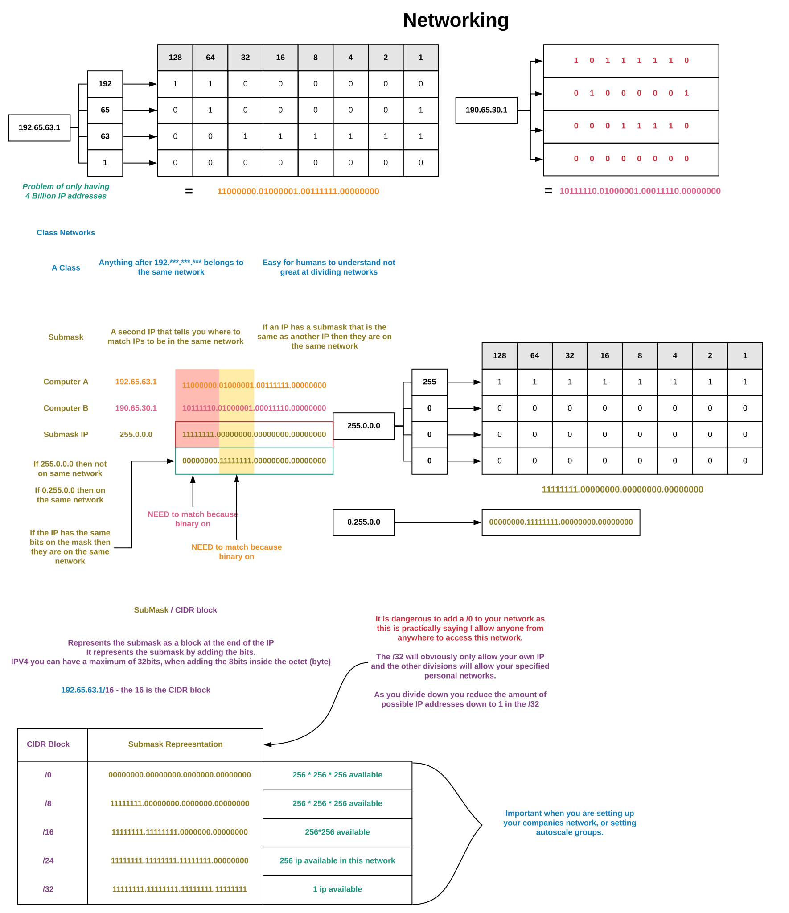
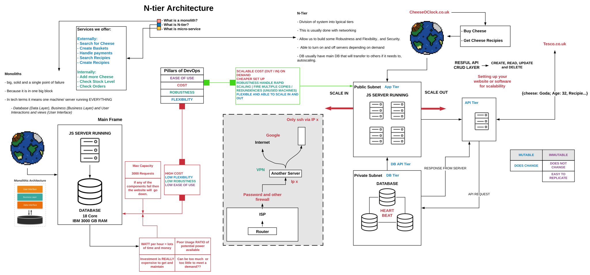

###### Sparta Global Training Day 42
###### Today we are going to be working with VPC, Networking and N-Tier Architecture

___

> 9:00 AM Academy Stand up [Morning]

No Real blockers, I have finally gotten my Jenkins to take in the GitHub Code and integrate that into a build which will then be automatically merged to my GitHub Repository. Then That will trigger my Deployment job on jenkins which will SSH into the EM2 Instance and copy over the app and environment folder.

To confirm this was a success I can connect to my EM2 Instances IP address which is being hosted on the NGINX web server, this should show any updated HTML like text and images.

### Research Task

* **What is a network?** 

A computer network is a group of computers that use a set of common communication protocols over digital interconnections for the purpose of sharing resources located on or provided by the network nodes.

* **What is an IP?**

An Internet Protocol address is a numerical label assigned to each device connected to a computer network that uses the internet protocol for communication. 

An IP address serves two main functions: host or network interface identification and location addressing. 

When you mail a letter and it is delivered to the wrong address, you get the letter back if you include a return address on the envelope. The same holds true for email. When you write to an invalid recipient (such as a correspondent who left her company) your IP address enables the company’s mail server to send you a bounce back email saying the destination was not found.

* **Maximum IP in IPV4?**

There is a finite amount of ip addresses, and ipv4 uses 32 bit IP addresses, and with 32 bits the maximum number of IP addresses is 2^32. Or **4,294,967,266**. This may run out in our lifetime with more and more machines needing IP addresses therefore 

To deal with the long-anticipated problem of IPv4 address exhaustion they invented IPV6. Now IPV6 has a 128 bit architecture and can have a possible 2^128 ip addresses.

* **IPV4 VS IPV6**

    * **IPV4** 
        * 4 bytes each (4 * 8 = 2^32)
        * total range = 4.3 billion possible addresses
        * **123.45.67.89**
    
    * **IPV6**
        * 128 bits each (2^128)
        * total range = 340 undecillion possible addresses
        * **2001:db8::ff00:42:8329**

* **IP and Binary - Little Demo Convert 1 IP into binary**

For example IP address: **154.31.16.13**

1. **Can I subtract 128 from 154** - YES So we assign 1 to 128.

2. 154 - 128 = 26 so... **Can I subtract 64 from 26?** - NO So we assign 0 to 64.

3. **Can we subtract 32 from 26?** - NO so we assign 0 to 32.

4. **Can we subtract 16 from 26?** - YES so we assign 1 to 16.

5. 26 - 16 = 10. **Can we subtract 8 from 10?** - Yes 

6. **Can we subtract 4 from 2?** - NO

7. **Can I subtract 2 from 2?** - YES

| 128 | 64 | 32 | 16 | 8 | 4 | 2 | 1 |
|-----|----|----|----|---|---|---|---|
| 1   | 0  | 0  | 1  | 1 | 0 | 1 | 0 |
| 0   | 0  | 0  | 1  | 1 | 1 | 1 | 1 |
| 0   | 0  | 0  | 1  | 0 | 0 | 0 | 0 |
| 0   | 0  | 0  | 0  | 1 | 1 | 0 | 1 |

**10011010.00011111.00010000.00001101**

* **What is a subnet?**

A subnet, or subnetwork, is a segmented piece of a larger network. More specifically, subnets are a logical partition of an IP network into multiple, smaller network segments. The Internet Protocol (IP) is the method for sending data from one computer to another over the internet. Each computer, or host, on the internet has at least one IP address as a unique identifier. 

One goal of a subnet is to split a large network into a grouping of smaller, interconnected networks to help minimize traffic

Figure 1 shows an IPv4 Class B address, **172.16.37.5**. Its Network Prefix is **172.16.0.0**, and the Host ID is **37.5**.

## Networking

## N-Tier Architecture

* **Side Exercise**

**What is inside a common 2 tier vpc?**

First of all **VPC** stands for **Virtual Private Cloud** and is an on-demand configurable pool of shared computing resources allocated within a public cloud environment, providing a certain level of isolation between the different organizations.

The common configuration of a **VPC** includes a **public subnet** and a **private subnet**. This is most commonly used if a public facing web application is needed, while maintaining back-end server that aren't publicly accessible. The web server is in the **public subnet** and the database servers are in the **private subnet**

_This information is courtesy of [**Amazon**](https://docs.aws.amazon.com/vpc/latest/userguide/VPC_Scenario2.html)_

**Terminology to Master**
* **VPC** - Virtual Private Cloud in AWS to launch computing resources.
* **IGW** - Internet gateway, attached to the VPC and allows internet into the VPC via route table.
* **Subnet** - Internal networking
* **NACLs** - Network Access Control list, this is an optional layer of security for your machine. (A firewall at the level of a subnet)
* **Route Tables** - Contains a set of rules, called routes that determine where network traffic from a subnet or gateway is directed.
* **SG** - Security Group / Firewall
* **EC2** - Amazon Elastic Compute Cloud

**Objective:**

A classic tier architecture VPC for our web app and DB. It will have a public subnet and private subnet.

Getting to work and communicating and working and setting up all the networking --->> network practice 

**Acceptance Criteria**

* **Has a private sub**
* **Has a public sub**
* **Is your own VPC**
* **Public sub has internet access**
* **Has the right routes**
* **App exists in public sub**
* **DB exists in private sub**
* **Networking has been done correctly**

