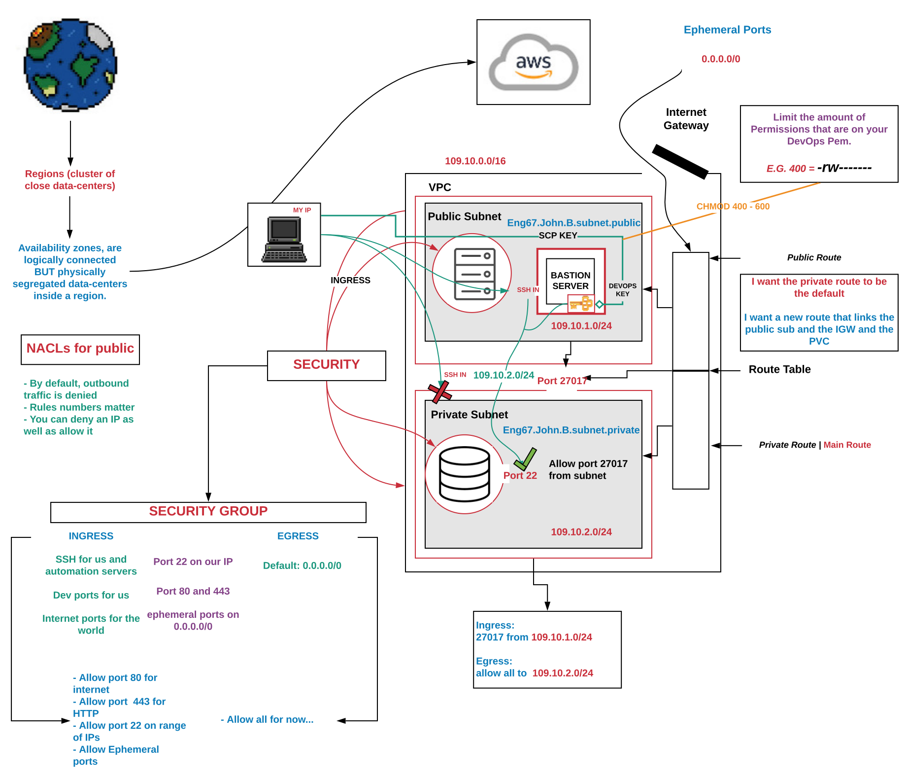

###### Sparta Global Training Day 43
###### Continuing with VPC and Networks

___

> 9:30 AM Academy Stand up [Morning]

The lecturers were in their meeting this morning so we started our Stand up at 9:30, 
yesterday was a flurry of information and was actually quite
exciting as it is information that is quite new to me in terms of the depth that
it was taught. It is quite amazing how networks are designed and everything kind of 
goes hand in hand.

I don't really have any blockers but I really need to start revising on them. I will continue to make diagrams and make README as this is a good way to drill in the information that we learnt.

### **INTERNAL QUALITY GATES THURSDAY TO FRIDAY**

_What to expect in the Internal QG..._

**Points of the interview**
- GREENWICH GAMES
- C#, C++, SQL and Web Dev
- Present my idea, worked with Student Nurses
- Gaming Society 
- DevOps | Sparta
- Skills
- 100% at Python exam (Love programming)

**If you are from a tech background**... Why are you here? 

~ I wanted to refresh my knowledge from this eclectic experience where I am looking at the latest greatest technology, software and interests within the DevOps field.

_I have learnt all these skills so far_

Lots of useful Information on this [**card**](https://trello.com/c/pHNg1SKE/199-discuss-what-to-expect-in-internal-qg) in the Trello board.

### **General Hints and Advice**

* Be present and in the two way conversation (center yourself)
* Listen
* Be Genuine 
* Think how you will be perceived. Abstract yourself from the world around you and be there as yourself and with your best performance... No Baggage
* Bring a notebook, knock on the door (the interviewer call you), have water with you. _So you can be smooth and have a pause to think_
* Align with company dress code, E.G. what is appropriate, correct headset ECT... just adapt to the situation.
* Sales person - get insight into the role and the people.
* Study the person - use your 20 80 principle
* **STAR** situation, task, action and response.

### **Structure of Interview**

* Intro
* Questions from the interviewer: (motivation and positivity and long term person, your interests are aligned) 
* Questions Technical overview and concepts: (technical clarity, conciseness,  Draw on experience) Define --> experience 
* Actual Technical questions
* Your Questions 

### **Questions motivated and alignment**

* Dig into the background and motivation
* Intent and assertive
* if you from a tech background... why are you here? (do not use the word NO EXPERIENCE)
* If you are from a non-tech background.... why are you here?
* what we want to avoid is hiring someone who isn't happy doing what they are doing
* Genuine
* Pitfalls: superficial anwsers with no intent
* Pitfalls: Don't be a time-waster of your own time :) 

### **Questions Technical Overview and Concepts**

* Have technical clarity
* Think, apply and draw on your experience

### **Actual Technical questions**

* Let people know you are taking notes
* Take time to understand the actual question
* Pseudo-code the question, take notes.
* Then attempt the question
* Verbalize everything you are doing > Your thoughts

### **Your questions to ask the interviewer**

* Research LinkedIN, for targeted questions relevant to the person.
* Questions regarding role
* Questions regarding tech stack
* Question why they like working at the company
* Don't be in a rush to leave, like you were never supposed to be there.

## Image of Setting up VPC, Bastion Server and access into Private subnet

