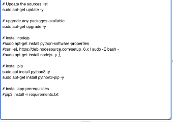

###### Sparta Global Training Day 41
###### Running our VM on Jenkins with automated testing

___

> 9:30 AM Academy Stand up [Morning]

No real blockers in terms of learning this weekend, however I did struggle quite a bit with getting the posts to work. Unfortunately I did not get it to work and am now going to work with someone to get it up and running for this mornings task.

I have been put into a group with Ibrahim and we are going to try complete the task together this morning.

I managed to get my posts working, I already had it set up for the most part but was missing a few small parts. I had to go to my security groups and add the port "**27017**" to my inbound rules, with the rule "**any**" this meant any inbound connections coming from this port would be allowed.

**27017** is the default port of mongodb. This worked when I went into my app instance and ran the command `npm test` which then ran the tests and actually ran the website.

### How does it work?

**CI**
* Job consists
* Triggers: push to dev branch
* Job: Installing packages running tests.

When we tell Jenkins to **Restrict build** we are asking it to the run the tests on a different node. In this case the `sparta-ubuntu-node`.

There is a node that is running on Jenkins that will always be using the same versions to the development server and will run the instance there.

You can test what is actually running inside a VirtualMachine by clicking on the working directory.

**CI Deployment**

After successful job on Jenkins then it should automatically run the other job which will move the code from one server to another. (**Message**)