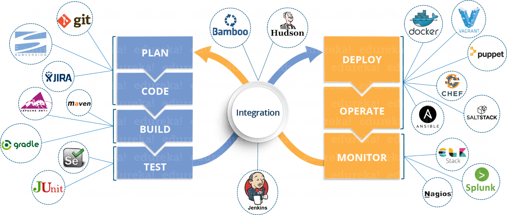

<!-- Your title -->
## Hi, I am John Byrne a Junior DevOps Engineer at Sparta Global

<!-- Social Media / Contacts Badges -->

&nbsp;

### **Personal Information:**

<!-- Any image aligned to the right. Beware the width -->

- :round_pushpin: **London** Based
- :date: **Start of Training** : **15/06/2020**
- :calendar: **End of Training** : **28/06/2020**
- :cyclone: **Junior DevOp Engineer**
- :trophy: **1st Class** in Computing with Games Development
- :notebook: [**Training Notes**](/Notes)
- :zap: **Fun Fact** : I have an almost unhealthy obsession with Japanese Culture. :japanese_castle:

<!-- Technical skills Here -->

&nbsp;

<!-- Any image aligned to the right. Beware the width -->

### **Course Road Map:**
- [x] **Week One** - Business Week
- [x] **Week Two** - SQL
- [x] **Week Three** - Python
- [x] **Week Four** - Python Continued
- [x] **Week Five** - Python Airport Project
- [x] **Week Six** - Quality Gate and Interviews
- [x] **Week Seven** - DevOps Begins **|** Linux with Virtual Machines, Vagrant and Ruby Scripting
- [x] **Week Eight** - DevOps Continued **|** _**CICD**_ Pipeline, Jenkins and AWS
- [x] **Week Nine** - DevOps In-depth **|** Amazon Web Service, VPC, Networking and N-Tier Architecture
- [x] **Week Ten** - Infrastructure as Code **|** _**IAC**_ with Ansible, Provision orchestration with Terraform, Hybrid Cloud, Route 53, Scalability and Load Balancing
- [x] **Week Eleven** - Containerisation **|** with Docker and orchestration theory with Kubernetes. Quality gates.. and E2E CICD Pipeline
- [ ] **Week Twelve** - Graduation Project **|**

### **Technical Skills**

___

### **My Repositories**

##### **4 Pillars of OOP | Flask | SQL | TDD | Unit Testing | API** 

##### **Virtual Machines | AWS | Jenkins | Vagrant**

##### **Networking | VPC | EC2 | Ansible | Terraform**

